<!-- README.md is generated from README.Rmd. Please edit that file -->

## Pacotes exigidos

``` r
library(ggpubr)
library(tidyverse)
library(geobr)
library(writexl)
library(sp)
library(gstat)
source("r/graficos.R")
source("r/funcoes.R")
```

## Correção do sinal de SIF

sif_757: 2.6250912\*10^-19

sif_771: 2.57743\*10^-19

``` r
lst_dn<- read_rds("data/lst_dn.rds")
uso_solo <- read_rds("data/land_use2.rds")
oco2_br <- read_rds("data/oco2_br.rds") %>% 
  mutate(
    sif_757 = fluorescence_radiance_757nm_idp_ph_sec_1_m_2_sr_1_um_1*2.6250912*10^(-19),
    sif_771 = fluorescence_radiance_771nm_idp_ph_sec_1_m_2_sr_1_um_1* 2.57743*10^(-19),
    SIF = (sif_757 + 1.5*sif_771)/2
  )
oco2_br %>% glimpse()
#> Rows: 37,387
#> Columns: 35
#> $ longitude                                                     <dbl> -70.5, -~
#> $ longitude_bnds                                                <chr> "-71.0:-~
#> $ latitude                                                      <dbl> -5.5, -4~
#> $ latitude_bnds                                                 <chr> "-6.0:-5~
#> $ time_yyyymmddhhmmss                                           <dbl> 2.014091~
#> $ time_bnds_yyyymmddhhmmss                                      <chr> "2014090~
#> $ altitude_km                                                   <dbl> 3307.8, ~
#> $ alt_bnds_km                                                   <chr> "0.0:661~
#> $ fluorescence_radiance_757nm_uncert_idp_ph_sec_1_m_2_sr_1_um_1 <dbl> 7.272876~
#> $ fluorescence_radiance_757nm_idp_ph_sec_1_m_2_sr_1_um_1        <dbl> 2.537127~
#> $ xco2_moles_mole_1                                             <dbl> 0.000394~
#> $ aerosol_total_aod                                             <dbl> 0.148579~
#> $ fluorescence_offset_relative_771nm_idp                        <dbl> 0.016753~
#> $ fluorescence_at_reference_ph_sec_1_m_2_sr_1_um_1              <dbl> 2.615319~
#> $ fluorescence_radiance_771nm_idp_ph_sec_1_m_2_sr_1_um_1        <dbl> 3.088582~
#> $ fluorescence_offset_relative_757nm_idp                        <dbl> 0.013969~
#> $ fluorescence_radiance_771nm_uncert_idp_ph_sec_1_m_2_sr_1_um_1 <dbl> 5.577878~
#> $ xco2                                                          <dbl> 394.3686~
#> $ data                                                          <dttm> 2014-09~
#> $ ano                                                           <dbl> 2014, 20~
#> $ mes                                                           <dbl> 9, 9, 9,~
#> $ dia                                                           <int> 6, 6, 6,~
#> $ dia_semana                                                    <dbl> 7, 7, 7,~
#> $ x                                                             <int> 7, 8, 11~
#> $ xco2_est                                                      <dbl> 392.7080~
#> $ delta                                                         <dbl> -1.66062~
#> $ XCO2                                                          <dbl> 387.2781~
#> $ flag_norte                                                    <lgl> TRUE, TR~
#> $ flag_nordeste                                                 <lgl> FALSE, F~
#> $ flag_sul                                                      <lgl> FALSE, F~
#> $ flag_sudeste                                                  <lgl> FALSE, F~
#> $ flag_centroeste                                               <lgl> FALSE, F~
#> $ sif_757                                                       <dbl> 0.666019~
#> $ sif_771                                                       <dbl> 0.796060~
#> $ SIF                                                           <dbl> 0.930054~
```

## Definição da região de trabalho

``` r
estados <- read_state(showProgress = FALSE)
matopiba_filtro <- estados$abbrev_state %in% c("MA","PI","TO","BA")
matopiba <- estados$geom[matopiba_filtro] 
matopiba %>% 
  ggplot2::ggplot() +
  ggplot2::geom_sf(fill="white", color="black",
          size=.15, show.legend = FALSE) +
  tema_mapa()
```

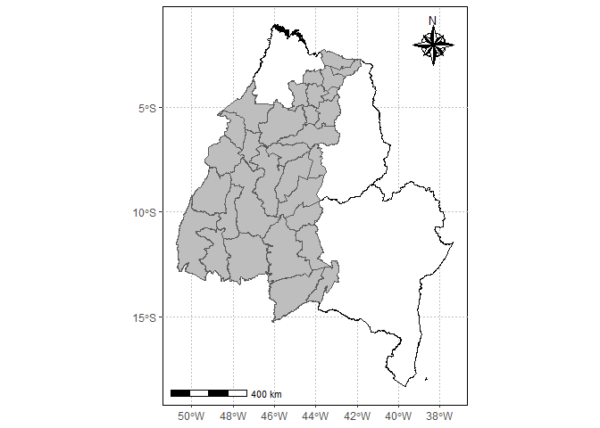<!-- -->

## Dados de xCO2 e SIF

Inicialmente vamos extrair os polígonos com os limites dos estados do
objegio gerado pelo `{geobr}`.

``` r
pol_to <- estados$geom %>% purrr::pluck(7) %>% as.matrix()
pol_ma <- estados$geom %>% purrr::pluck(8) %>% as.matrix()
pol_ba <- estados$geom %>% purrr::pluck(16) %>% as.matrix()
pol_pi <- estados$geom %>% purrr::pluck(9) %>% as.matrix()
```

Utilizando a função `def_pol` para classificar se o ponto pertence, ou
não a um dos estados.

``` r
data_set <- oco2_br %>% 
  mutate(
    flag_to = def_pol(longitude, latitude, pol_to),
    flag_ma = def_pol(longitude, latitude, pol_ma),
    flag_ba = def_pol(longitude, latitude, pol_ba),
    flag_pi = def_pol(longitude, latitude, pol_pi)
  )
```

## Mapeamento

Plot dos pontos do satélite e da região do matopiba.

``` r
matopiba %>% 
  ggplot2::ggplot() +
  ggplot2::geom_sf(fill="white", color="black",
                   size=.15, show.legend = FALSE)+
  tema_mapa() +
  ggplot2::geom_point(data=data_set  %>%  dplyr::filter(flag_to |
                                                          flag_ma |
                                                          flag_pi |
                                                          flag_ba, ano == 2014) ,
                      ggplot2::aes(x=longitude,y=latitude),
                      shape=3,
                      col="red",
                      alpha=0.2)
```

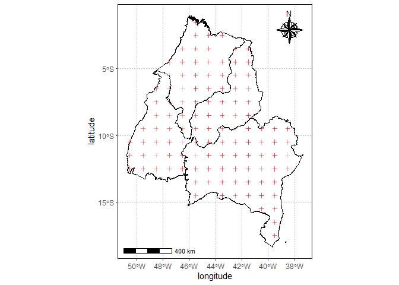<!-- -->

# Análise de série espaço-temporal

## Gráfico de concentração de CO<sub>2</sub>

``` r
data_set  %>%  
    tidyr::pivot_longer(
    dplyr::starts_with("flag"),
    names_to = "região",
    values_to = "flag"
  ) %>% 
  dplyr::filter(flag)  %>%  
  dplyr::mutate(região = stringr::str_remove(região,"flag_"))  %>% 
  dplyr::filter(região %in% c("ba","pi","to","ma")) %>% 
  dplyr::group_by(região, ano, mes) %>%  
  dplyr::summarise(media_co2 = mean(XCO2, na.rm=TRUE)) %>% 
    dplyr::mutate(
    mes_ano = lubridate::make_date(ano, mes, 1)
  )  %>%  
  ggplot2::ggplot(ggplot2::aes(x = mes_ano, y = media_co2,
                               color=região)) +
  ggplot2::geom_line() +
  ggplot2::theme_bw()
```

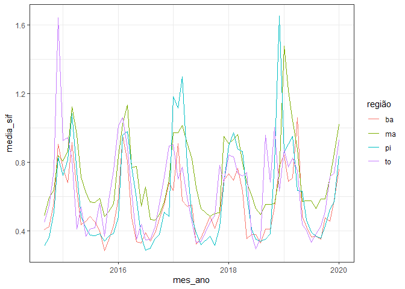<!-- -->

## Gráfico do SIF

``` r
data_set  %>%  filter(SIF >= 0) %>% 
    tidyr::pivot_longer(
    dplyr::starts_with("flag"),
    names_to = "região",
    values_to = "flag"
  ) %>% 
  dplyr::filter(flag)  %>%  
  dplyr::mutate(região = stringr::str_remove(região,"flag_"))  %>% 
  dplyr::filter(região %in% c("ba","pi","to","ma")) %>% 
  dplyr::group_by(região, ano, mes) %>%  
  dplyr::summarise(media_sif = mean(SIF, na.rm=TRUE)) %>% 
    dplyr::mutate(
    mes_ano = lubridate::make_date(ano, mes, 1)
  )  %>%  
  ggplot2::ggplot(ggplot2::aes(x = mes_ano, y = media_sif,
                               color=região)) +
  ggplot2::geom_line() +
  ggplot2::theme_bw()
```

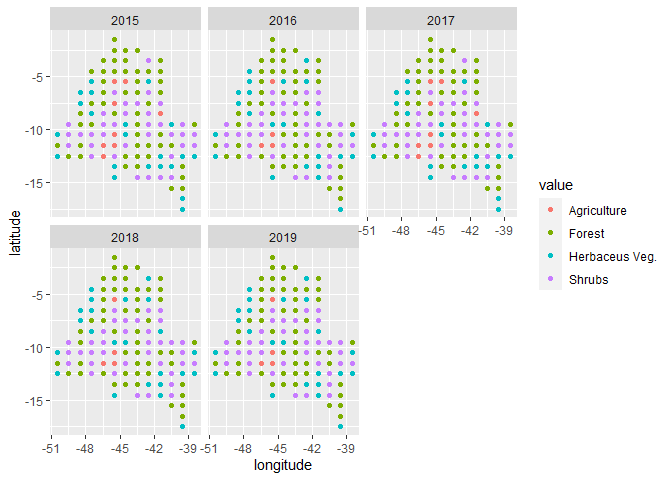<!-- --> \## Gráfico
do Temperatura da Superfício do Solo

## Tabela de médias de FCO2

``` r
tab_oco2_sif_media <- data_set  %>%  filter(SIF >= 0) %>% 
    tidyr::pivot_longer(
    dplyr::starts_with("flag"),
    names_to = "região",
    values_to = "flag"
  ) %>% 
  dplyr::filter(flag)  %>%  
  dplyr::mutate(região = stringr::str_remove(região,"flag_"))  %>% 
  dplyr::filter(região %in% c("ba","pi","to","ma")) %>% 
  dplyr::group_by(região, ano, mes, longitude, latitude) %>%  
  dplyr::summarise(media_sif = mean(SIF, na.rm=TRUE),
                   media_xco2 = mean(XCO2, na.rm=TRUE),
                   #latitude = mean(latitude, na.rm=TRUE),
                   #longitude = mean(longitude, na.rm=TRUE)
                   ) %>% 
    dplyr::mutate(
    mes_ano = lubridate::make_date(ano, mes, 1)
  )
write_xlsx(tab_oco2_sif_media, "data/medias_oco2_sif.xlsx")
```

## Gráficos de dispersão

``` r
tab_oco2_sif_media %>% 
  group_by(região, ano, mes) %>%  
  dplyr::summarise(media_sif = mean(media_sif, na.rm=TRUE),
                   media_xco2 = mean(media_xco2, na.rm=TRUE)
  ) %>% 
  ggscatter(
    x = "media_sif", y = "media_xco2",
    color = "região", palette = "jco",
    add = "reg.line"
  ) + coord_cartesian(ylim = c(382.5,392))+
  facet_wrap(~região) +
  stat_cor(label.y = 390) + 
  stat_regline_equation(label.y = 391.2)
```

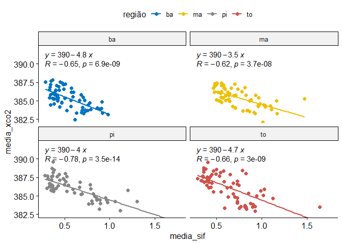<!-- -->

## Faça o download da tabela de médias

[medias_oco2_sif.xlsx](https://github.com/arpanosso/matopiba-xco2-sif/raw/master/data/medias_oco2_sif.xlsx)

## Análise geoestatística

### Criando o modelo de variabilidade espacial

Inicialmente, devemos criar o banco de dados com as amostras para a
geoestatística espaço-temporal.

``` r
dados_geo <- data_set  %>%  filter(SIF >= 0) %>% 
    tidyr::pivot_longer(
    dplyr::starts_with("flag"),
    names_to = "região",
    values_to = "flag"
  ) %>% 
  dplyr::filter(flag)  %>%  
  dplyr::mutate(região = stringr::str_remove(região,"flag_"))  %>% 
  dplyr::filter(região %in% c("ba","pi","to","ma")) %>% 
  mutate(
    mes_ano = lubridate::make_date(ano, mes, 1)
  ) %>% 
  select(longitude, latitude, mes_ano, XCO2, SIF)
dados_geo %>% glimpse()
#> Rows: 7,137
#> Columns: 5
#> $ longitude <dbl> -45.5, -45.5, -45.5, -45.5, -45.5, -44.5, -44.5, -44.5, -44.~
#> $ latitude  <dbl> -7.5, -6.5, -5.5, -4.5, -3.5, -12.5, -11.5, -10.5, -9.5, -8.~
#> $ mes_ano   <date> 2014-09-01, 2014-09-01, 2014-09-01, 2014-09-01, 2014-09-01,~
#> $ XCO2      <dbl> 386.7473, 384.4216, 389.8342, 388.0266, 381.5863, 386.5267, ~
#> $ SIF       <dbl> 0.4928928, 0.2229115, 0.1562369, 0.7605132, 1.1376032, 1.519~
```

Criando o grid de refinamento para a plotagem de pontos em locais não
amostrados

``` r
minX_pol <- min(pol_ma[,1],pol_to[,1],pol_pi[,1],pol_ba[,1])
maxX_pol <- max(pol_ma[,1],pol_to[,1],pol_pi[,1],pol_ba[,1])
minY_pol <- min(pol_ma[,2],pol_to[,2],pol_pi[,2],pol_ba[,2])
maxY_pol <- max(pol_ma[,2],pol_to[,2],pol_pi[,2],pol_ba[,2])
#x<-df_aux$x
#y<-df_aux$y
dis <- .1 #Distância entre pontos
grid <- expand.grid(X=seq(min(minX_pol),max(maxX_pol),dis), Y=seq(min(minY_pol),max(maxY_pol),dis))
gridded(grid) = ~ X + Y
plot(grid)
```

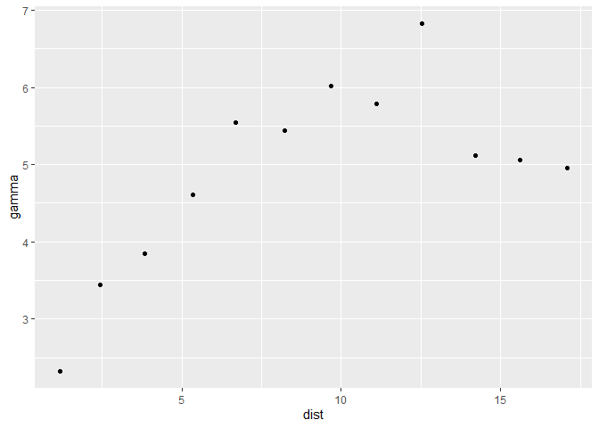<!-- -->

Vamos filtrar para uma data específica e criar

``` r
lista_datas <- dados_geo$mes_ano %>% unique()
data_especifica <- "2014-09-01"
df_aux <- dados_geo %>% filter(mes_ano == data_especifica) %>% 
  mutate(x = longitude, y=latitude) %>% 
  select(x, y, XCO2) %>% 
  group_by(x,y) %>% 
  summarise(XCO2 = mean(XCO2))
coordinates(df_aux)= ~ x+y
form<-XCO2~1
```

Verificando o Variograma experimental

``` r
vario <- variogram(form, data=df_aux, cutoff=20, width=1.5,cressie=FALSE)
# vario  %>%
#   ggplot(aes(x=dist, y=gamma)) +
#   geom_point()
m_vario <- fit.variogram(vario,
                         fit.method = 7,
                         vgm(1, "Sph", 10, 0))
```

``` r
sqr.f1<-round(attr(m_vario, "SSErr"),4); c0<-round(m_vario$psill[[1]],4); c0_c1<-round(sum(m_vario$psill),4);a<-round(m_vario$range[[2]],2)
r2<-round(r2findWLS(m_vario,vario),8)
texto_ajuste <- paste("Esf(C0= ",c0,"; C0+C1= ", c0_c1, "; a= ", a,"; SQR = ", sqr.f1,"; R² = ",r2,")",sep="")
preds = gstat::variogramLine(m_vario, maxdist = max(vario$dist))
semivar <- vario %>% 
  ggplot(aes(dist, gamma)) +
  geom_point() +
  geom_line(data = preds) + 
  theme_bw() +
  labs(x="Distância de separação", y="Semivariância",
       title=data_especifica,
       subtitle = texto_ajuste)+
  coord_cartesian(ylim = c(0,max(vario$gamma)))
ggsave(paste0("img/variograma/",data_especifica,"_modelo.png"),semivar)
```

### Krigragem ordinária (KO)

Utilizando o algoritmo de KO, vamos estimar xco2/sif nos locais não
amostrados.

``` r
ko_var<-krige(formula=form, df_aux, grid, model=m_vario, 
    block=c(0,0),
    nsim=0,
    na.action=na.pass,
    debug.level=-1,  
    )
#> [using ordinary kriging]
#> 100% done
```

Mapa de padrões espaciais.

``` r
krigagem <- tibble::as.tibble(ko_var) %>%  
  dplyr::mutate(flag = def_pol(X,Y,pol_ma) | def_pol(X,Y,pol_to) | def_pol(X,Y,pol_pi) | def_pol(X,Y,pol_ba)
                ) %>% 
  dplyr::filter(flag) %>% 
  ggplot(aes(x=X, y=Y),color="black") + 
  geom_tile(aes(fill = var1.pred)) +
  scale_fill_gradient(low = "yellow", high = "blue") + 
  coord_equal()+
  tema_mapa()+
  ggplot2::labs(fill="xco2 (ppm)",title = data_especifica) +
  ggspatial::annotation_scale(
    location="bl",
    plot_unit="km",
    height = ggplot2::unit(0.2,"cm"))
ggsave(paste0("img/krig/",data_especifica,"_modelo.png"),krigagem)
```

## Vamos criar um grid para testar todos os modelos

``` r
mypar<-expand.grid(dia_ = lista_datas, 
            modelo_ = c("Sph","Exp","Gau"),
            variavel_ = c("XCO2","SIF"))
```

## Usando a `my_geo_stat` função para análise geoestatística

``` r
# my_geo_stat(df = dados_geo,
#                         modelo = "Sph",
#                         dia = "2014-09-01",
#                         variavel="XCO2")
# 
# for(i in 1:nrow(mypar)){
#   my_geo_stat(df = dados_geo,
#                         modelo = mypar$modelo_[i] %>% as.character(),
#                         dia = mypar$dia_[i] %>% as.character(),
#                         variavel=mypar$variavel_[i]%>% as.character()
#               )
# }
```

## Juntando os diferentes usos do solo para a região

``` r
uso_solo_uni <-uso_solo %>% 
  pivot_longer(LU_15:LU_19,names_to = "ano") %>% 
  arrange(ano) %>% 
  mutate(ano = as.numeric(str_remove(ano,"LU_"))+2000) %>% 
  rename(longitude = lon,latitude = lat)
uso_solo_uni %>% 
  ggplot(aes(longitude, latitude, color=value)) +
  geom_point() +
  facet_wrap(~ano)
```

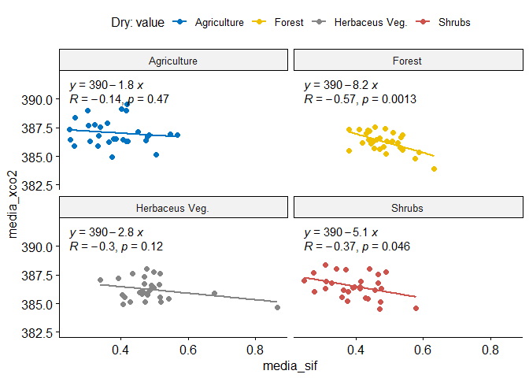<!-- -->

``` r
matopiba %>% 
  ggplot() +
  geom_sf(fill="white", color="black",
                   size=.15, show.legend = FALSE)+
  tema_mapa() +
  geom_point(data=uso_solo_uni,
                      ggplot2::aes(x=longitude,y=latitude,color=value)) +
  facet_wrap(~ano)
```

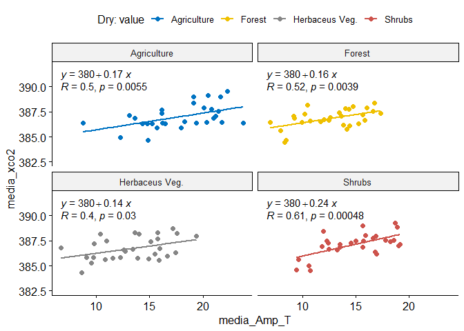<!-- -->

## Juntando as duas bases de dados

``` r
tab_oco2_sif_uso <- tab_oco2_sif_media %>%
  group_by(longitude, latitude, ano) %>% 
  summarise(
    media_sif = mean(media_sif),
    media_xco2 = mean(media_xco2)
  ) %>% 
  left_join(uso_solo_uni,c("longitude","latitude","ano")) %>% 
  drop_na()

tab_oco2_sif_media <- tab_oco2_sif_media %>%
  left_join(uso_solo_uni,c("longitude","latitude","ano")) %>% 
  drop_na()


names(lst_dn) <- c("longitude", "latitude",  "ano", "mes",     "LST_d",     "LST_n" )

tab_oco2_sif_media <- left_join(tab_oco2_sif_media, lst_dn,
          c("longitude","latitude","ano","mes"))


write_xlsx(tab_oco2_sif_media, "data/medias_oco2_sif_uso.xlsx")
```

## Faça o download da tabela de médias e usos do solo de 2015 a 2019

[medias_oco2_sif.xlsx](https://github.com/arpanosso/matopiba-xco2-sif/raw/master/data/medias_oco2_sif_uso.xlsx)

``` r
tab_oco2_sif_media %>% 
  mutate(season = ifelse(mes >= 5 & mes <= 10, "dry","wet")) %>% 
  group_by(season, value, ano, mes) %>%  
  dplyr::summarise(media_sif = mean(media_sif, na.rm=TRUE),
                   media_xco2 = mean(media_xco2, na.rm=TRUE)
  ) %>% 
  ggscatter(
    x = "media_sif", y = "media_xco2",
    color = "value", palette = "jco",
    add = "reg.line"
  ) + coord_cartesian(ylim = c(382.5,392))+
  facet_wrap(~value) +
  stat_cor(label.y = 390) + 
  stat_regline_equation(label.y = 391.2)
```

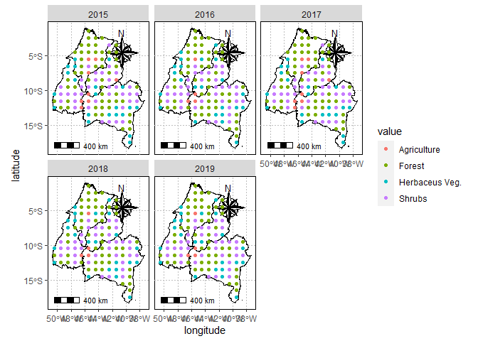<!-- --> \### Para
periodo de seca

``` r
tab_oco2_sif_media %>% 
  mutate(season = ifelse(mes >= 5 & mes <= 10, "dry","wet")) %>% 
  group_by(season, value, ano, mes) %>%  
  dplyr::summarise(media_sif = mean(media_sif, na.rm=TRUE),
                   media_xco2 = mean(media_xco2, na.rm=TRUE)
  ) %>% 
  filter(season == "dry") %>% 
  ggscatter(
    x = "media_sif", y = "media_xco2",
    color = "value", palette = "jco",
    add = "reg.line"
  ) + coord_cartesian(ylim = c(382.5,392))+
  facet_wrap(~value) +
  stat_cor(label.y = 390) + 
  stat_regline_equation(label.y = 391.2)+
  labs(color = "Dry: value")
```

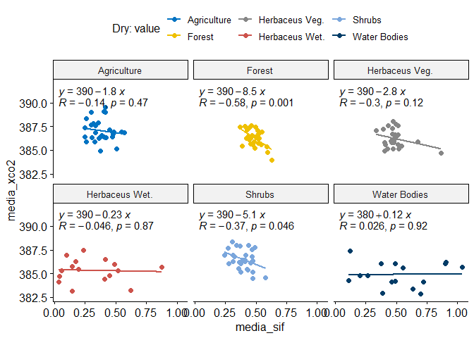<!-- -->

### Para período úmido

``` r
tab_oco2_sif_media %>% 
  mutate(season = ifelse(mes >= 5 & mes <= 10, "dry","wet")) %>% 
  group_by(season, value, ano, mes) %>%  
  dplyr::summarise(media_sif = mean(media_sif, na.rm=TRUE),
                   media_xco2 = mean(media_xco2, na.rm=TRUE)
  ) %>% 
  filter(season == "wet") %>% 
  ggscatter(
    x = "media_sif", y = "media_xco2",
    color = "value", palette = "jco",
    add = "reg.line"
  ) + coord_cartesian(ylim = c(382.5,392)) +
  facet_wrap(~value) +
  stat_cor(label.y = 390) + 
  stat_regline_equation(label.y = 391.2) +
  labs(color = "Wet: value")
```

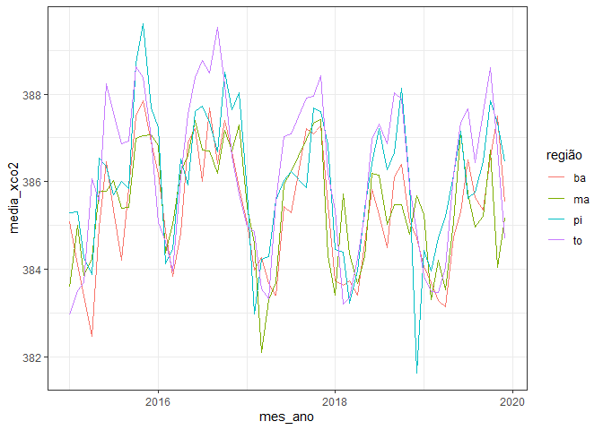<!-- -->

## Motivação, quais pontos apresentaram alteração do uso do solo?

``` r
tab_oco2_sif_uso <- tab_oco2_sif_uso %>% ungroup()
tab_oco2_sif_uso %>% 
  group_by(longitude, latitude, value) %>% 
  summarise(
   n = n()
  ) %>% 
  filter(n<5) %>% 
  ggplot(aes(x=longitude, y=latitude)) +
  geom_point()
```

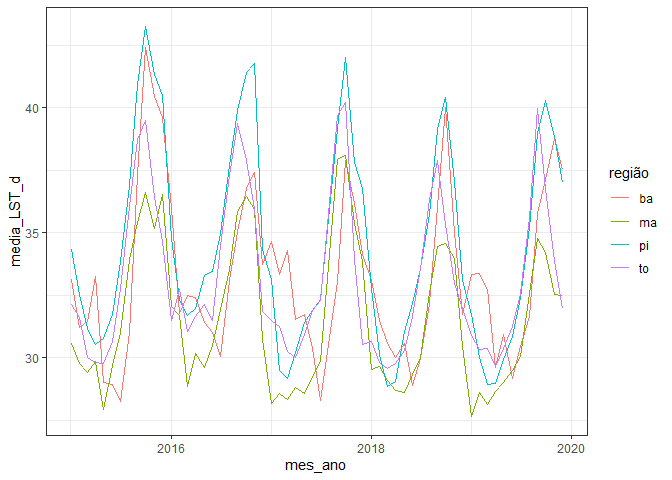<!-- -->

Mapear os dados acima

``` r
matopiba %>% 
  ggplot() +
  geom_sf(fill="white", color="black",
          size=.15, show.legend = FALSE)+
  tema_mapa() +
  geom_point(data=tab_oco2_sif_uso %>% 
               group_by(longitude, latitude, value) %>% 
               summarise(
                 n = n()
               ) %>% 
               filter(n<5),
             aes(x=longitude,y=latitude),color="red")
```

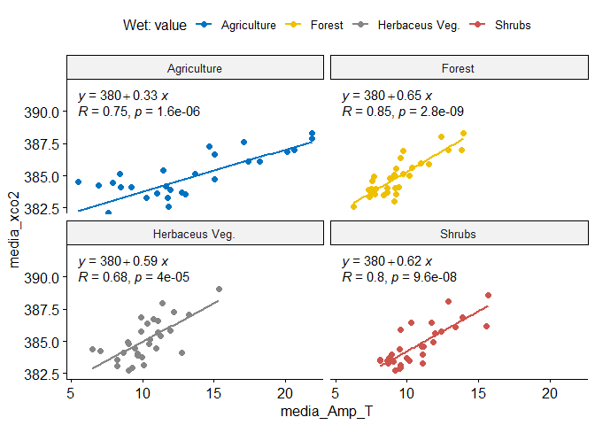<!-- -->

Ideal é identificar no banco de dados quais são esses pontos, por meio
da latitude e longitude

``` r
mudanca <- tab_oco2_sif_uso %>% 
  group_by(longitude, latitude, value) %>% 
  summarise(
   n = n()
  ) %>% 
  filter(n<5) %>% 
  count()
tab_oco2_sif_media <- tab_oco2_sif_media %>% 
  mutate(
    mudança = 
      longitude %in% mudanca$longitude &
      latitude %in% mudanca$latitude
  )
#write_xlsx(tab_oco2_sif_media, "data/medias_oco2_sif_uso.xlsx")

tab_oco2_sif_media  %>% ungroup() %>%
  mutate(season = ifelse(mes >= 5 & mes <= 10, "dry","wet")) %>% 
  group_by(mudança, season, ano, mes) %>%  
  dplyr::summarise(media_sif = mean(media_sif, na.rm=TRUE),
                   media_xco2 = mean(media_xco2, na.rm=TRUE)
  ) %>% 
  ggscatter(
    x = "media_sif", y = "media_xco2",
    color = "mudança", palette = "jco",
    add = "reg.line"
  ) + coord_cartesian(ylim = c(382.5,392))+
  facet_wrap(~mudança + season) +
  stat_cor(label.y = 390) + 
  stat_regline_equation(label.y = 391.2)
```

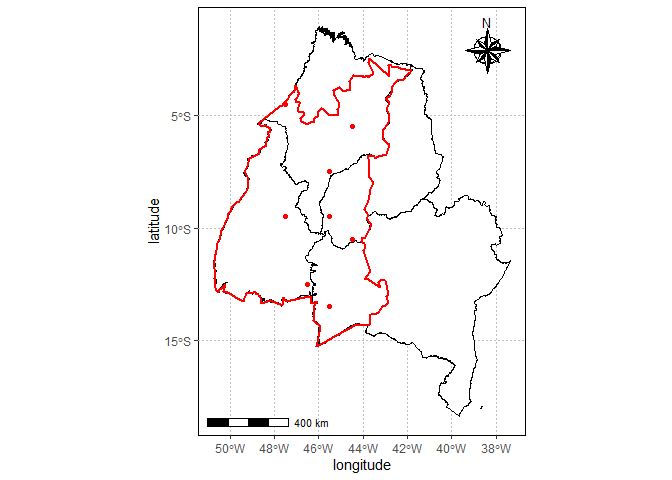<!-- -->
