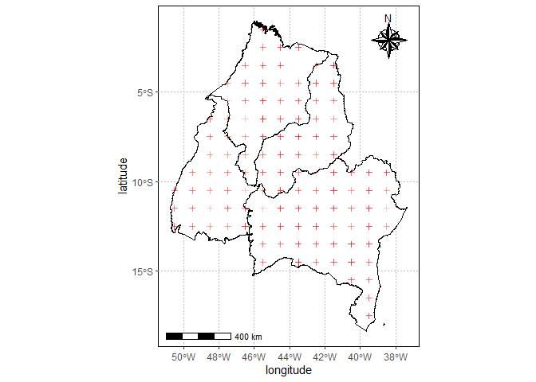

<!-- README.md is generated from README.Rmd. Please edit that file -->

## Pacotes exigidos

``` r
library(tidyverse)
library(geobr)
library(fco2r)
source("r/graficos.R")
source("r/funcoes.R")
```

## Correção do sinal de SIF

sif_757: 2.6250912\*10^-19

sif_771: 2.57743\*10^-19

``` r
oco2_br <- oco2_br %>% 
  mutate(
    sif_757 = fluorescence_radiance_757nm_idp_ph_sec_1_m_2_sr_1_um_1*2.6250912*10^(-19),
    sif_771 = fluorescence_radiance_771nm_idp_ph_sec_1_m_2_sr_1_um_1* 2.57743*10^(-19),
    SIF = (sif_757 + 1.5*sif_771)/2
  )
oco2_br %>% glimpse()
#> Rows: 37,387
#> Columns: 35
#> $ longitude                                                     <dbl> -70.5, -~
#> $ longitude_bnds                                                <chr> "-71.0:-~
#> $ latitude                                                      <dbl> -5.5, -4~
#> $ latitude_bnds                                                 <chr> "-6.0:-5~
#> $ time_yyyymmddhhmmss                                           <dbl> 2.014091~
#> $ time_bnds_yyyymmddhhmmss                                      <chr> "2014090~
#> $ altitude_km                                                   <dbl> 3307.8, ~
#> $ alt_bnds_km                                                   <chr> "0.0:661~
#> $ fluorescence_radiance_757nm_uncert_idp_ph_sec_1_m_2_sr_1_um_1 <dbl> 7.272876~
#> $ fluorescence_radiance_757nm_idp_ph_sec_1_m_2_sr_1_um_1        <dbl> 2.537127~
#> $ xco2_moles_mole_1                                             <dbl> 0.000394~
#> $ aerosol_total_aod                                             <dbl> 0.148579~
#> $ fluorescence_offset_relative_771nm_idp                        <dbl> 0.016753~
#> $ fluorescence_at_reference_ph_sec_1_m_2_sr_1_um_1              <dbl> 2.615319~
#> $ fluorescence_radiance_771nm_idp_ph_sec_1_m_2_sr_1_um_1        <dbl> 3.088582~
#> $ fluorescence_offset_relative_757nm_idp                        <dbl> 0.013969~
#> $ fluorescence_radiance_771nm_uncert_idp_ph_sec_1_m_2_sr_1_um_1 <dbl> 5.577878~
#> $ xco2                                                          <dbl> 394.3686~
#> $ data                                                          <dttm> 2014-09~
#> $ ano                                                           <dbl> 2014, 20~
#> $ mes                                                           <dbl> 9, 9, 9,~
#> $ dia                                                           <int> 6, 6, 6,~
#> $ dia_semana                                                    <dbl> 7, 7, 7,~
#> $ x                                                             <int> 7, 8, 11~
#> $ xco2_est                                                      <dbl> 392.7080~
#> $ delta                                                         <dbl> -1.66062~
#> $ XCO2                                                          <dbl> 387.2781~
#> $ flag_norte                                                    <lgl> TRUE, TR~
#> $ flag_nordeste                                                 <lgl> FALSE, F~
#> $ flag_sul                                                      <lgl> FALSE, F~
#> $ flag_sudeste                                                  <lgl> FALSE, F~
#> $ flag_centroeste                                               <lgl> FALSE, F~
#> $ sif_757                                                       <dbl> 0.666019~
#> $ sif_771                                                       <dbl> 0.796060~
#> $ SIF                                                           <dbl> 0.930054~
```

## Definição da região de trabalho

``` r
estados <- read_state(showProgress = FALSE)
#> Using year 2010
#> Loading data for the whole country
matopiba_filtro <- estados$abbrev_state %in% c("MA","PI","TO","BA")
matopiba <- estados$geom[matopiba_filtro] 
matopiba %>% 
  ggplot2::ggplot() +
  ggplot2::geom_sf(fill="white", color="black",
          size=.15, show.legend = FALSE) +
  tema_mapa()
```

<!-- -->

## Dados de xCO2 e SIF

``` r
pol_to <- estados$geom %>% purrr::pluck(7) %>% as.matrix()
pol_ma <- estados$geom %>% purrr::pluck(8) %>% as.matrix()
pol_ba <- estados$geom %>% purrr::pluck(16) %>% as.matrix()
pol_pi <- estados$geom %>% purrr::pluck(9) %>% as.matrix()
data_set <- oco2_br %>% 
  mutate(
    flag_to = def_pol(longitude, latitude, pol_to),
    flag_ma = def_pol(longitude, latitude, pol_ma),
    flag_ba = def_pol(longitude, latitude, pol_ba),
    flag_pi = def_pol(longitude, latitude, pol_pi)
  )
```

## Mapeamento

``` r
matopiba %>% 
  ggplot2::ggplot() +
  ggplot2::geom_sf(fill="white", color="black",
                   size=.15, show.legend = FALSE)+
  tema_mapa() +
  ggplot2::geom_point(data=data_set  %>%  dplyr::filter(flag_to |
                                                          flag_ma |
                                                          flag_pi |
                                                          flag_ba, ano == 2014) ,
                      ggplot2::aes(x=longitude,y=latitude),
                      shape=3,
                      col="red",
                      alpha=0.2)
```

<!-- -->

# Análise de série espaço-temporal

## Gráfico de concentração de CO2

``` r
data_set  %>%  
    tidyr::pivot_longer(
    dplyr::starts_with("flag"),
    names_to = "região",
    values_to = "flag"
  ) %>% 
  dplyr::filter(flag)  %>%  
  dplyr::mutate(região = stringr::str_remove(região,"flag_"))  %>% 
  dplyr::filter(região %in% c("ba","pi","to","ma")) %>% 
  dplyr::group_by(região, ano, mes) %>%  
  dplyr::summarise(media_co2 = mean(XCO2, na.rm=TRUE)) %>% 
    dplyr::mutate(
    mes_ano = lubridate::make_date(ano, mes, 1)
  )  %>%  
  ggplot2::ggplot(ggplot2::aes(x = mes_ano, y = media_co2,
                               color=região)) +
  ggplot2::geom_line() +
  ggplot2::theme_bw()
#> `summarise()` has grouped output by 'região', 'ano'. You can override using the
#> `.groups` argument.
```

<!-- -->

## Tablea de médias de FCO2

``` r
data_set  %>%  
    tidyr::pivot_longer(
    dplyr::starts_with("flag"),
    names_to = "região",
    values_to = "flag"
  ) %>% 
  dplyr::filter(flag)  %>%  
  dplyr::mutate(região = stringr::str_remove(região,"flag_"))  %>% 
  dplyr::filter(região %in% c("ba","pi","to","ma")) %>% 
  dplyr::group_by(região, ano, mes) %>%  
  dplyr::summarise(media_co2 = mean(XCO2, na.rm=TRUE)) %>% 
    dplyr::mutate(
    mes_ano = lubridate::make_date(ano, mes, 1)
  ) 
#> `summarise()` has grouped output by 'região', 'ano'. You can override using the
#> `.groups` argument.
#> # A tibble: 256 x 5
#> # Groups:   região, ano [28]
#>    região   ano   mes media_co2 mes_ano   
#>    <chr>  <dbl> <dbl>     <dbl> <date>    
#>  1 ba      2014     9      385. 2014-09-01
#>  2 ba      2014    10      386. 2014-10-01
#>  3 ba      2014    11      386. 2014-11-01
#>  4 ba      2014    12      384. 2014-12-01
#>  5 ba      2015     1      385. 2015-01-01
#>  6 ba      2015     2      384. 2015-02-01
#>  7 ba      2015     3      383. 2015-03-01
#>  8 ba      2015     4      383. 2015-04-01
#>  9 ba      2015     5      385. 2015-05-01
#> 10 ba      2015     6      386. 2015-06-01
#> # ... with 246 more rows
```

## Gráfico de concentração de SIF

``` r
data_set  %>%  filter(SIF >= 0) %>% 
    tidyr::pivot_longer(
    dplyr::starts_with("flag"),
    names_to = "região",
    values_to = "flag"
  ) %>% 
  dplyr::filter(flag)  %>%  
  dplyr::mutate(região = stringr::str_remove(região,"flag_"))  %>% 
  dplyr::filter(região %in% c("ba","pi","to","ma")) %>% 
  dplyr::group_by(região, ano, mes) %>%  
  dplyr::summarise(media_sif = mean(SIF, na.rm=TRUE)) %>% 
    dplyr::mutate(
    mes_ano = lubridate::make_date(ano, mes, 1)
  )  %>%  
  ggplot2::ggplot(ggplot2::aes(x = mes_ano, y = media_sif,
                               color=região)) +
  ggplot2::geom_line() +
  ggplot2::theme_bw()
#> `summarise()` has grouped output by 'região', 'ano'. You can override using the
#> `.groups` argument.
```

<!-- --> \## Tablea
de médias de FCO2

``` r
data_set  %>%  filter(SIF >= 0) %>% 
    tidyr::pivot_longer(
    dplyr::starts_with("flag"),
    names_to = "região",
    values_to = "flag"
  ) %>% 
  dplyr::filter(flag)  %>%  
  dplyr::mutate(região = stringr::str_remove(região,"flag_"))  %>% 
  dplyr::filter(região %in% c("ba","pi","to","ma")) %>% 
  dplyr::group_by(região, ano, mes) %>%  
  dplyr::summarise(media_sif = mean(SIF, na.rm=TRUE)) %>% 
    dplyr::mutate(
    mes_ano = lubridate::make_date(ano, mes, 1)
  )
#> `summarise()` has grouped output by 'região', 'ano'. You can override using the
#> `.groups` argument.
#> # A tibble: 256 x 5
#> # Groups:   região, ano [28]
#>    região   ano   mes media_sif mes_ano   
#>    <chr>  <dbl> <dbl>     <dbl> <date>    
#>  1 ba      2014     9     0.406 2014-09-01
#>  2 ba      2014    10     0.422 2014-10-01
#>  3 ba      2014    11     0.564 2014-11-01
#>  4 ba      2014    12     0.904 2014-12-01
#>  5 ba      2015     1     0.765 2015-01-01
#>  6 ba      2015     2     0.680 2015-02-01
#>  7 ba      2015     3     0.917 2015-03-01
#>  8 ba      2015     4     0.638 2015-04-01
#>  9 ba      2015     5     0.434 2015-05-01
#> 10 ba      2015     6     0.455 2015-06-01
#> # ... with 246 more rows
```
