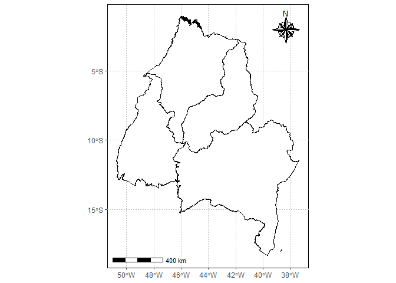

<!-- README.md is generated from README.Rmd. Please edit that file -->

## Pacotes exigidos

``` r
library(tidyverse)
#> -- Attaching packages --------------------------------------- tidyverse 1.3.1 --
#> v ggplot2 3.3.5     v purrr   0.3.4
#> v tibble  3.1.6     v dplyr   1.0.8
#> v tidyr   1.2.0     v stringr 1.4.0
#> v readr   2.1.2     v forcats 0.5.1
#> -- Conflicts ------------------------------------------ tidyverse_conflicts() --
#> x dplyr::filter() masks stats::filter()
#> x dplyr::lag()    masks stats::lag()
library(geobr)
#> Loading required namespace: sf
library(fco2r)
source("r/graficos.R")
source("r/funcoes.R")
```

## Definição da região de trabalho

``` r
estados <- read_state(showProgress = FALSE)
#> Using year 2010
#> Loading data for the whole country
matopiba_filtro <- estados$abbrev_state %in% c("MA","PI","TO","BA")
matopiba <- estados$geom[matopiba_filtro] 
matopiba %>% 
  ggplot2::ggplot() +
  ggplot2::geom_sf(fill="white", color="black",
          size=.15, show.legend = FALSE) +
  tema_mapa()
```

<!-- -->

## Dados de xCO2 e SIF

``` r
pol_to <- estados$geom %>% purrr::pluck(7) %>% as.matrix()
pol_ma <- estados$geom %>% purrr::pluck(8) %>% as.matrix()
pol_ba <- estados$geom %>% purrr::pluck(16) %>% as.matrix()
pol_pi <- estados$geom %>% purrr::pluck(9) %>% as.matrix()
data_set <- oco2_br %>% 
  mutate(
    flag_to = def_pol(longitude, latitude, pol_to),
    flag_ma = def_pol(longitude, latitude, pol_ma),
    flag_ba = def_pol(longitude, latitude, pol_ba),
    flag_pi = def_pol(longitude, latitude, pol_pi)
  )
```

## Mapeamento

``` r
matopiba %>% 
  ggplot2::ggplot() +
  ggplot2::geom_sf(fill="white", color="black",
                   size=.15, show.legend = FALSE)+
  tema_mapa() +
  ggplot2::geom_point(data=data_set  %>%  dplyr::filter(flag_to |
                                                          flag_ma |
                                                          flag_pi |
                                                          flag_ba, ano == 2014) ,
                      ggplot2::aes(x=longitude,y=latitude),
                      shape=3,
                      col="red",
                      alpha=0.2)
```

<!-- -->
