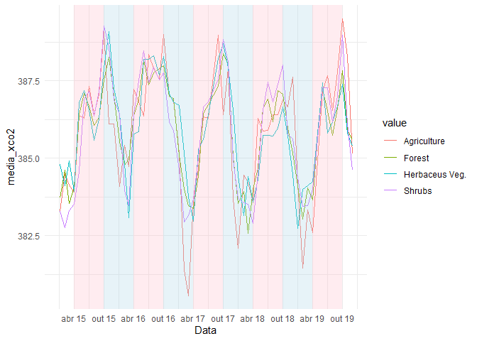
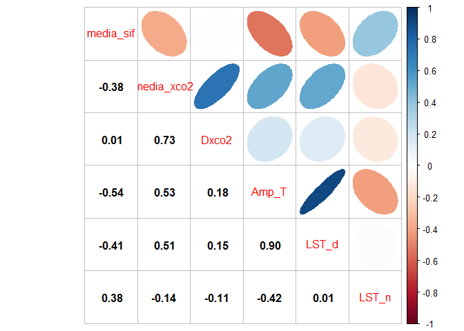
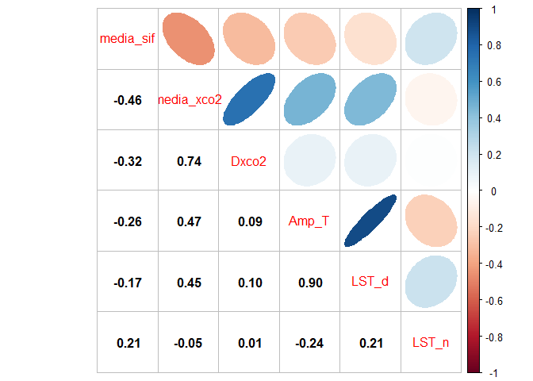
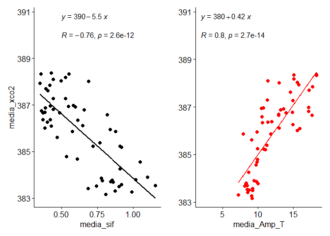
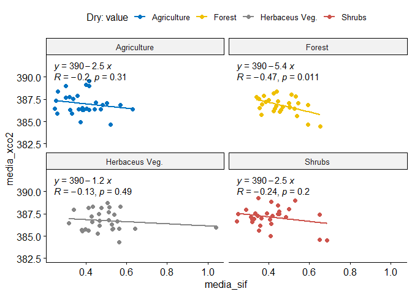
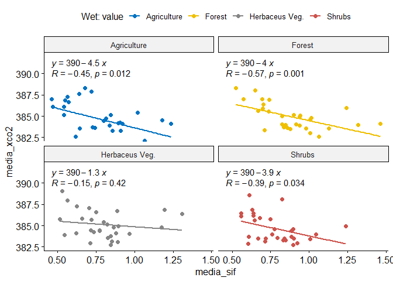
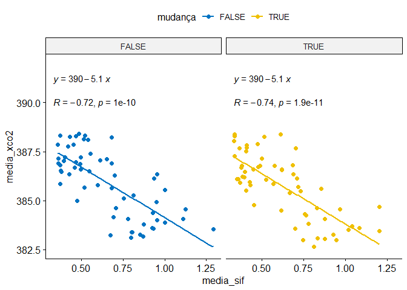
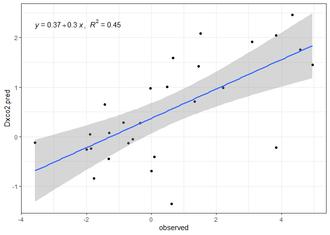
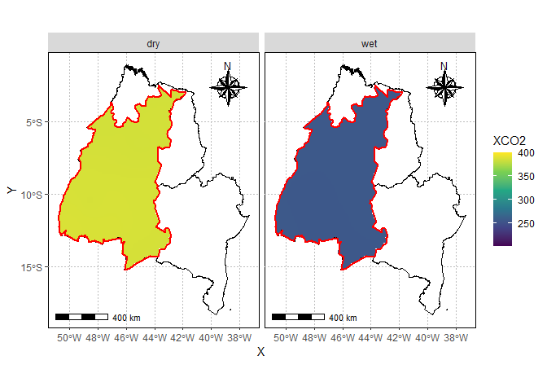

<!-- README.md is generated from README.Rmd. Please edit that file -->

## Pacotes exigidos

``` r
library(patchwork)
library(tidyverse)
library(lubridate)
library(writexl)
library(ggpubr)
library(gstat)
library(geobr)
library(sp)
source("r/graficos.R")
source("r/funcoes.R")
```

## Correção do sinal de SIF

sif_757: 2.6250912\*10^-19

sif_771: 2.57743\*10^-19

``` r
lst_dn<- read_rds("data/lst_dn.rds")
uso_solo <- read_rds("data/land_use2.rds")
oco2_br <- read_rds("data/oco2_br.rds") %>% 
  mutate(
    sif_757 = fluorescence_radiance_757nm_idp_ph_sec_1_m_2_sr_1_um_1*2.6250912*10^(-19),
    sif_771 = fluorescence_radiance_771nm_idp_ph_sec_1_m_2_sr_1_um_1* 2.57743*10^(-19),
    SIF = (sif_757 + 1.5*sif_771)/2
  )
oco2_br %>% glimpse()
#> Rows: 37,387
#> Columns: 35
#> $ longitude                                                     <dbl> -70.5, -~
#> $ longitude_bnds                                                <chr> "-71.0:-~
#> $ latitude                                                      <dbl> -5.5, -4~
#> $ latitude_bnds                                                 <chr> "-6.0:-5~
#> $ time_yyyymmddhhmmss                                           <dbl> 2.014091~
#> $ time_bnds_yyyymmddhhmmss                                      <chr> "2014090~
#> $ altitude_km                                                   <dbl> 3307.8, ~
#> $ alt_bnds_km                                                   <chr> "0.0:661~
#> $ fluorescence_radiance_757nm_uncert_idp_ph_sec_1_m_2_sr_1_um_1 <dbl> 7.272876~
#> $ fluorescence_radiance_757nm_idp_ph_sec_1_m_2_sr_1_um_1        <dbl> 2.537127~
#> $ xco2_moles_mole_1                                             <dbl> 0.000394~
#> $ aerosol_total_aod                                             <dbl> 0.148579~
#> $ fluorescence_offset_relative_771nm_idp                        <dbl> 0.016753~
#> $ fluorescence_at_reference_ph_sec_1_m_2_sr_1_um_1              <dbl> 2.615319~
#> $ fluorescence_radiance_771nm_idp_ph_sec_1_m_2_sr_1_um_1        <dbl> 3.088582~
#> $ fluorescence_offset_relative_757nm_idp                        <dbl> 0.013969~
#> $ fluorescence_radiance_771nm_uncert_idp_ph_sec_1_m_2_sr_1_um_1 <dbl> 5.577878~
#> $ xco2                                                          <dbl> 394.3686~
#> $ data                                                          <dttm> 2014-09~
#> $ ano                                                           <dbl> 2014, 20~
#> $ mes                                                           <dbl> 9, 9, 9,~
#> $ dia                                                           <int> 6, 6, 6,~
#> $ dia_semana                                                    <dbl> 7, 7, 7,~
#> $ x                                                             <int> 7, 8, 11~
#> $ xco2_est                                                      <dbl> 392.7080~
#> $ delta                                                         <dbl> -1.66062~
#> $ XCO2                                                          <dbl> 387.2781~
#> $ flag_norte                                                    <lgl> TRUE, TR~
#> $ flag_nordeste                                                 <lgl> FALSE, F~
#> $ flag_sul                                                      <lgl> FALSE, F~
#> $ flag_sudeste                                                  <lgl> FALSE, F~
#> $ flag_centroeste                                               <lgl> FALSE, F~
#> $ sif_757                                                       <dbl> 0.666019~
#> $ sif_771                                                       <dbl> 0.796060~
#> $ SIF                                                           <dbl> 0.930054~
```

## Definição da região de trabalho

``` r
estados <- read_state(showProgress = FALSE) # carregando estados
matopiba_filtro <- estados$abbrev_state %in% c("MA","PI","TO","BA") # filtrando estados
matopiba <- estados$geom[matopiba_filtro] ## estados do matopiba

microregiao <- read_micro_region(showProgress = FALSE) # buscando as microregioes
micro_nomes <- read.table("data-raw/microregiao_nomes.txt",h=TRUE,sep="\t") ## dados retirados da wikipedia
microregiao_filtro <- microregiao$name_micro %in% micro_nomes$Microrregião ## filtro por microregiao

poli_micro <- read.table("data-raw/digit.dat",sep=",") %>% as.matrix() ## lendo o polígono editado manualmente pelo surfer
colnames(poli_micro) <- c("X","Y") ## renomaenado colunas

matopiba_micro <- microregiao$geom[microregiao_filtro]
matopiba_micro <- matopiba_micro[-15]
matopiba %>% 
  ggplot2::ggplot() +
  ggplot2::geom_sf(fill="white", color="black",
          size=.15, show.legend = FALSE) +
  tema_mapa()+
  geom_sf(data=matopiba_micro,fill="gray")
```

<!-- -->

## Dados de xCO2 e SIF

Inicialmente vamos extrair os polígonos com os limites dos estados do
objegio gerado pelo `{geobr}`.

``` r
pol_to <- estados$geom %>% purrr::pluck(7) %>% as.matrix()
pol_ma <- estados$geom %>% purrr::pluck(8) %>% as.matrix()
pol_ba <- estados$geom %>% purrr::pluck(16) %>% as.matrix()
pol_pi <- estados$geom %>% purrr::pluck(9) %>% as.matrix()
```

Utilizando a função `def_pol` para classificar se o ponto pertence, ou
não a um dos estados.

``` r
data_set <- oco2_br %>% 
  mutate(
    flag_to = def_pol(longitude, latitude, pol_to),
    flag_ma = def_pol(longitude, latitude, pol_ma),
    flag_ba = def_pol(longitude, latitude, pol_ba),
    flag_pi = def_pol(longitude, latitude, pol_pi),
    flag_matopiba = def_pol(longitude, latitude, poli_micro)
  )
```

## Mapeamento

Plot dos pontos do satélite e da região do matopiba.

``` r
matopiba %>% 
  ggplot2::ggplot() +
  ggplot2::geom_sf(fill="white", color="black",
                   size=.15, show.legend = FALSE)+
  tema_mapa() +
  ggplot2::geom_point(data=data_set  %>%  dplyr::filter(flag_to |
                                                          flag_ma |
                                                          flag_pi |
                                                          flag_ba |
                                                          flag_matopiba, ano == 2014) ,
                      ggplot2::aes(x=longitude,y=latitude),
                      shape=3,
                      col="red",
                      alpha=0.2)
```

<!-- -->

## Tabela de médias de FCO2

``` r
tab_oco2_sif_media <- data_set  %>%  filter(SIF >= 0) %>% 
    tidyr::pivot_longer(
    dplyr::starts_with("flag"),
    names_to = "região",
    values_to = "flag"
  ) %>% 
  dplyr::filter(flag)  %>%  
  dplyr::mutate(região = stringr::str_remove(região,"flag_"))  %>% 
  dplyr::filter(região %in% c("ba","pi","to","ma")) %>% 
  dplyr::group_by(região, ano, mes, longitude, latitude) %>%  
  dplyr::summarise(media_sif = mean(SIF, na.rm=TRUE),
                   media_xco2 = mean(XCO2, na.rm=TRUE),
                   #latitude = mean(latitude, na.rm=TRUE),
                   #longitude = mean(longitude, na.rm=TRUE)
                   ) %>% 
    dplyr::mutate(
    mes_ano = lubridate::make_date(ano, mes, 1)
  )
# write_xlsx(tab_oco2_sif_media, "data/medias_oco2_sif.xlsx")
```

## Faça o download da tabela de médias

[medias_oco2_sif.xlsx](https://github.com/arpanosso/matopiba-xco2-sif/raw/master/data/medias_oco2_sif.xlsx)

## Juntando os diferentes usos do solo para a região

``` r
uso_solo_uni <-uso_solo %>% 
  pivot_longer(LU_15:LU_19,names_to = "ano") %>% 
  arrange(ano) %>% 
  mutate(ano = as.numeric(str_remove(ano,"LU_"))+2000) %>% 
  rename(longitude = lon,latitude = lat)
uso_solo_uni %>% 
  ggplot(aes(longitude, latitude, color=value)) +
  geom_point() +
  facet_wrap(~ano)
```

<!-- -->

``` r
matopiba %>% 
  ggplot() +
  geom_sf(fill="white", color="black",
                   size=.15, show.legend = FALSE)+
  tema_mapa() +
  geom_point(data=uso_solo_uni,
                      ggplot2::aes(x=longitude,y=latitude,color=value)) +
    geom_polygon(data=poli_micro %>% as.tibble(),
               aes(x=X,y=Y),color="red", fill="lightblue", alpha=.0,
               size=1)
```

<!-- -->

``` r
  facet_wrap(~ano)
#> <ggproto object: Class FacetWrap, Facet, gg>
#>     compute_layout: function
#>     draw_back: function
#>     draw_front: function
#>     draw_labels: function
#>     draw_panels: function
#>     finish_data: function
#>     init_scales: function
#>     map_data: function
#>     params: list
#>     setup_data: function
#>     setup_params: function
#>     shrink: TRUE
#>     train_scales: function
#>     vars: function
#>     super:  <ggproto object: Class FacetWrap, Facet, gg>
```

## Juntando as duas bases de dados

ANOMALIA CALCULADA (Dxco2)- De acordo com o trabalho de Golkar e
Mousavi, 2022 (Variation of XCO2 anomaly patterns in the Middle East
from OCO-2 satellite data)


``` r
tab_oco2_sif_media <- tab_oco2_sif_media %>%
  mutate(
    flag = def_pol(longitude, latitude, poli_micro)
  ) %>%
  filter(flag) %>%
  group_by(flag, ano, mes) %>%
  mutate(
    xco2_background = median(media_xco2, na.rm=TRUE),
    Dxco2 = media_xco2 - xco2_background
  )

tab_oco2_sif_uso <- tab_oco2_sif_media %>%
  group_by(longitude, latitude, ano) %>% 
  summarise(
    media_sif = mean(media_sif),
    media_xco2 = mean(media_xco2)
  ) %>% 
  left_join(uso_solo_uni,c("longitude","latitude","ano")) %>% 
  drop_na()
```

``` r
tab_oco2_sif_media <- tab_oco2_sif_media %>%
  left_join(uso_solo_uni,c("longitude","latitude","ano")) %>% 
  drop_na()

names(lst_dn) <- c("longitude","latitude","ano","mes","LST_d","LST_n" )

tab_oco2_sif_media <- left_join(tab_oco2_sif_media, lst_dn,
          c("longitude","latitude","ano","mes"))

tab_oco2_sif_media <- tab_oco2_sif_media %>% 
  mutate(
    Amp_T = LST_d - LST_n
  )
  
# write_xlsx(tab_oco2_sif_media, "data/medias_oco2_sif_uso.xlsx")
```

## Faça o download da tabela de médias e usos do solo de 2015 a 2019

[medias_oco2_sif.xlsx](https://github.com/arpanosso/matopiba-xco2-sif/raw/master/data/medias_oco2_sif_uso.xlsx)

# RESULTADOS - variabilidade temporal

definindo as cores e a sequencia de datas para as estações

``` r
vec_xmin <- seq.Date(as.Date("2015-04-01"),as.Date("2019-04-01"),by = "6 month")
vec_xmax <-seq.Date(as.Date("2015-10-01"),as.Date("2019-10-01"),by = "6 month")
cores <- rep(c("pink","lightblue"),5)[-10]
```

``` r
tab_oco2_sif_media  %>%  
  mutate(
        flag_matopiba = def_pol(longitude, latitude, poli_micro)
  ) %>% 
  filter(flag_matopiba) %>% 
  group_by(value, ano, mes) %>%  
  mutate(
    media_xco2 = mean(media_xco2)
  ) %>% 
  ggplot(aes(x = mes_ano, y = media_xco2,
                               color=value)) +
  geom_line() +
  theme_minimal() +
  scale_x_date(name = "Data",date_breaks = "6 months",
               date_labels = "%b %y") +
  annotate("rect", 
           xmin =vec_xmin, 
           xmax =vec_xmax,
           ymin = -Inf, ymax = Inf,
           alpha = 0.3, fill = cores
  )
```

<!-- -->

``` r
tab_oco2_sif_media  %>%  
    mutate(
        flag_matopiba = def_pol(longitude, latitude, poli_micro)
  ) %>% 
  filter(flag_matopiba) %>% 
  group_by(value, ano, mes) %>%  
  mutate(
    media_sif = mean(media_sif)
  ) %>% 
  ggplot(aes(x = mes_ano, y = media_sif,
                               color=value)) +
  geom_line() +
  theme_minimal() +
  scale_x_date(name = "Data",date_breaks = "6 months",
               date_labels = "%b %y") +
  annotate("rect", 
           xmin =vec_xmin, 
           xmax =vec_xmax,
           ymin = -Inf, ymax = Inf,
           alpha = 0.3, fill = cores
  )
```

<!-- -->

``` r
tab_oco2_sif_media  %>%  
    mutate(
        flag_matopiba = def_pol(longitude, latitude, poli_micro)
  ) %>% 
  filter(flag_matopiba) %>% 
  group_by(value, ano, mes) %>%  
  mutate(
    media_Amp_T = mean(Amp_T, na.rm=TRUE)
  ) %>% 
  ggplot(aes(x = mes_ano, y = media_Amp_T,
                               color=value)) +
  geom_line() +
  theme_minimal() +
  scale_x_date(name = "Data",date_breaks = "6 months",
               date_labels = "%b %y") +
  annotate("rect", 
           xmin =vec_xmin, 
           xmax =vec_xmax,
           ymin = -Inf, ymax = Inf,
           alpha = 0.3, fill = cores
  )
```

<!-- -->

``` r
tab_oco2_sif_media  %>%  
    mutate(
        flag_matopiba = def_pol(longitude, latitude, poli_micro)
  ) %>% 
  filter(flag_matopiba) %>% 
  group_by(value, ano, mes) %>%  
  mutate(
    media_LST_d = mean(LST_d, na.rm=TRUE)
  ) %>% 
  ggplot(aes(x = mes_ano, y = media_LST_d,
                               color=value)) +
  geom_line() +
  theme_minimal() +
  scale_x_date(name = "Data",date_breaks = "6 months",
               date_labels = "%b %y") +
  annotate("rect", 
           xmin =vec_xmin, 
           xmax =vec_xmax,
           ymin = -Inf, ymax = Inf,
           alpha = 0.3, fill = cores
  )
```

<!-- -->

``` r
tab_oco2_sif_media  %>%  
    mutate(
        flag_matopiba = def_pol(longitude, latitude, poli_micro)
  ) %>% 
  filter(flag_matopiba) %>% 
  group_by(value, ano, mes) %>%  
  mutate(
    media_LST_n = mean(LST_n,na.rm=TRUE)
  ) %>% 
  ggplot(aes(x = mes_ano, y = media_LST_n,
                               color=value)) +
  geom_line() +
  theme_minimal() +
  scale_x_date(name = "Data",date_breaks = "6 months",
               date_labels = "%b %y") +
  annotate("rect", 
           xmin =vec_xmin, 
           xmax =vec_xmax,
           ymin = -Inf, ymax = Inf,
           alpha = 0.3, fill = cores
  )
```

<!-- -->

``` r
tab_oco2_sif_media  %>%  
    mutate(
        flag_matopiba = def_pol(longitude, latitude, poli_micro)
  ) %>% 
  filter(flag_matopiba) %>% 
  group_by(value, ano, mes) %>%  
  mutate(
    media_dxco2 = mean(Dxco2),
    dia = make_date(ano, mes, 1)
  ) %>% 
  ggplot(aes(x = dia, y = media_dxco2,
                               color=value)) +
  geom_line() +
  theme_minimal() +
  scale_x_date(name = "Data",date_breaks = "6 months",
               date_labels = "%b %y") +
  annotate("rect", 
           xmin =vec_xmin, 
           xmax =vec_xmax,
           ymin = -Inf, ymax = Inf,
           alpha = 0.3, fill = cores
  )
```

<!-- -->

## Correlação

``` r
mc <- tab_oco2_sif_media %>% ungroup() %>% 
  mutate(
    flag_matopiba = def_pol(longitude, latitude, poli_micro)
  ) %>% 
  filter(flag_matopiba) %>% 
  select(media_sif, media_xco2, Dxco2, Amp_T, LST_d, LST_n) %>% 
  drop_na() %>% 
  cor()
corrplot::corrplot.mixed(mc,upper = "ellipse",lower = "number",lower.col = "black")
```

<!-- -->

## Correlação por uso

``` r
land_uses <- tab_oco2_sif_media %>% pull(value) %>%  unique()

for(i in seq_along(land_uses)){
  print(land_uses[i])
  mc <- tab_oco2_sif_media %>% ungroup() %>% 
      mutate(
        flag_matopiba = def_pol(longitude, latitude, poli_micro)
  ) %>% 
  filter(flag_matopiba) %>% 
    filter(value==land_uses[i]) %>% 
    select(media_sif, media_xco2, Dxco2, Amp_T, LST_d, LST_n) %>% 
    drop_na() %>% 
    cor()
  corrplot::corrplot.mixed(mc,upper = "ellipse",lower = "number",lower.col = "black")
}
#> [1] "Agriculture"
```

<!-- -->

    #> [1] "Herbaceus Veg."

<!-- -->

    #> [1] "Shrubs"

<!-- -->

    #> [1] "Forest"

<!-- -->

# Análise de regressão para XCO2

``` r
sc_sif <- tab_oco2_sif_media %>% 
  summarise(media_sif = mean(media_sif, na.rm=TRUE),
                    media_xco2 = mean(media_xco2, na.rm=TRUE)
  ) %>% 
  filter(media_sif <= 2.5, media_xco2 <= 392.5 & media_xco2>=377.5) %>% 
  ggscatter(
    x = "media_sif", y = "media_xco2",
    add = "reg.line"
  ) + 
  stat_cor(label.y = 390, label.x = .5) + 
  stat_regline_equation(label.y = 390.8, label.x = .5)+
  labs()


sc_amp <- tab_oco2_sif_media %>% 
  summarise(media_Amp_T = mean(Amp_T, na.rm=TRUE),
                   media_xco2 = mean(media_xco2, na.rm=TRUE)
  ) %>% 
  filter(media_xco2 <= 392.5 & media_xco2>=377.5) %>%
  ggscatter(
    x = "media_Amp_T", y = "media_xco2",
    add = "reg.line", color="red"
  ) + # coord_cartesian(ylim = c(382.5,392))+
  stat_cor(label.y = 390, label.x = 2) + 
  stat_regline_equation(label.y = 390.8, label.x = 2) +
  labs(y="")

sc_sif | sc_amp
```

<!-- -->

``` r
tab_oco2_sif_media %>% 
  mutate(
        flag_matopiba = def_pol(longitude, latitude, poli_micro)
  ) %>% 
  filter(flag_matopiba) %>%
  group_by(value, ano, mes) %>%  
  summarise(media_sif = mean(media_sif, na.rm=TRUE),
                   media_xco2 = mean(media_xco2, na.rm=TRUE)
  ) %>% filter(media_sif <= 2.5, media_xco2 <= 392.5 & media_xco2>=377.5) %>% 
  ggscatter(
    x = "media_sif", y = "media_xco2",
    color = "value", palette = "jco",
    add = "reg.line"
  ) + coord_cartesian(ylim = c(382.5,392))+
  facet_wrap(~value) +
  stat_cor(label.y = 390) + 
  stat_regline_equation(label.y = 391.2)
```

<!-- -->

``` r
tab_oco2_sif_media %>% 
  mutate(
        flag_matopiba = def_pol(longitude, latitude, poli_micro)
  ) %>% 
  filter(flag_matopiba) %>%
  group_by(value, ano, mes) %>%  
  summarise(media_Amp_T = mean(Amp_T, na.rm=TRUE),
                   media_xco2 = mean(media_xco2, na.rm=TRUE)
  ) %>% filter(media_xco2 <= 392.5 & media_xco2>=377.5) %>% 
  ggscatter(
    x = "media_Amp_T", y = "media_xco2",
    color = "value", palette = "jco",
    add = "reg.line"
  ) + coord_cartesian(ylim = c(382.5,392))+
  facet_wrap(~value) +
  stat_cor(label.y = 390) + 
  stat_regline_equation(label.y = 391.2)
```

<!-- -->

### Para período de seca

``` r
tab_oco2_sif_media %>% 
  mutate(
        flag_matopiba = def_pol(longitude, latitude, poli_micro)
  ) %>% 
  filter(flag_matopiba) %>%
  mutate(season = ifelse(mes >= 5 & mes <= 10, "dry","wet")) %>% 
  group_by(season, value, ano, mes) %>%  
  dplyr::summarise(media_sif = mean(media_sif, na.rm=TRUE),
                   media_xco2 = mean(media_xco2, na.rm=TRUE)
  ) %>% filter(media_sif <= 2.5, media_xco2 <= 392.5 & media_xco2>=377.5) %>% 
  filter(season == "dry") %>% 
  ggscatter(
    x = "media_sif", y = "media_xco2",
    color = "value", palette = "jco",
    add = "reg.line"
  ) + coord_cartesian(ylim = c(382.5,392))+
  facet_wrap(~value) +
  stat_cor(label.y = 390) + 
  stat_regline_equation(label.y = 391.2)+
  labs(color = "Dry: value")
```

<!-- -->

``` r
tab_oco2_sif_media %>% 
  mutate(
        flag_matopiba = def_pol(longitude, latitude, poli_micro)
  ) %>% 
  filter(flag_matopiba) %>%
  mutate(season = ifelse(mes >= 5 & mes <= 10, "dry","wet")) %>% 
  group_by(season, value, ano, mes) %>%  
  dplyr::summarise(media_Amp_T = mean(Amp_T, na.rm=TRUE),
                   media_xco2 = mean(media_xco2, na.rm=TRUE)
  ) %>% filter(media_xco2 <= 392.5 & media_xco2>=377.5) %>% 
  filter(season == "dry") %>% 
  ggscatter(
    x = "media_Amp_T", y = "media_xco2",
    color = "value", palette = "jco",
    add = "reg.line"
  ) + coord_cartesian(ylim = c(382.5,392))+
  facet_wrap(~value) +
  stat_cor(label.y = 390) + 
  stat_regline_equation(label.y = 391.2)+
  labs(color = "Dry: value")
```

<!-- -->

### Para período úmido

``` r
tab_oco2_sif_media %>% 
  mutate(
        flag_matopiba = def_pol(longitude, latitude, poli_micro)
  ) %>% 
  filter(flag_matopiba) %>%
  mutate(season = ifelse(mes >= 5 & mes <= 10, "dry","wet")) %>% 
  group_by(season, value, ano, mes) %>%  
  dplyr::summarise(media_sif = mean(media_sif, na.rm=TRUE),
                   media_xco2 = mean(media_xco2, na.rm=TRUE)
  ) %>% 
  filter(season == "wet") %>% 
  ggscatter(
    x = "media_sif", y = "media_xco2",
    color = "value", palette = "jco",
    add = "reg.line"
  ) + coord_cartesian(ylim = c(382.5,392)) +
  facet_wrap(~value) +
  stat_cor(label.y = 390) + 
  stat_regline_equation(label.y = 391.2) +
  labs(color = "Wet: value")
```

<!-- -->

``` r
tab_oco2_sif_media %>% 
  mutate(
        flag_matopiba = def_pol(longitude, latitude, poli_micro)
  ) %>% 
  filter(flag_matopiba) %>%
  mutate(season = ifelse(mes >= 5 & mes <= 10, "dry","wet")) %>% 
  group_by(season, value, ano, mes) %>%  
  dplyr::summarise(media_Amp_T = mean(Amp_T, na.rm=TRUE),
                   media_xco2 = mean(media_xco2, na.rm=TRUE)
  ) %>% filter(media_xco2 <= 392.5 & media_xco2>=377.5) %>% 
  filter(season == "wet") %>% 
  ggscatter(
    x = "media_Amp_T", y = "media_xco2",
    color = "value", palette = "jco",
    add = "reg.line"
  ) + coord_cartesian(ylim = c(382.5,392))+
  facet_wrap(~value) +
  stat_cor(label.y = 390) + 
  stat_regline_equation(label.y = 391.2)+
  labs(color = "Wet: value")
```

<!-- -->

## Motivação, quais pontos apresentaram alteração do uso do solo?

``` r
tab_oco2_sif_uso <- tab_oco2_sif_uso %>% ungroup()
tab_oco2_sif_uso %>% 
  group_by(longitude, latitude, value) %>% 
  summarise(
   n = n()
  ) %>% 
  filter(n<5) %>% 
  ggplot(aes(x=longitude, y=latitude)) +
  geom_point()
```

<!-- -->

Mapear os dados acima

``` r
  matopiba %>% 
  ggplot() +
  geom_sf(fill="white", color="black",
          size=.15, show.legend = FALSE)+
  tema_mapa() +
  geom_point(data=tab_oco2_sif_uso %>% 
               group_by(longitude, latitude, value) %>% 
               summarise(
                 n = n()
               ) %>% 
               filter(n<5),
             aes(x=longitude,y=latitude),color="red")+
      geom_polygon(data=poli_micro %>% as.tibble(),
               aes(x=X,y=Y),color="red", fill="lightblue", alpha=.0,
               size=1)
```

<!-- -->

Ideal é identificar no banco de dados quais são esses pontos, por meio
da latitude e longitude

``` r
mudanca <- tab_oco2_sif_uso %>% 
  mutate(
        flag_matopiba = def_pol(longitude, latitude, poli_micro)
  ) %>% 
  filter(flag_matopiba) %>%
  group_by(longitude, latitude, value) %>% 
  summarise(
   n = n()
  ) %>% 
  filter(n<5) %>% 
  count()
tab_oco2_sif_media <- tab_oco2_sif_media %>% 
  mutate(
    mudança = 
      longitude %in% mudanca$longitude &
      latitude %in% mudanca$latitude
  )
#write_xlsx(tab_oco2_sif_media, "data/medias_oco2_sif_uso.xlsx")

tab_oco2_sif_media  %>% ungroup() %>%
  mutate(
        flag_matopiba = def_pol(longitude, latitude, poli_micro)
  ) %>% 
  filter(flag_matopiba) %>%
  mutate(season = ifelse(mes >= 5 & mes <= 10, "dry","wet")) %>% 
  group_by(mudança, ano, mes) %>%  
  dplyr::summarise(media_sif = mean(media_sif, na.rm=TRUE),
                   media_xco2 = mean(media_xco2, na.rm=TRUE)
  ) %>% 
  ggscatter(
    x = "media_sif", y = "media_xco2",
    color = "mudança", palette = "jco",
    add = "reg.line"
  ) + coord_cartesian(ylim = c(382.5,392))+
  facet_wrap(~mudança ) +
  stat_cor(label.y = 390) + 
  stat_regline_equation(label.y = 391.2)
```

<!-- -->

``` r
tab_oco2_sif_media  %>% ungroup() %>%
  mutate(
        flag_matopiba = def_pol(longitude, latitude, poli_micro)
  ) %>% 
  filter(flag_matopiba) %>%
  mutate(season = ifelse(mes >= 5 & mes <= 10, "dry","wet")) %>% 
  group_by(mudança, ano, mes) %>%  
  dplyr::summarise(media_Amp_T = mean(Amp_T, na.rm=TRUE),
                   media_xco2 = mean(media_xco2, na.rm=TRUE)
  ) %>% 
  ggscatter(
    x = "media_Amp_T", y = "media_xco2",
    color = "mudança", palette = "jco",
    add = "reg.line"
  ) + coord_cartesian(ylim = c(382.5,392))+
  facet_wrap(~mudança) +
  stat_cor(label.y = 390) + 
  stat_regline_equation(label.y = 391.2)
```

<!-- -->

### Tabela de estatística descritiva

``` r
data_set_aux <- tab_oco2_sif_media  %>% ungroup() #%>% 
  #   mutate(
  #       flag_matopiba = def_pol(longitude, latitude, poli_micro)
  # ) %>% 
  # filter(flag_matopiba) 

datas <- data_set_aux %>% pull(mes_ano) %>% unique()
usos <-  data_set_aux %>% pull(value) %>% unique()

for(i in 2015:2019){
  daux <-  data_set_aux %>% 
    filter(ano == i) %>% 
    select(mes,value,media_xco2,media_sif,Amp_T,LST_d, LST_n) %>%
    group_by(mes,value) %>% 
    summarise(media_xco2=mean(media_xco2,na.rm=TRUE),
              media_sif=mean(media_sif,na.rm=TRUE),
              Amp_T=mean(Amp_T,na.rm=TRUE),
              LST_d=mean(LST_d,na.rm=TRUE), 
              LST_n=mean(LST_n,na.rm=TRUE))
    
  trat <- daux$value %>% as_factor()
  media_xco2 <- daux$media_xco2
  model<-aov(media_xco2 ~trat)
  print(paste("Anova para ano:",i,""))
  print(anova(model))
  print(cat("\n"))
  print(agricolae::LSD.test(model,"trat",alpha = 0.15,group=TRUE,console = TRUE,p.adj=c("fdr")))
  
  for(j in seq_along(usos)){
   daux <-  data_set_aux %>% 
      filter(ano == i, value == usos[j]) %>% 
      select(media_xco2,media_sif,Amp_T,LST_d, LST_n)
    d_aux <- apply(daux,2,est_descritiva)
    d_aux <- as.data.frame(d_aux)
    d_aux$ano <- i; d_aux$uso <- usos[j]; d_aux$medida <- row.names(d_aux)
    if(i == 2015 & j == 1) d_final <- d_aux
    else d_final <- rbind(d_final,d_aux)
  }
}
#> [1] "Anova para ano: 2015 "
#> Analysis of Variance Table
#> 
#> Response: media_xco2
#>           Df  Sum Sq Mean Sq F value Pr(>F)
#> trat       3   1.033  0.3444  0.1084 0.9547
#> Residuals 44 139.739  3.1759               
#> 
#> NULL
#> 
#> Study: model ~ "trat"
#> 
#> LSD t Test for media_xco2 
#> P value adjustment method: fdr 
#> 
#> Mean Square Error:  3.175897 
#> 
#> trat,  means and individual ( 85 %) CI
#> 
#>                media_xco2      std  r      LCL      UCL      Min      Max
#> Agriculture      385.8853 1.656571 12 385.1316 386.6391 383.2770 389.0938
#> Forest           385.9472 1.577641 12 385.1935 386.7010 383.5333 388.2747
#> Herbaceus Veg.   386.2022 1.578185 12 385.4485 386.9560 383.9291 389.0819
#> Shrubs           385.8127 2.231534 12 385.0589 386.5664 382.7661 389.2690
#> 
#> Alpha: 0.15 ; DF Error: 44
#> Critical Value of t: 1.465112 
#> 
#> Minimum Significant Difference: 1.065929 
#> 
#> Treatments with the same letter are not significantly different.
#> 
#>                media_xco2 groups
#> Herbaceus Veg.   386.2022      a
#> Forest           385.9472      a
#> Agriculture      385.8853      a
#> Shrubs           385.8127      a
#> $statistics
#>    MSerror Df     Mean        CV  t.value      MSD
#>   3.175897 44 385.9619 0.4617308 1.465112 1.065929
#> 
#> $parameters
#>         test p.ajusted name.t ntr alpha
#>   Fisher-LSD       fdr   trat   4  0.15
#> 
#> $means
#>                media_xco2      std  r      LCL      UCL      Min      Max
#> Agriculture      385.8853 1.656571 12 385.1316 386.6391 383.2770 389.0938
#> Forest           385.9472 1.577641 12 385.1935 386.7010 383.5333 388.2747
#> Herbaceus Veg.   386.2022 1.578185 12 385.4485 386.9560 383.9291 389.0819
#> Shrubs           385.8127 2.231534 12 385.0589 386.5664 382.7661 389.2690
#>                     Q25      Q50      Q75
#> Agriculture    384.4162 386.2024 386.5739
#> Forest         384.4760 386.3686 387.0378
#> Herbaceus Veg. 384.8926 386.4180 387.2119
#> Shrubs         383.4533 386.6251 387.1572
#> 
#> $comparison
#> NULL
#> 
#> $groups
#>                media_xco2 groups
#> Herbaceus Veg.   386.2022      a
#> Forest           385.9472      a
#> Agriculture      385.8853      a
#> Shrubs           385.8127      a
#> 
#> attr(,"class")
#> [1] "group"
#> [1] "Anova para ano: 2016 "
#> Analysis of Variance Table
#> 
#> Response: media_xco2
#>           Df Sum Sq Mean Sq F value Pr(>F)
#> trat       3  0.355 0.11831  0.0556 0.9825
#> Residuals 44 93.561 2.12639               
#> 
#> NULL
#> 
#> Study: model ~ "trat"
#> 
#> LSD t Test for media_xco2 
#> P value adjustment method: fdr 
#> 
#> Mean Square Error:  2.126389 
#> 
#> trat,  means and individual ( 85 %) CI
#> 
#>                media_xco2      std  r      LCL      UCL      Min      Max
#> Agriculture      386.7833 1.444318 12 386.1665 387.4000 384.0998 389.0049
#> Forest           386.8059 1.171448 12 386.1892 387.4227 384.7768 388.1667
#> Herbaceus Veg.   386.7126 1.623696 12 386.0959 387.3293 383.0780 388.3091
#> Shrubs           386.5853 1.552683 12 385.9686 387.2020 383.4667 388.4660
#> 
#> Alpha: 0.15 ; DF Error: 44
#> Critical Value of t: 1.465112 
#> 
#> Minimum Significant Difference: 0.872201 
#> 
#> Treatments with the same letter are not significantly different.
#> 
#>                media_xco2 groups
#> Forest           386.8059      a
#> Agriculture      386.7833      a
#> Herbaceus Veg.   386.7126      a
#> Shrubs           386.5853      a
#> $statistics
#>    MSerror Df     Mean        CV  t.value      MSD
#>   2.126389 44 386.7218 0.3770707 1.465112 0.872201
#> 
#> $parameters
#>         test p.ajusted name.t ntr alpha
#>   Fisher-LSD       fdr   trat   4  0.15
#> 
#> $means
#>                media_xco2      std  r      LCL      UCL      Min      Max
#> Agriculture      386.7833 1.444318 12 386.1665 387.4000 384.0998 389.0049
#> Forest           386.8059 1.171448 12 386.1892 387.4227 384.7768 388.1667
#> Herbaceus Veg.   386.7126 1.623696 12 386.0959 387.3293 383.0780 388.3091
#> Shrubs           386.5853 1.552683 12 385.9686 387.2020 383.4667 388.4660
#>                     Q25      Q50      Q75
#> Agriculture    386.1304 386.9459 387.6478
#> Forest         386.1760 386.9693 387.7884
#> Herbaceus Veg. 385.8387 386.9560 388.1880
#> Shrubs         386.1048 386.9457 387.5814
#> 
#> $comparison
#> NULL
#> 
#> $groups
#>                media_xco2 groups
#> Forest           386.8059      a
#> Agriculture      386.7833      a
#> Herbaceus Veg.   386.7126      a
#> Shrubs           386.5853      a
#> 
#> attr(,"class")
#> [1] "group"
#> [1] "Anova para ano: 2017 "
#> Analysis of Variance Table
#> 
#> Response: media_xco2
#>           Df Sum Sq Mean Sq F value Pr(>F)
#> trat       3   6.96   2.320  0.5368 0.6598
#> Residuals 40 172.88   4.322               
#> 
#> NULL
#> 
#> Study: model ~ "trat"
#> 
#> LSD t Test for media_xco2 
#> P value adjustment method: fdr 
#> 
#> Mean Square Error:  4.322008 
#> 
#> trat,  means and individual ( 85 %) CI
#> 
#>                media_xco2      std  r      LCL      UCL      Min      Max
#> Agriculture      385.0004 2.571709 11 384.0804 385.9204 380.5659 388.9877
#> Forest           385.6695 1.802450 11 384.7495 386.5895 383.3861 388.3915
#> Herbaceus Veg.   386.1141 1.803697 11 385.1941 387.0341 382.9614 388.7022
#> Shrubs           385.6689 2.042597 11 384.7489 386.5889 382.9509 388.8459
#> 
#> Alpha: 0.15 ; DF Error: 40
#> Critical Value of t: 1.46772 
#> 
#> Minimum Significant Difference: 1.301082 
#> 
#> Treatments with the same letter are not significantly different.
#> 
#>                media_xco2 groups
#> Herbaceus Veg.   386.1141      a
#> Forest           385.6695      a
#> Shrubs           385.6689      a
#> Agriculture      385.0004      a
#> $statistics
#>    MSerror Df     Mean        CV t.value      MSD
#>   4.322008 40 385.6132 0.5391268 1.46772 1.301082
#> 
#> $parameters
#>         test p.ajusted name.t ntr alpha
#>   Fisher-LSD       fdr   trat   4  0.15
#> 
#> $means
#>                media_xco2      std  r      LCL      UCL      Min      Max
#> Agriculture      385.0004 2.571709 11 384.0804 385.9204 380.5659 388.9877
#> Forest           385.6695 1.802450 11 384.7495 386.5895 383.3861 388.3915
#> Herbaceus Veg.   386.1141 1.803697 11 385.1941 387.0341 382.9614 388.7022
#> Shrubs           385.6689 2.042597 11 384.7489 386.5889 382.9509 388.8459
#>                     Q25      Q50      Q75
#> Agriculture    383.6439 385.1641 386.3697
#> Forest         384.2171 385.1010 387.0245
#> Herbaceus Veg. 385.2223 386.4121 387.3078
#> Shrubs         384.1471 385.0117 387.1954
#> 
#> $comparison
#> NULL
#> 
#> $groups
#>                media_xco2 groups
#> Herbaceus Veg.   386.1141      a
#> Forest           385.6695      a
#> Shrubs           385.6689      a
#> Agriculture      385.0004      a
#> 
#> attr(,"class")
#> [1] "group"
#> [1] "Anova para ano: 2018 "
#> Analysis of Variance Table
#> 
#> Response: media_xco2
#>           Df  Sum Sq Mean Sq F value Pr(>F)
#> trat       3   2.145 0.71513  0.3045 0.8219
#> Residuals 44 103.321 2.34821               
#> 
#> NULL
#> 
#> Study: model ~ "trat"
#> 
#> LSD t Test for media_xco2 
#> P value adjustment method: fdr 
#> 
#> Mean Square Error:  2.348207 
#> 
#> trat,  means and individual ( 85 %) CI
#> 
#>                media_xco2      std  r      LCL      UCL      Min      Max
#> Agriculture      385.5352 1.604590 12 384.8871 386.1833 382.0957 387.6136
#> Forest           385.3187 1.559248 12 384.6706 385.9668 382.5743 387.1889
#> Herbaceus Veg.   384.9952 1.076691 12 384.3471 385.6433 383.1376 386.6627
#> Shrubs           385.4866 1.796553 12 384.8385 386.1347 382.9067 388.0163
#> 
#> Alpha: 0.15 ; DF Error: 44
#> Critical Value of t: 1.465112 
#> 
#> Minimum Significant Difference: 0.9165652 
#> 
#> Treatments with the same letter are not significantly different.
#> 
#>                media_xco2 groups
#> Agriculture      385.5352      a
#> Shrubs           385.4866      a
#> Forest           385.3187      a
#> Herbaceus Veg.   384.9952      a
#> $statistics
#>    MSerror Df     Mean        CV  t.value       MSD
#>   2.348207 44 385.3339 0.3976774 1.465112 0.9165652
#> 
#> $parameters
#>         test p.ajusted name.t ntr alpha
#>   Fisher-LSD       fdr   trat   4  0.15
#> 
#> $means
#>                media_xco2      std  r      LCL      UCL      Min      Max
#> Agriculture      385.5352 1.604590 12 384.8871 386.1833 382.0957 387.6136
#> Forest           385.3187 1.559248 12 384.6706 385.9668 382.5743 387.1889
#> Herbaceus Veg.   384.9952 1.076691 12 384.3471 385.6433 383.1376 386.6627
#> Shrubs           385.4866 1.796553 12 384.8385 386.1347 382.9067 388.0163
#>                     Q25      Q50      Q75
#> Agriculture    384.4046 386.1055 386.4757
#> Forest         383.9865 385.5716 386.6856
#> Herbaceus Veg. 384.3913 385.0949 385.7502
#> Shrubs         383.6706 385.6869 386.9690
#> 
#> $comparison
#> NULL
#> 
#> $groups
#>                media_xco2 groups
#> Agriculture      385.5352      a
#> Shrubs           385.4866      a
#> Forest           385.3187      a
#> Herbaceus Veg.   384.9952      a
#> 
#> attr(,"class")
#> [1] "group"
#> [1] "Anova para ano: 2019 "
#> Analysis of Variance Table
#> 
#> Response: media_xco2
#>           Df  Sum Sq Mean Sq F value Pr(>F)
#> trat       3   0.595  0.1983  0.0583 0.9813
#> Residuals 44 149.705  3.4024               
#> 
#> NULL
#> 
#> Study: model ~ "trat"
#> 
#> LSD t Test for media_xco2 
#> P value adjustment method: fdr 
#> 
#> Mean Square Error:  3.402379 
#> 
#> trat,  means and individual ( 85 %) CI
#> 
#>                media_xco2      std  r      LCL      UCL      Min      Max
#> Agriculture      385.7153 2.498262 12 384.9351 386.4954 381.4532 389.5003
#> Forest           385.4957 1.492857 12 384.7155 386.2758 383.0333 387.8283
#> Herbaceus Veg.   385.4724 1.440237 12 384.6923 386.2526 382.7432 387.4454
#> Shrubs           385.6960 1.750799 12 384.9159 386.4762 383.4513 388.9884
#> 
#> Alpha: 0.15 ; DF Error: 44
#> Critical Value of t: 1.465112 
#> 
#> Minimum Significant Difference: 1.103282 
#> 
#> Treatments with the same letter are not significantly different.
#> 
#>                media_xco2 groups
#> Agriculture      385.7153      a
#> Shrubs           385.6960      a
#> Forest           385.4957      a
#> Herbaceus Veg.   385.4724      a
#> $statistics
#>    MSerror Df     Mean        CV  t.value      MSD
#>   3.402379 44 385.5949 0.4783658 1.465112 1.103282
#> 
#> $parameters
#>         test p.ajusted name.t ntr alpha
#>   Fisher-LSD       fdr   trat   4  0.15
#> 
#> $means
#>                media_xco2      std  r      LCL      UCL      Min      Max
#> Agriculture      385.7153 2.498262 12 384.9351 386.4954 381.4532 389.5003
#> Forest           385.4957 1.492857 12 384.7155 386.2758 383.0333 387.8283
#> Herbaceus Veg.   385.4724 1.440237 12 384.6923 386.2526 382.7432 387.4454
#> Shrubs           385.6960 1.750799 12 384.9159 386.4762 383.4513 388.9884
#>                     Q25      Q50      Q75
#> Agriculture    383.9740 385.8416 387.6999
#> Forest         384.0967 385.6914 386.5443
#> Herbaceus Veg. 384.2190 385.8150 386.3080
#> Shrubs         384.2789 385.8640 387.0714
#> 
#> $comparison
#> NULL
#> 
#> $groups
#>                media_xco2 groups
#> Agriculture      385.7153      a
#> Shrubs           385.6960      a
#> Forest           385.4957      a
#> Herbaceus Veg.   385.4724      a
#> 
#> attr(,"class")
#> [1] "group"
d_final
#>                 media_xco2     media_sif         Amp_T         LST_d
#> N             5.400000e+01  5.400000e+01  5.400000e+01  5.400000e+01
#> N_perdidos    0.000000e+00  0.000000e+00  3.000000e+00  2.000000e+00
#> Media         3.861670e+02  6.005090e-01  1.601730e+01  3.651813e+01
#> Mediana       3.863709e+02  4.703543e-01  1.497000e+01  3.602941e+01
#> Min           3.809519e+02  9.221319e-03  5.466665e+00  2.763142e+01
#> Max           3.931707e+02  1.577927e+00  2.893929e+01  4.897428e+01
#> Var           4.736928e+00  1.257880e-01  3.441550e+01  3.159364e+01
#> DP            2.176449e+00  3.546661e-01  5.866473e+00  5.620822e+00
#> Q1.25%        3.846822e+02  3.822162e-01  1.170154e+01  3.133038e+01
#> Q3.75%        3.872572e+02  6.760671e-01  1.978624e+01  4.053349e+01
#> CV            5.636030e-01  5.906091e+01  3.662585e+01  1.539187e+01
#> EPM           2.961771e-01  4.826394e-02  8.214705e-01  7.794678e-01
#> G1            3.901287e-01  1.298644e+00  3.966246e-01  1.816255e-01
#> G2            1.282637e+00  1.097964e+00 -5.474688e-01 -9.656380e-01
#> Norm          5.443363e-01  1.141962e-05  2.606979e-01  7.829257e-02
#> N1            8.700000e+01  8.700000e+01  8.700000e+01  8.700000e+01
#> N_perdidos1   0.000000e+00  0.000000e+00  5.000000e+00  3.000000e+00
#> Media1        3.863086e+02  5.557118e-01  1.314248e+01  3.466346e+01
#> Mediana1      3.862104e+02  5.069408e-01  1.327059e+01  3.437611e+01
#> Min1          3.802239e+02  9.481342e-02  3.805008e+00  2.711564e+01
#> Max1          3.925769e+02  1.316767e+00  2.753037e+01  4.666909e+01
#> Var1          5.162468e+00  6.966615e-02  2.276413e+01  2.155390e+01
#> DP1           2.272106e+00  2.639435e-01  4.771177e+00  4.642617e+00
#> Q1.25%1       3.847726e+02  3.601276e-01  9.721168e+00  3.110289e+01
#> Q3.75%1       3.879818e+02  7.147794e-01  1.582943e+01  3.762508e+01
#> CV1           5.881584e-01  4.749647e+01  3.630346e+01  1.339341e+01
#> EPM1          2.435954e-01  2.829771e-02  5.268883e-01  5.065511e-01
#> G11          -4.352244e-02  6.772222e-01  6.043726e-01  5.675359e-01
#> G21           1.110370e-01  2.857006e-02  3.448446e-01 -3.528845e-01
#> Norm1         9.633286e-01  8.324686e-03  6.274550e-02  9.183947e-03
#> N2            1.440000e+02  1.440000e+02  1.440000e+02  1.440000e+02
#> N_perdidos2   0.000000e+00  0.000000e+00  5.000000e+00  2.000000e+00
#> Media2        3.859964e+02  5.708316e-01  1.363220e+01  3.535353e+01
#> Mediana2      3.862856e+02  4.748968e-01  1.344036e+01  3.457794e+01
#> Min2          3.784330e+02  2.955395e-02  4.670013e+00  2.588000e+01
#> Max2          3.917572e+02  1.670835e+00  2.578208e+01  4.865799e+01
#> Var2          6.456544e+00  9.196105e-02  2.076034e+01  2.232968e+01
#> DP2           2.540973e+00  3.032508e-01  4.556352e+00  4.725429e+00
#> Q1.25%2       3.844934e+02  3.565776e-01  9.903638e+00  3.155999e+01
#> Q3.75%2       3.876712e+02  7.577658e-01  1.633408e+01  3.854953e+01
#> CV2           6.582893e-01  5.312439e+01  3.342345e+01  1.336622e+01
#> EPM2          2.117477e-01  2.527090e-02  3.864647e-01  3.965492e-01
#> G12          -4.828963e-01  1.183893e+00  4.247304e-01  6.180466e-01
#> G22           1.087696e-01  1.538720e+00 -3.661665e-01 -2.575204e-01
#> Norm2         5.877340e-02  7.906810e-08  2.078199e-02  1.913486e-04
#> N3            1.770000e+02  1.770000e+02  1.770000e+02  1.770000e+02
#> N_perdidos3   0.000000e+00  0.000000e+00  6.000000e+00  1.000000e+00
#> Media3        3.860841e+02  6.062313e-01  1.185771e+01  3.414720e+01
#> Mediana3      3.864808e+02  5.270562e-01  1.150927e+01  3.332344e+01
#> Min3          3.797511e+02  9.503351e-02  4.553883e+00  2.683749e+01
#> Max3          3.907960e+02  2.312140e+00  2.711378e+01  4.681142e+01
#> Var3          4.583376e+00  1.091071e-01  1.743504e+01  1.993719e+01
#> DP3           2.140882e+00  3.303136e-01  4.175528e+00  4.465108e+00
#> Q1.25%3       3.844101e+02  3.712445e-01  8.630835e+00  3.062196e+01
#> Q3.75%3       3.876382e+02  7.454615e-01  1.477916e+01  3.741416e+01
#> CV3           5.545119e-01  5.448640e+01  3.521360e+01  1.307606e+01
#> EPM3          1.609186e-01  2.482789e-02  3.193106e-01  3.365702e-01
#> G13          -3.606171e-01  1.719876e+00  6.481673e-01  5.860315e-01
#> G23          -2.991075e-01  5.185431e+00  5.916624e-01 -2.710276e-01
#> Norm3         1.857714e-02  8.055950e-11  3.113933e-04  9.758664e-05
#> N4            4.000000e+01  4.000000e+01  4.000000e+01  4.000000e+01
#> N_perdidos4   0.000000e+00  0.000000e+00  2.000000e+00  1.000000e+00
#> Media4        3.868805e+02  5.363588e-01  1.776825e+01  3.694942e+01
#> Mediana4      3.875120e+02  4.244752e-01  1.841615e+01  3.647454e+01
#> Min4          3.834752e+02  1.290638e-01  7.194992e+00  2.937333e+01
#> Max4          3.900039e+02  1.426902e+00  2.434342e+01  4.409111e+01
#> Var4          3.094953e+00  9.352318e-02  2.644528e+01  1.480978e+01
#> DP4           1.759248e+00  3.058156e-01  5.142497e+00  3.848347e+00
#> Q1.25%4       3.853547e+02  3.080724e-01  1.429790e+01  3.475933e+01
#> Q3.75%4       3.881565e+02  7.108805e-01  2.218149e+01  3.957911e+01
#> CV4           4.547264e-01  5.701698e+01  2.894206e+01  1.041518e+01
#> EPM4          2.781615e-01  4.835369e-02  8.342232e-01  6.162288e-01
#> G14          -4.383426e-01  1.102753e+00 -4.858344e-01 -1.352436e-01
#> G24          -9.791135e-01  6.593445e-01 -7.957784e-01 -5.318211e-01
#> Norm4         1.966518e-02  1.533284e-03  2.838806e-02  4.172826e-01
#> N5            9.100000e+01  9.100000e+01  9.100000e+01  9.100000e+01
#> N_perdidos5   0.000000e+00  0.000000e+00  6.000000e+00  3.000000e+00
#> Media5        3.869839e+02  7.122673e-01  1.207169e+01  3.405530e+01
#> Mediana5      3.871712e+02  5.959798e-01  1.206711e+01  3.377583e+01
#> Min5          3.818444e+02  1.797189e-01  2.989990e+00  2.528000e+01
#> Max5          3.919572e+02  4.023066e+00  2.061575e+01  4.197427e+01
#> Var5          4.525675e+00  3.179528e-01  1.420011e+01  1.283533e+01
#> DP5           2.127363e+00  5.638731e-01  3.768303e+00  3.582643e+00
#> Q1.25%5       3.854993e+02  4.018314e-01  9.516217e+00  3.136902e+01
#> Q3.75%5       3.886698e+02  7.998110e-01  1.444335e+01  3.673999e+01
#> CV5           5.497292e-01  7.916594e+01  3.121605e+01  1.052007e+01
#> EPM5          2.230083e-01  5.910996e-02  4.087299e-01  3.819110e-01
#> G15          -2.280353e-01  3.469100e+00 -3.624072e-03  6.240208e-02
#> G25          -3.748702e-01  1.543519e+01 -1.895433e-01 -4.374936e-01
#> Norm5         6.185466e-01  2.197969e-13  8.565121e-01  7.342369e-01
#> N6            1.530000e+02  1.530000e+02  1.530000e+02  1.530000e+02
#> N_perdidos6   0.000000e+00  0.000000e+00  2.000000e+00  1.000000e+00
#> Media6        3.866384e+02  5.694299e-01  1.346548e+01  3.518672e+01
#> Mediana6      3.872037e+02  4.520374e-01  1.322892e+01  3.406536e+01
#> Min6          3.807789e+02  6.011542e-02  4.819997e+00  2.638666e+01
#> Max6          3.912561e+02  3.129390e+00  2.354769e+01  4.609732e+01
#> Var6          4.801795e+00  1.494889e-01  1.555952e+01  1.393425e+01
#> DP6           2.191300e+00  3.866380e-01  3.944556e+00  3.732861e+00
#> Q1.25%6       3.850424e+02  3.242709e-01  1.046465e+01  3.230363e+01
#> Q3.75%6       3.882180e+02  7.411735e-01  1.635148e+01  3.812987e+01
#> CV6           5.667569e-01  6.789914e+01  2.929385e+01  1.060872e+01
#> EPM6          1.771561e-01  3.125783e-02  3.210034e-01  3.027750e-01
#> G16          -5.612270e-01  2.949692e+00  2.998802e-01  4.941919e-01
#> G26          -2.015762e-01  1.469744e+01 -4.151023e-01 -3.460827e-01
#> Norm6         2.140877e-04  2.123545e-14  9.924499e-02  3.736629e-04
#> N7            2.220000e+02  2.220000e+02  2.220000e+02  2.220000e+02
#> N_perdidos7   0.000000e+00  0.000000e+00  8.000000e+00  4.000000e+00
#> Media7        3.868884e+02  6.068561e-01  1.175445e+01  3.371583e+01
#> Mediana7      3.869532e+02  5.485662e-01  1.164628e+01  3.301327e+01
#> Min7          3.779836e+02  1.668885e-02  3.410004e+00  2.613998e+01
#> Max7          3.984694e+02  1.474855e+00  2.282696e+01  4.313882e+01
#> Var7          4.495183e+00  1.048800e-01  1.428818e+01  1.188876e+01
#> DP7           2.120185e+00  3.238518e-01  3.779971e+00  3.448009e+00
#> Q1.25%7       3.857152e+02  3.563462e-01  8.867218e+00  3.138699e+01
#> Q3.75%7       3.881715e+02  8.047475e-01  1.433799e+01  3.662857e+01
#> CV7           5.480094e-01  5.336550e+01  3.215779e+01  1.022667e+01
#> EPM7          1.422975e-01  2.173551e-02  2.583935e-01  2.335286e-01
#> G17           1.761387e-01  6.499208e-01  2.259476e-01  3.192832e-01
#> G27           5.004262e+00 -2.165546e-01 -3.296314e-01 -6.729450e-01
#> Norm7         2.189839e-07  3.431841e-06  1.115405e-01  4.267787e-04
#> N8            4.500000e+01  4.500000e+01  4.500000e+01  4.500000e+01
#> N_perdidos8   0.000000e+00  0.000000e+00  2.000000e+00  1.000000e+00
#> Media8        3.851831e+02  5.584473e-01  1.455466e+01  3.377972e+01
#> Mediana8      3.854384e+02  4.839439e-01  1.396400e+01  3.304608e+01
#> Min8          3.765005e+02  1.384869e-01  3.119995e+00  2.312000e+01
#> Max8          3.926764e+02  1.352243e+00  2.910690e+01  4.854454e+01
#> Var8          7.670542e+00  9.312716e-02  3.826368e+01  3.423931e+01
#> DP8           2.769574e+00  3.051674e-01  6.185764e+00  5.851436e+00
#> Q1.25%8       3.837888e+02  3.192076e-01  9.394446e+00  3.008393e+01
#> Q3.75%8       3.869932e+02  7.429352e-01  1.926323e+01  3.725503e+01
#> CV8           7.190281e-01  5.464570e+01  4.250024e+01  1.732233e+01
#> EPM8          4.128638e-01  4.549168e-02  9.433202e-01  8.821372e-01
#> G18          -2.153162e-01  7.428459e-01  1.915705e-01  5.450043e-01
#> G28           2.052812e+00 -2.426962e-01 -4.460672e-01  6.265756e-02
#> Norm8         1.214024e-01  1.082961e-02  8.425323e-01  3.915902e-01
#> N9            7.000000e+01  7.000000e+01  7.000000e+01  7.000000e+01
#> N_perdidos9   0.000000e+00  0.000000e+00  3.000000e+00  1.000000e+00
#> Media9        3.859024e+02  6.000844e-01  1.174959e+01  3.274166e+01
#> Mediana9      3.861038e+02  5.864225e-01  1.096078e+01  3.195999e+01
#> Min9          3.799754e+02  5.682880e-02  5.495898e+00  2.575499e+01
#> Max9          3.940068e+02  1.863297e+00  2.199428e+01  4.477428e+01
#> Var9          7.329104e+00  1.146735e-01  1.498277e+01  1.480739e+01
#> DP9           2.707232e+00  3.386347e-01  3.870758e+00  3.848037e+00
#> Q1.25%9       3.841079e+02  3.408622e-01  8.895553e+00  3.028749e+01
#> Q3.75%9       3.872316e+02  7.544330e-01  1.401690e+01  3.327578e+01
#> CV9           7.015328e-01  5.643118e+01  3.294378e+01  1.175273e+01
#> EPM9          3.235761e-01  4.047459e-02  4.728884e-01  4.632493e-01
#> G19           4.330990e-01  9.423671e-01  7.450402e-01  1.172994e+00
#> G29           6.304804e-01  1.659441e+00  1.020162e-01  1.315682e+00
#> Norm9         2.821258e-01  3.627606e-03  8.256956e-03  3.372806e-05
#> N10           1.160000e+02  1.160000e+02  1.160000e+02  1.160000e+02
#> N_perdidos10  0.000000e+00  0.000000e+00  6.000000e+00  3.000000e+00
#> Media10       3.858478e+02  5.917078e-01  1.276270e+01  3.372188e+01
#> Mediana10     3.856712e+02  4.938844e-01  1.220722e+01  3.225666e+01
#> Min10         3.754507e+02  9.284105e-03  5.146667e+00  2.742000e+01
#> Max10         3.920075e+02  6.011580e+00  2.282391e+01  4.463583e+01
#> Var10         6.729728e+00  3.625970e-01  1.539476e+01  1.687370e+01
#> DP10          2.594172e+00  6.021602e-01  3.923615e+00  4.107761e+00
#> Q1.25%10      3.843062e+02  3.124362e-01  9.968778e+00  3.087453e+01
#> Q3.75%10      3.874902e+02  7.156898e-01  1.532638e+01  3.535999e+01
#> CV10          6.723304e-01  1.017665e+02  3.074284e+01  1.218129e+01
#> EPM10         2.408628e-01  5.590918e-02  3.741020e-01  3.864257e-01
#> G110         -2.985080e-01  6.627627e+00  6.248045e-01  1.154962e+00
#> G210          1.623532e+00  5.763590e+01 -4.479096e-02  3.889631e-01
#> Norm10        3.265121e-02  3.325937e-18  2.417991e-03  1.031560e-08
#> N11           1.730000e+02  1.730000e+02  1.730000e+02  1.730000e+02
#> N_perdidos11  0.000000e+00  0.000000e+00  1.300000e+01  4.000000e+00
#> Media11       3.856797e+02  6.794837e-01  1.079781e+01  3.262449e+01
#> Mediana11     3.857315e+02  5.994660e-01  1.051420e+01  3.186400e+01
#> Min11         3.774532e+02  1.517444e-02  9.000091e-01  2.388000e+01
#> Max11         3.942389e+02  5.105489e+00  2.599394e+01  4.578521e+01
#> Var11         5.875086e+00  2.459352e-01  1.600344e+01  1.792715e+01
#> DP11          2.423858e+00  4.959185e-01  4.000430e+00  4.234046e+00
#> Q1.25%11      3.842820e+02  3.768980e-01  7.623755e+00  2.937199e+01
#> Q3.75%11      3.873527e+02  8.918285e-01  1.327528e+01  3.489764e+01
#> CV11          6.284640e-01  7.298461e+01  3.704855e+01  1.297812e+01
#> EPM11         1.842825e-01  3.770399e-02  3.162618e-01  3.256959e-01
#> G111         -3.831452e-02  4.462464e+00  6.017719e-01  8.765083e-01
#> G211          1.157584e+00  3.634779e+01  6.476521e-01  5.023631e-01
#> Norm11        1.196144e-01  3.795584e-17  5.329646e-03  2.576715e-06
#> N12           3.700000e+01  3.700000e+01  3.700000e+01  3.700000e+01
#> N_perdidos12  0.000000e+00  0.000000e+00  0.000000e+00  0.000000e+00
#> Media12       3.855324e+02  5.497164e-01  1.556382e+01  3.400188e+01
#> Mediana12     3.857546e+02  4.716761e-01  1.668081e+01  3.450799e+01
#> Min12         3.794150e+02  6.787300e-02  5.176656e+00  2.463334e+01
#> Max12         3.904341e+02  1.583709e+00  2.642000e+01  4.638545e+01
#> Var12         4.783463e+00  1.154779e-01  4.040827e+01  3.146814e+01
#> DP12          2.187113e+00  3.398204e-01  6.356750e+00  5.609647e+00
#> Q1.25%12      3.845727e+02  3.245968e-01  8.820002e+00  2.914332e+01
#> Q3.75%12      3.867863e+02  6.554106e-01  2.065057e+01  3.730908e+01
#> CV12          5.672969e-01  6.181740e+01  4.084311e+01  1.649805e+01
#> EPM12         3.595592e-01  5.586613e-02  1.045043e+00  9.222203e-01
#> G112         -6.645734e-01  1.101570e+00 -4.004336e-02  2.969857e-01
#> G212          1.414260e+00  1.417918e+00 -1.203296e+00 -4.936360e-01
#> Norm12        1.977835e-01  1.781242e-02  5.711263e-02  2.669116e-01
#> N13           8.700000e+01  8.700000e+01  8.700000e+01  8.700000e+01
#> N_perdidos13  0.000000e+00  0.000000e+00  6.000000e+00  0.000000e+00
#> Media13       3.851668e+02  6.582126e-01  1.175965e+01  3.296170e+01
#> Mediana13     3.851304e+02  5.836879e-01  1.221040e+01  3.259599e+01
#> Min13         3.803815e+02  9.166851e-02  3.608667e+00  2.589500e+01
#> Max13         3.901096e+02  5.069615e+00  2.140381e+01  4.172362e+01
#> Var13         4.329052e+00  3.111038e-01  1.636911e+01  1.231456e+01
#> DP13          2.080637e+00  5.577668e-01  4.045876e+00  3.509210e+00
#> Q1.25%13      3.839032e+02  3.625102e-01  8.533811e+00  3.015869e+01
#> Q3.75%13      3.868060e+02  7.951533e-01  1.447460e+01  3.546179e+01
#> CV13          5.401913e-01  8.473961e+01  3.440473e+01  1.064633e+01
#> EPM13         2.230678e-01  5.979888e-02  4.495418e-01  3.762268e-01
#> G113         -2.188353e-02  5.903795e+00  4.082960e-02  3.410486e-01
#> G213         -2.355241e-01  4.594044e+01 -5.670797e-01 -4.251857e-01
#> Norm13        8.304423e-01  3.086479e-15  5.969509e-01  2.224403e-01
#> N14           1.500000e+02  1.500000e+02  1.500000e+02  1.500000e+02
#> N_perdidos14  0.000000e+00  0.000000e+00  4.000000e+00  2.000000e+00
#> Media14       3.856385e+02  5.857522e-01  1.279738e+01  3.380444e+01
#> Mediana14     3.858335e+02  5.015228e-01  1.251750e+01  3.318570e+01
#> Min14         3.768844e+02  6.065667e-02  5.505340e+00  2.773499e+01
#> Max14         3.918026e+02  4.480031e+00  2.564018e+01  4.689142e+01
#> Var14         5.935643e+00  1.999111e-01  1.640545e+01  1.445302e+01
#> DP14          2.436317e+00  4.471142e-01  4.050364e+00  3.801713e+00
#> Q1.25%14      3.840350e+02  3.187879e-01  9.777870e+00  3.075535e+01
#> Q3.75%14      3.872208e+02  7.349627e-01  1.551250e+01  3.615417e+01
#> CV14          6.317620e-01  7.633164e+01  3.164994e+01  1.124619e+01
#> EPM14         1.989245e-01  3.650672e-02  3.352105e-01  3.124989e-01
#> G114         -3.064560e-01  4.808774e+00  5.654401e-01  7.772711e-01
#> G214          7.171851e-01  3.831567e+01  8.977674e-02  2.054039e-01
#> Norm14        3.360278e-01  5.102048e-17  5.560038e-03  1.787159e-05
#> N15           1.970000e+02  1.970000e+02  1.970000e+02  1.970000e+02
#> N_perdidos15  0.000000e+00  0.000000e+00  2.000000e+00  0.000000e+00
#> Media15       3.855645e+02  6.694486e-01  1.097111e+01  3.215149e+01
#> Mediana15     3.860083e+02  5.633157e-01  1.033734e+01  3.116615e+01
#> Min15         3.745277e+02  6.835881e-02  2.425003e+00  2.573999e+01
#> Max15         3.905846e+02  4.294137e+00  2.228250e+01  4.336461e+01
#> Var15         6.543743e+00  1.980714e-01  1.632126e+01  1.416171e+01
#> DP15          2.558074e+00  4.450521e-01  4.039958e+00  3.763205e+00
#> Q1.25%15      3.841907e+02  3.681213e-01  7.823752e+00  2.940380e+01
#> Q3.75%15      3.874203e+02  8.987805e-01  1.355873e+01  3.442999e+01
#> CV15          6.634620e-01  6.648040e+01  3.682360e+01  1.170461e+01
#> EPM15         1.822552e-01  3.170865e-02  2.893074e-01  2.681173e-01
#> G115         -9.938504e-01  3.140136e+00  5.981456e-01  8.368881e-01
#> G215          1.789397e+00  2.140379e+01 -2.128696e-01  1.550660e-01
#> Norm15        1.717426e-06  1.380862e-15  3.324914e-05  2.633659e-07
#> N16           3.400000e+01  3.400000e+01  3.400000e+01  3.400000e+01
#> N_perdidos16  0.000000e+00  0.000000e+00  1.000000e+00  1.000000e+00
#> Media16       3.858440e+02  5.247424e-01  1.531451e+01  3.395556e+01
#> Mediana16     3.861530e+02  4.933144e-01  1.536010e+01  3.313818e+01
#> Min16         3.800674e+02  1.667992e-01  5.853997e+00  2.522888e+01
#> Max16         3.911087e+02  1.318683e+00  2.562245e+01  4.429777e+01
#> Var16         7.212921e+00  6.135112e-02  3.285183e+01  2.631809e+01
#> DP16          2.685688e+00  2.476916e-01  5.731652e+00  5.130116e+00
#> Q1.25%16      3.842666e+02  3.193151e-01  1.110603e+01  2.952888e+01
#> Q3.75%16      3.877155e+02  6.147026e-01  1.931506e+01  3.675130e+01
#> CV16          6.960554e-01  4.720251e+01  3.742628e+01  1.510832e+01
#> EPM16         4.605917e-01  4.247876e-02  9.977525e-01  8.930386e-01
#> G116         -3.961857e-01  1.261699e+00  1.985663e-01  4.578204e-01
#> G216         -1.610532e-01  2.317075e+00 -9.699687e-01 -6.166022e-01
#> Norm16        5.941359e-01  9.045296e-03  2.805754e-01  1.395056e-01
#> N17           9.800000e+01  9.800000e+01  9.800000e+01  9.800000e+01
#> N_perdidos17  0.000000e+00  0.000000e+00  9.000000e+00  4.000000e+00
#> Media17       3.856124e+02  6.380138e-01  1.192351e+01  3.342156e+01
#> Mediana17     3.857588e+02  6.089844e-01  1.155633e+01  3.252099e+01
#> Min17         3.784826e+02  9.984847e-02  5.559998e+00  2.632001e+01
#> Max17         3.915550e+02  1.439231e+00  2.254313e+01  4.297166e+01
#> Var17         4.901913e+00  8.394162e-02  1.508801e+01  1.318459e+01
#> DP17          2.214026e+00  2.897268e-01  3.884328e+00  3.631060e+00
#> Q1.25%17      3.844751e+02  4.535104e-01  9.082161e+00  3.068953e+01
#> Q3.75%17      3.870683e+02  8.174935e-01  1.444659e+01  3.575583e+01
#> CV17          5.741585e-01  4.541074e+01  3.257707e+01  1.086442e+01
#> EPM17         2.236504e-01  2.926683e-02  4.117380e-01  3.745152e-01
#> G117         -3.274868e-01  6.022028e-01  5.890237e-01  6.227339e-01
#> G217          6.900875e-01  3.712514e-01  1.485180e-01 -2.477473e-01
#> Norm17        4.425402e-01  2.348995e-02  2.061841e-02  4.674828e-03
#> N18           1.660000e+02  1.660000e+02  1.660000e+02  1.660000e+02
#> N_perdidos18  0.000000e+00  0.000000e+00  3.000000e+00  2.000000e+00
#> Media18       3.857944e+02  5.810335e-01  1.272266e+01  3.402150e+01
#> Mediana18     3.859343e+02  5.130673e-01  1.196070e+01  3.302336e+01
#> Min18         3.805353e+02  4.215244e-02  4.789998e+00  2.775499e+01
#> Max18         3.911232e+02  3.007400e+00  2.352726e+01  4.558666e+01
#> Var18         4.634531e+00  1.293855e-01  1.871444e+01  1.682348e+01
#> DP18          2.152796e+00  3.597019e-01  4.326019e+00  4.101644e+00
#> Q1.25%18      3.843916e+02  3.467527e-01  9.134424e+00  3.086400e+01
#> Q3.75%18      3.873438e+02  7.731888e-01  1.579792e+01  3.634832e+01
#> CV18          5.580165e-01  6.190726e+01  3.400248e+01  1.205603e+01
#> EPM18         1.670894e-01  2.791828e-02  3.388399e-01  3.202846e-01
#> G118         -8.892885e-02  2.266380e+00  4.719275e-01  8.375912e-01
#> G218         -3.913437e-01  1.177807e+01 -5.342359e-01  6.569787e-03
#> Norm18        7.459111e-01  1.697596e-11  5.542488e-04  5.328781e-07
#> N19           2.140000e+02  2.140000e+02  2.140000e+02  2.140000e+02
#> N_perdidos19  0.000000e+00  0.000000e+00  5.000000e+00  2.000000e+00
#> Media19       3.857129e+02  6.397399e-01  1.126434e+01  3.278435e+01
#> Mediana19     3.858277e+02  5.593508e-01  1.079411e+01  3.238341e+01
#> Min19         3.776436e+02  1.456092e-04  2.679993e+00  2.506399e+01
#> Max19         3.917321e+02  4.165649e+00  2.469705e+01  4.398499e+01
#> Var19         5.160387e+00  2.564605e-01  1.582056e+01  1.496328e+01
#> DP19          2.271648e+00  5.064193e-01  3.977507e+00  3.868241e+00
#> Q1.25%19      3.844355e+02  3.837270e-01  8.117897e+00  2.992591e+01
#> Q3.75%19      3.871178e+02  7.773128e-01  1.385167e+01  3.513811e+01
#> CV19          5.889480e-01  7.916019e+01  3.531062e+01  1.179905e+01
#> EPM19         1.552867e-01  3.461811e-02  2.751299e-01  2.656719e-01
#> G119         -4.867414e-01  4.083195e+00  6.494123e-01  7.449340e-01
#> G219          8.612877e-01  2.442658e+01  2.096910e-01  7.023606e-02
#> Norm19        1.263380e-02  2.513139e-20  6.836771e-05  1.091587e-06
#>                      LST_n  ano            uso     medida
#> N             5.400000e+01 2015    Agriculture          N
#> N_perdidos    3.000000e+00 2015    Agriculture N_perdidos
#> Media         2.066699e+01 2015    Agriculture      Media
#> Mediana       2.051692e+01 2015    Agriculture    Mediana
#> Min           1.572666e+01 2015    Agriculture        Min
#> Max           2.533647e+01 2015    Agriculture        Max
#> Var           7.083493e+00 2015    Agriculture        Var
#> DP            2.661483e+00 2015    Agriculture         DP
#> Q1.25%        1.903237e+01 2015    Agriculture     Q1.25%
#> Q3.75%        2.258122e+01 2015    Agriculture     Q3.75%
#> CV            1.287795e+01 2015    Agriculture         CV
#> EPM           3.726822e-01 2015    Agriculture        EPM
#> G1           -2.165348e-01 2015    Agriculture         G1
#> G2           -8.325857e-01 2015    Agriculture         G2
#> Norm          9.276737e-02 2015    Agriculture       Norm
#> N1            8.700000e+01 2015 Herbaceus Veg.          N
#> N_perdidos1   5.000000e+00 2015 Herbaceus Veg. N_perdidos
#> Media1        2.161264e+01 2015 Herbaceus Veg.      Media
#> Mediana1      2.191198e+01 2015 Herbaceus Veg.    Mediana
#> Min1          1.280249e+01 2015 Herbaceus Veg.        Min
#> Max1          2.673399e+01 2015 Herbaceus Veg.        Max
#> Var1          9.093505e+00 2015 Herbaceus Veg.        Var
#> DP1           3.015544e+00 2015 Herbaceus Veg.         DP
#> Q1.25%1       2.031128e+01 2015 Herbaceus Veg.     Q1.25%
#> Q3.75%1       2.383346e+01 2015 Herbaceus Veg.     Q3.75%
#> CV1           1.395268e+01 2015 Herbaceus Veg.         CV
#> EPM1          3.330111e-01 2015 Herbaceus Veg.        EPM
#> G11          -8.854520e-01 2015 Herbaceus Veg.         G1
#> G21           6.410981e-01 2015 Herbaceus Veg.         G2
#> Norm1         1.169318e-03 2015 Herbaceus Veg.       Norm
#> N2            1.440000e+02 2015         Shrubs          N
#> N_perdidos2   5.000000e+00 2015         Shrubs N_perdidos
#> Media2        2.181083e+01 2015         Shrubs      Media
#> Mediana2      2.192499e+01 2015         Shrubs    Mediana
#> Min2          1.598583e+01 2015         Shrubs        Min
#> Max2          2.576400e+01 2015         Shrubs        Max
#> Var2          3.456679e+00 2015         Shrubs        Var
#> DP2           1.859214e+00 2015         Shrubs         DP
#> Q1.25%2       2.068818e+01 2015         Shrubs     Q1.25%
#> Q3.75%2       2.332195e+01 2015         Shrubs     Q3.75%
#> CV2           8.524272e+00 2015         Shrubs         CV
#> EPM2          1.576965e-01 2015         Shrubs        EPM
#> G12          -5.361011e-01 2015         Shrubs         G1
#> G22           4.462834e-01 2015         Shrubs         G2
#> Norm2         2.554645e-02 2015         Shrubs       Norm
#> N3            1.770000e+02 2015         Forest          N
#> N_perdidos3   6.000000e+00 2015         Forest N_perdidos
#> Media3        2.241182e+01 2015         Forest      Media
#> Mediana3      2.240799e+01 2015         Forest    Mediana
#> Min3          1.528166e+01 2015         Forest        Min
#> Max3          2.655523e+01 2015         Forest        Max
#> Var3          3.708897e+00 2015         Forest        Var
#> DP3           1.925850e+00 2015         Forest         DP
#> Q1.25%3       2.111858e+01 2015         Forest     Q1.25%
#> Q3.75%3       2.382504e+01 2015         Forest     Q3.75%
#> CV3           8.593009e+00 2015         Forest         CV
#> EPM3          1.472734e-01 2015         Forest        EPM
#> G13          -3.085304e-01 2015         Forest         G1
#> G23           2.953022e-01 2015         Forest         G2
#> Norm3         9.151129e-02 2015         Forest       Norm
#> N4            4.000000e+01 2016    Agriculture          N
#> N_perdidos4   2.000000e+00 2016    Agriculture N_perdidos
#> Media4        1.917668e+01 2016    Agriculture      Media
#> Mediana4      1.923777e+01 2016    Agriculture    Mediana
#> Min4          1.478879e+01 2016    Agriculture        Min
#> Max4          2.467000e+01 2016    Agriculture        Max
#> Var4          5.324590e+00 2016    Agriculture        Var
#> DP4           2.307507e+00 2016    Agriculture         DP
#> Q1.25%4       1.746465e+01 2016    Agriculture     Q1.25%
#> Q3.75%4       2.068610e+01 2016    Agriculture     Q3.75%
#> CV4           1.203288e+01 2016    Agriculture         CV
#> EPM4          3.743271e-01 2016    Agriculture        EPM
#> G14           3.636955e-01 2016    Agriculture         G1
#> G24          -3.254016e-01 2016    Agriculture         G2
#> Norm4         8.096531e-01 2016    Agriculture       Norm
#> N5            9.100000e+01 2016 Herbaceus Veg.          N
#> N_perdidos5   6.000000e+00 2016 Herbaceus Veg. N_perdidos
#> Media5        2.213122e+01 2016 Herbaceus Veg.      Media
#> Mediana5      2.220666e+01 2016 Herbaceus Veg.    Mediana
#> Min5          1.639304e+01 2016 Herbaceus Veg.        Min
#> Max5          2.617230e+01 2016 Herbaceus Veg.        Max
#> Var5          3.618926e+00 2016 Herbaceus Veg.        Var
#> DP5           1.902348e+00 2016 Herbaceus Veg.         DP
#> Q1.25%5       2.102750e+01 2016 Herbaceus Veg.     Q1.25%
#> Q3.75%5       2.339000e+01 2016 Herbaceus Veg.     Q3.75%
#> CV5           8.595766e+00 2016 Herbaceus Veg.         CV
#> EPM5          2.063386e-01 2016 Herbaceus Veg.        EPM
#> G15          -5.658998e-01 2016 Herbaceus Veg.         G1
#> G25           8.386651e-01 2016 Herbaceus Veg.         G2
#> Norm5         5.169032e-02 2016 Herbaceus Veg.       Norm
#> N6            1.530000e+02 2016         Shrubs          N
#> N_perdidos6   2.000000e+00 2016         Shrubs N_perdidos
#> Media6        2.173380e+01 2016         Shrubs      Media
#> Mediana6      2.182222e+01 2016         Shrubs    Mediana
#> Min6          1.643840e+01 2016         Shrubs        Min
#> Max6          2.544000e+01 2016         Shrubs        Max
#> Var6          3.246516e+00 2016         Shrubs        Var
#> DP6           1.801809e+00 2016         Shrubs         DP
#> Q1.25%6       2.065344e+01 2016         Shrubs     Q1.25%
#> Q3.75%6       2.304453e+01 2016         Shrubs     Q3.75%
#> CV6           8.290355e+00 2016         Shrubs         CV
#> EPM6          1.466292e-01 2016         Shrubs        EPM
#> G16          -4.803772e-01 2016         Shrubs         G1
#> G26           1.300525e-01 2016         Shrubs         G2
#> Norm6         2.584795e-02 2016         Shrubs       Norm
#> N7            2.220000e+02 2016         Forest          N
#> N_perdidos7   8.000000e+00 2016         Forest N_perdidos
#> Media7        2.201482e+01 2016         Forest      Media
#> Mediana7      2.229178e+01 2016         Forest    Mediana
#> Min7          1.402499e+01 2016         Forest        Min
#> Max7          2.644222e+01 2016         Forest        Max
#> Var7          3.978369e+00 2016         Forest        Var
#> DP7           1.994585e+00 2016         Forest         DP
#> Q1.25%7       2.094780e+01 2016         Forest     Q1.25%
#> Q3.75%7       2.333250e+01 2016         Forest     Q3.75%
#> CV7           9.060192e+00 2016         Forest         CV
#> EPM7          1.363470e-01 2016         Forest        EPM
#> G17          -1.077521e+00 2016         Forest         G1
#> G27           2.497457e+00 2016         Forest         G2
#> Norm7         1.395061e-07 2016         Forest       Norm
#> N8            4.500000e+01 2017    Agriculture          N
#> N_perdidos8   2.000000e+00 2017    Agriculture N_perdidos
#> Media8        1.947297e+01 2017    Agriculture      Media
#> Mediana8      1.943764e+01 2017    Agriculture    Mediana
#> Min8          1.429999e+01 2017    Agriculture        Min
#> Max8          2.377999e+01 2017    Agriculture        Max
#> Var8          5.794375e+00 2017    Agriculture        Var
#> DP8           2.407151e+00 2017    Agriculture         DP
#> Q1.25%8       1.817174e+01 2017    Agriculture     Q1.25%
#> Q3.75%8       2.108982e+01 2017    Agriculture     Q3.75%
#> CV8           1.236150e+01 2017    Agriculture         CV
#> EPM8          3.670871e-01 2017    Agriculture        EPM
#> G18          -3.510836e-01 2017    Agriculture         G1
#> G28          -2.538709e-01 2017    Agriculture         G2
#> Norm8         4.148432e-01 2017    Agriculture       Norm
#> N9            7.000000e+01 2017 Herbaceus Veg.          N
#> N_perdidos9   3.000000e+00 2017 Herbaceus Veg. N_perdidos
#> Media9        2.109704e+01 2017 Herbaceus Veg.      Media
#> Mediana9      2.149714e+01 2017 Herbaceus Veg.    Mediana
#> Min9          1.196461e+01 2017 Herbaceus Veg.        Min
#> Max9          2.631636e+01 2017 Herbaceus Veg.        Max
#> Var9          7.121074e+00 2017 Herbaceus Veg.        Var
#> DP9           2.668534e+00 2017 Herbaceus Veg.         DP
#> Q1.25%9       1.985916e+01 2017 Herbaceus Veg.     Q1.25%
#> Q3.75%9       2.297785e+01 2017 Herbaceus Veg.     Q3.75%
#> CV9           1.264885e+01 2017 Herbaceus Veg.         CV
#> EPM9          3.260133e-01 2017 Herbaceus Veg.        EPM
#> G19          -9.929200e-01 2017 Herbaceus Veg.         G1
#> G29           1.593506e+00 2017 Herbaceus Veg.         G2
#> Norm9         4.579067e-03 2017 Herbaceus Veg.       Norm
#> N10           1.160000e+02 2017         Shrubs          N
#> N_perdidos10  6.000000e+00 2017         Shrubs N_perdidos
#> Media10       2.102381e+01 2017         Shrubs      Media
#> Mediana10     2.112483e+01 2017         Shrubs    Mediana
#> Min10         1.195999e+01 2017         Shrubs        Min
#> Max10         2.488363e+01 2017         Shrubs        Max
#> Var10         4.327212e+00 2017         Shrubs        Var
#> DP10          2.080195e+00 2017         Shrubs         DP
#> Q1.25%10      1.990666e+01 2017         Shrubs     Q1.25%
#> Q3.75%10      2.247809e+01 2017         Shrubs     Q3.75%
#> CV10          9.894470e+00 2017         Shrubs         CV
#> EPM10         1.983388e-01 2017         Shrubs        EPM
#> G110         -1.000623e+00 2017         Shrubs         G1
#> G210          2.552188e+00 2017         Shrubs         G2
#> Norm10        6.105974e-04 2017         Shrubs       Norm
#> N11           1.730000e+02 2017         Forest          N
#> N_perdidos11  1.300000e+01 2017         Forest N_perdidos
#> Media11       2.200305e+01 2017         Forest      Media
#> Mediana11     2.215582e+01 2017         Forest    Mediana
#> Min11         1.744999e+01 2017         Forest        Min
#> Max11         2.654799e+01 2017         Forest        Max
#> Var11         3.387016e+00 2017         Forest        Var
#> DP11          1.840385e+00 2017         Forest         DP
#> Q1.25%11      2.089855e+01 2017         Forest     Q1.25%
#> Q3.75%11      2.319310e+01 2017         Forest     Q3.75%
#> CV11          8.364226e+00 2017         Forest         CV
#> EPM11         1.454952e-01 2017         Forest        EPM
#> G111         -2.225886e-01 2017         Forest         G1
#> G211         -7.212356e-02 2017         Forest         G2
#> Norm11        7.996909e-02 2017         Forest       Norm
#> N12           3.700000e+01 2018    Agriculture          N
#> N_perdidos12  0.000000e+00 2018    Agriculture N_perdidos
#> Media12       1.843805e+01 2018    Agriculture      Media
#> Mediana12     1.809142e+01 2018    Agriculture    Mediana
#> Min12         1.342181e+01 2018    Agriculture        Min
#> Max12         2.353999e+01 2018    Agriculture        Max
#> Var12         5.390184e+00 2018    Agriculture        Var
#> DP12          2.321677e+00 2018    Agriculture         DP
#> Q1.25%12      1.710666e+01 2018    Agriculture     Q1.25%
#> Q3.75%12      2.000083e+01 2018    Agriculture     Q3.75%
#> CV12          1.259177e+01 2018    Agriculture         CV
#> EPM12         3.816813e-01 2018    Agriculture        EPM
#> G112          3.626145e-01 2018    Agriculture         G1
#> G212          9.889721e-02 2018    Agriculture         G2
#> Norm12        3.845209e-01 2018    Agriculture       Norm
#> N13           8.700000e+01 2018 Herbaceus Veg.          N
#> N_perdidos13  6.000000e+00 2018 Herbaceus Veg. N_perdidos
#> Media13       2.132047e+01 2018 Herbaceus Veg.      Media
#> Mediana13     2.175368e+01 2018 Herbaceus Veg.    Mediana
#> Min13         1.377090e+01 2018 Herbaceus Veg.        Min
#> Max13         2.509332e+01 2018 Herbaceus Veg.        Max
#> Var13         4.965575e+00 2018 Herbaceus Veg.        Var
#> DP13          2.228357e+00 2018 Herbaceus Veg.         DP
#> Q1.25%13      2.037391e+01 2018 Herbaceus Veg.     Q1.25%
#> Q3.75%13      2.271999e+01 2018 Herbaceus Veg.     Q3.75%
#> CV13          1.045173e+01 2018 Herbaceus Veg.         CV
#> EPM13         2.475952e-01 2018 Herbaceus Veg.        EPM
#> G113         -9.815372e-01 2018 Herbaceus Veg.         G1
#> G213          1.453639e+00 2018 Herbaceus Veg.         G2
#> Norm13        9.794199e-04 2018 Herbaceus Veg.       Norm
#> N14           1.500000e+02 2018         Shrubs          N
#> N_perdidos14  4.000000e+00 2018         Shrubs N_perdidos
#> Media14       2.105559e+01 2018         Shrubs      Media
#> Mediana14     2.131691e+01 2018         Shrubs    Mediana
#> Min14         1.560799e+01 2018         Shrubs        Min
#> Max14         2.444000e+01 2018         Shrubs        Max
#> Var14         3.084062e+00 2018         Shrubs        Var
#> DP14          1.756150e+00 2018         Shrubs         DP
#> Q1.25%14      2.023500e+01 2018         Shrubs     Q1.25%
#> Q3.75%14      2.220349e+01 2018         Shrubs     Q3.75%
#> CV14          8.340537e+00 2018         Shrubs         CV
#> EPM14         1.453400e-01 2018         Shrubs        EPM
#> G114         -6.296504e-01 2018         Shrubs         G1
#> G214          2.514063e-01 2018         Shrubs         G2
#> Norm14        2.750992e-03 2018         Shrubs       Norm
#> N15           1.970000e+02 2018         Forest          N
#> N_perdidos15  2.000000e+00 2018         Forest N_perdidos
#> Media15       2.120912e+01 2018         Forest      Media
#> Mediana15     2.130249e+01 2018         Forest    Mediana
#> Min15         1.245042e+01 2018         Forest        Min
#> Max15         2.596285e+01 2018         Forest        Max
#> Var15         4.203918e+00 2018         Forest        Var
#> DP15          2.050346e+00 2018         Forest         DP
#> Q1.25%15      2.010528e+01 2018         Forest     Q1.25%
#> Q3.75%15      2.266000e+01 2018         Forest     Q3.75%
#> CV15          9.667285e+00 2018         Forest         CV
#> EPM15         1.468283e-01 2018         Forest        EPM
#> G115         -9.786342e-01 2018         Forest         G1
#> G215          2.353440e+00 2018         Forest         G2
#> Norm15        3.925521e-06 2018         Forest       Norm
#> N16           3.400000e+01 2019    Agriculture          N
#> N_perdidos16  1.000000e+00 2019    Agriculture N_perdidos
#> Media16       1.864105e+01 2019    Agriculture      Media
#> Mediana16     1.863499e+01 2019    Agriculture    Mediana
#> Min16         1.526952e+01 2019    Agriculture        Min
#> Max16         2.359692e+01 2019    Agriculture        Max
#> Var16         4.914217e+00 2019    Agriculture        Var
#> DP16          2.216803e+00 2019    Agriculture         DP
#> Q1.25%16      1.675999e+01 2019    Agriculture     Q1.25%
#> Q3.75%16      2.000476e+01 2019    Agriculture     Q3.75%
#> CV16          1.189205e+01 2019    Agriculture         CV
#> EPM16         3.858959e-01 2019    Agriculture        EPM
#> G116          2.647847e-01 2019    Agriculture         G1
#> G216         -6.183133e-01 2019    Agriculture         G2
#> Norm16        4.197679e-01 2019    Agriculture       Norm
#> N17           9.800000e+01 2019 Herbaceus Veg.          N
#> N_perdidos17  9.000000e+00 2019 Herbaceus Veg. N_perdidos
#> Media17       2.160829e+01 2019 Herbaceus Veg.      Media
#> Mediana17     2.186665e+01 2019 Herbaceus Veg.    Mediana
#> Min17         1.388090e+01 2019 Herbaceus Veg.        Min
#> Max17         2.605916e+01 2019 Herbaceus Veg.        Max
#> Var17         4.499343e+00 2019 Herbaceus Veg.        Var
#> DP17          2.121166e+00 2019 Herbaceus Veg.         DP
#> Q1.25%17      2.046117e+01 2019 Herbaceus Veg.     Q1.25%
#> Q3.75%17      2.297817e+01 2019 Herbaceus Veg.     Q3.75%
#> CV17          9.816444e+00 2019 Herbaceus Veg.         CV
#> EPM17         2.248431e-01 2019 Herbaceus Veg.        EPM
#> G117         -1.032794e+00 2019 Herbaceus Veg.         G1
#> G217          1.855518e+00 2019 Herbaceus Veg.         G2
#> Norm17        6.896698e-04 2019 Herbaceus Veg.       Norm
#> N18           1.660000e+02 2019         Shrubs          N
#> N_perdidos18  3.000000e+00 2019         Shrubs N_perdidos
#> Media18       2.131282e+01 2019         Shrubs      Media
#> Mediana18     2.143571e+01 2019         Shrubs    Mediana
#> Min18         1.554166e+01 2019         Shrubs        Min
#> Max18         2.524500e+01 2019         Shrubs        Max
#> Var18         3.507876e+00 2019         Shrubs        Var
#> DP18          1.872932e+00 2019         Shrubs         DP
#> Q1.25%18      1.994899e+01 2019         Shrubs     Q1.25%
#> Q3.75%18      2.290133e+01 2019         Shrubs     Q3.75%
#> CV18          8.787819e+00 2019         Shrubs         CV
#> EPM18         1.466994e-01 2019         Shrubs        EPM
#> G118         -4.546747e-01 2019         Shrubs         G1
#> G218         -1.905329e-01 2019         Shrubs         G2
#> Norm18        9.230103e-03 2019         Shrubs       Norm
#> N19           2.140000e+02 2019         Forest          N
#> N_perdidos19  5.000000e+00 2019         Forest N_perdidos
#> Media19       2.155456e+01 2019         Forest      Media
#> Mediana19     2.189904e+01 2019         Forest    Mediana
#> Min19         1.250952e+01 2019         Forest        Min
#> Max19         2.518768e+01 2019         Forest        Max
#> Var19         4.951593e+00 2019         Forest        Var
#> DP19          2.225218e+00 2019         Forest         DP
#> Q1.25%19      2.019749e+01 2019         Forest     Q1.25%
#> Q3.75%19      2.312799e+01 2019         Forest     Q3.75%
#> CV19          1.032365e+01 2019         Forest         CV
#> EPM19         1.539215e-01 2019         Forest        EPM
#> G119         -1.025107e+00 2019         Forest         G1
#> G219          1.746159e+00 2019         Forest         G2
#> Norm19        2.002594e-07 2019         Forest       Norm
# write_xlsx(d_final,"data/estatistica_descritiva.xlsx")
```

# RESULTADOS - Variabilidade espacial

Inicialmente, devemos criar o banco de dados com as amostras para a
geoestatística espaço-temporal.

``` r
dados_geo <- data_set  %>%  filter(SIF >= 0) %>% 
    tidyr::pivot_longer(
    dplyr::starts_with("flag"),
    names_to = "região",
    values_to = "flag"
  ) %>% 
  dplyr::filter(flag)  %>%  
  dplyr::mutate(região = stringr::str_remove(região,"flag_"))  %>% 
  dplyr::filter(região %in% c("ba","pi","to","ma")) %>% 
  mutate(
    mes_ano = lubridate::make_date(ano, mes, 1)
  ) %>% 
  select(longitude, latitude, mes_ano, XCO2, SIF)

dados_geo <- dados_geo %>% 
  left_join(tab_oco2_sif_media,c("longitude","latitude","mes_ano")) %>% 
  drop_na()

dados_geo %>% glimpse()
#> Rows: 3,154
#> Columns: 18
#> $ longitude       <dbl> -50.5, -50.5, -48.5, -48.5, -47.5, -47.5, -47.5, -47.5~
#> $ latitude        <dbl> -12.5, -11.5, -9.5, -8.5, -12.5, -11.5, -10.5, -9.5, -~
#> $ mes_ano         <date> 2015-01-01, 2015-01-01, 2015-01-01, 2015-01-01, 2015-~
#> $ XCO2            <dbl> 382.4614, 382.7462, 384.4948, 383.7093, 384.5950, 383.~
#> $ SIF             <dbl> 1.0275361, 0.8187736, 0.8214164, 0.9543531, 1.1749167,~
#> $ região          <chr> "to", "to", "to", "to", "to", "to", "to", "to", "pi", ~
#> $ ano             <dbl> 2015, 2015, 2015, 2015, 2015, 2015, 2015, 2015, 2015, ~
#> $ mes             <dbl> 1, 1, 1, 1, 1, 1, 1, 1, 1, 1, 1, 1, 1, 1, 1, 1, 1, 1, ~
#> $ media_sif       <dbl> 1.0275361, 0.8187736, 0.8214164, 0.9543531, 1.1749167,~
#> $ media_xco2      <dbl> 382.4614, 382.7462, 384.4948, 383.7093, 384.5950, 383.~
#> $ flag            <lgl> TRUE, TRUE, TRUE, TRUE, TRUE, TRUE, TRUE, TRUE, TRUE, ~
#> $ xco2_background <dbl> 383.9573, 383.9573, 383.9573, 383.9573, 383.9573, 383.~
#> $ Dxco2           <dbl> -1.49589540, -1.21110228, 0.53751417, -0.24804271, 0.6~
#> $ value           <chr> "Herbaceus Veg.", "Forest", "Forest", "Forest", "Shrub~
#> $ LST_d           <dbl> 31.80200, 33.17500, 31.45272, 31.06999, 31.91999, 31.9~
#> $ LST_n           <dbl> 24.72000, 24.54999, 24.46666, 23.55500, 23.98666, 23.3~
#> $ Amp_T           <dbl> 7.081995, 8.625008, 6.986053, 7.514987, 7.933323, 8.56~
#> $ mudança         <lgl> FALSE, FALSE, FALSE, FALSE, TRUE, FALSE, TRUE, TRUE, F~
```

Criando o grid de refinamento para a plotagem de pontos em locais não
amostrados

``` r
minX_pol <- min(pol_ma[,1],pol_to[,1],pol_pi[,1],pol_ba[,1])
maxX_pol <- max(pol_ma[,1],pol_to[,1],pol_pi[,1],pol_ba[,1])
minY_pol <- min(pol_ma[,2],pol_to[,2],pol_pi[,2],pol_ba[,2])
maxY_pol <- max(pol_ma[,2],pol_to[,2],pol_pi[,2],pol_ba[,2])
#x<-df_aux$x
#y<-df_aux$y
dis <- .1 #Distância entre pontos
grid <- expand.grid(X=seq(min(minX_pol),max(maxX_pol),dis), Y=seq(min(minY_pol),max(maxY_pol),dis))
gridded(grid) = ~ X + Y
plot(grid)
```

<!-- --> Vamos
filtrar para uma data específica e criar

``` r
lista_datas <- dados_geo$mes_ano %>% unique()
data_especifica <- "2015-03-01"
df_aux <- dados_geo %>% filter(mes_ano == data_especifica) %>% 
  mutate(x = longitude, y=latitude) %>% 
  select(x, y, Dxco2) %>% 
  group_by(x,y) %>% 
  summarise(Dxco2 = mean(Dxco2))
coordinates(df_aux)= ~ x+y
# form<-XCO2~1
form<-Dxco2~1
```

Verificando o Variograma experimental

``` r
vario <- variogram(form, data=df_aux, cutoff=20, width=1.5,cressie=FALSE)
# vario  %>%
#   ggplot(aes(x=dist, y=gamma)) +
#   geom_point()
m_vario <- fit.variogram(vario,
                         fit.method = 7,
                         vgm(1, "Sph", 10, 0))

## validação Cruzada
m <- vgm(1, "Sph", 10, 0)
df_aux_g <- gstat(id=as.character(form)[2], formula = Dxco2~1, data=df_aux)
df_aux_g <- gstat(df_aux_g, model =  m, fill.all = TRUE)
x <- variogram(df_aux_g, cutoff = 20)
df_fit = fit.lmc(x, df_aux_g)
out = gstat.cv(df_fit, nmax = 40, verbose = FALSE) 
#> [using ordinary kriging]
#> [using ordinary kriging]
#> [using ordinary kriging]
#> [using ordinary kriging]
#> [using ordinary kriging]
#> [using ordinary kriging]
#> [using ordinary kriging]
#> [using ordinary kriging]
#> [using ordinary kriging]
#> [using ordinary kriging]
#> [using ordinary kriging]
#> [using ordinary kriging]
#> [using ordinary kriging]
#> [using ordinary kriging]
#> [using ordinary kriging]
#> [using ordinary kriging]
#> [using ordinary kriging]
#> [using ordinary kriging]
#> [using ordinary kriging]
#> [using ordinary kriging]
#> [using ordinary kriging]
#> [using ordinary kriging]
#> [using ordinary kriging]
#> [using ordinary kriging]
#> [using ordinary kriging]
#> [using ordinary kriging]
#> [using ordinary kriging]
#> [using ordinary kriging]
out %>% as.tibble() %>% 
  ggplot(aes(x=observed,Dxco2.pred)) +
  geom_point() +
  geom_smooth(method = "lm") +
  ggpubr::stat_regline_equation(ggplot2::aes(
  label =  paste(..eq.label.., ..rr.label.., sep = "*plain(\",\")~~")))+
  theme_bw()
```

<!-- -->

``` r
sqr.f1<-round(attr(m_vario, "SSErr"),4); c0<-round(m_vario$psill[[1]],4); c0_c1<-round(sum(m_vario$psill),4);a<-round(m_vario$range[[2]],2)
r2<-round(r2findWLS(m_vario,vario),8)
texto_ajuste <- paste("Esf(C0= ",c0,"; C0+C1= ", c0_c1, "; a= ", a,"; SQR = ", sqr.f1,"; R² = ",r2,")",sep="")
preds = gstat::variogramLine(m_vario, maxdist = max(vario$dist))
semivar <- vario %>% 
  ggplot(aes(dist, gamma)) +
  geom_point() +
  geom_line(data = preds) + 
  theme_bw() +
  labs(x="Distância de separação", y="Semivariância",
       title=data_especifica,
       subtitle = texto_ajuste)+
  coord_cartesian(ylim = c(0,max(vario$gamma)))
ggsave(paste0("img/variograma/",data_especifica,"_modelo.png"),semivar)
```

### Krigragem ordinária (KO)

Utilizando o algoritmo de KO, vamos estimar xco2/sif nos locais não
amostrados.

``` r
ko_var<-krige(formula=form, df_aux, grid, model=m_vario, 
    block=c(0,0),
    nsim=0,
    na.action=na.pass,
    debug.level=-1,  
    )
#> [using ordinary kriging]
#> 100% done
```

Mapa de padrões espaciais.

``` r
krigagem <- tibble::as.tibble(ko_var) %>%  
  dplyr::mutate(flag = def_pol(X,Y,pol_ma) | def_pol(X,Y,pol_to) | def_pol(X,Y,pol_pi) | def_pol(X,Y,pol_ba)
                ) %>% 
  dplyr::filter(flag) %>% 
  ggplot(aes(x=X, y=Y),color="black") + 
  geom_tile(aes(fill = var1.pred)) +
  scale_fill_gradient(low = "yellow", high = "blue") + 
  coord_equal()+
  tema_mapa()+
  ggplot2::labs(fill="Dxco2",title = data_especifica) +
  ggspatial::annotation_scale(
    location="bl",
    plot_unit="km",
    height = ggplot2::unit(0.2,"cm"))
ggsave(paste0("img/krig/",data_especifica,"_modelo.png"),krigagem)
print(krigagem)
```

<!-- -->

[Yamamoto,
2007](https://link.springer.com/article/10.1007/s10596-007-9046-x)

[Journel,
1978](https://trove.nla.gov.au/work/23680388?q&versionId=44967529)

![y = k_0 \cdot exp \left\[ ln(\hat{y}\_{OK})+\frac{\sigma^2\_{OK}}{2} \right\]](https://latex.codecogs.com/png.image?%5Cdpi%7B110%7D&space;%5Cbg_white&space;y%20%3D%20k_0%20%5Ccdot%20exp%20%5Cleft%5B%20ln%28%5Chat%7By%7D_%7BOK%7D%29%2B%5Cfrac%7B%5Csigma%5E2_%7BOK%7D%7D%7B2%7D%20%5Cright%5D "y = k_0 \cdot exp \left[ ln(\hat{y}_{OK})+\frac{\sigma^2_{OK}}{2} \right]")

De acordo com Noel Cressie, preditor não viciado de

a qual sofreu transformação lognormal:

 = exp(\hat{p}_Y(Z;S_0)+\sigma^2_{Y}(S_0)/2-var(\hat{p}_Y(Z;S_0))/2)")

``` r
krigagem_bt <- tibble::as.tibble(ko_var) %>%  
  mutate(
    pz = exp(var1.pred),
    bt = exp(var1.pred + (var1.var/2)),
    bt_2 = bt*(mean(df_aux$XCO2)/mean(bt))
  ) %>% 
  dplyr::mutate(flag = def_pol(X,Y,pol_ma) | def_pol(X,Y,pol_to) | def_pol(X,Y,pol_pi) | def_pol(X,Y,pol_ba) | def_pol(X,Y,poli_micro)
                ) %>%
  dplyr::filter(flag) %>%
  ggplot(aes(x=X, y=Y),color="black") + 
  geom_tile(aes(fill = bt_2)) +
  scale_fill_gradient(low = "yellow", high = "blue") + 
  coord_equal()+
  tema_mapa()+
  ggplot2::labs(fill="Dxco2 (ppm)",title = data_especifica) +
  ggspatial::annotation_scale(
    location="bl",
    plot_unit="km",
    height = ggplot2::unit(0.2,"cm"))+
  geom_polygon(data=poli_micro %>% as.tibble(),
               aes(x=X,y=Y),color="red", fill="lightblue", alpha=.0,
               size=1)
print(krigagem_bt)
```

<!-- -->

## Vamos criar um grid para testar todos os modelos

<https://gis.stackexchange.com/questions/237574/backtransformation-of-kriging-predictions-and-variances>

``` r
mypar<-expand.grid(dia_ = lista_datas, 
             modelo_ = c("Sph","Exp","Gau"),
             variavel_ = c("Dxco2"))
```

## Usando a `my_geo_stat` função para análise geoestatística

``` r
# my_geo_stat(df = dados_geo,
#                        modelo = "Gau",
#                          dia = "2015-01-01",
#                          variavel="Dxco2")

# arq_dx <- list.files("img/validacao_cruzada/")
# datas_dx <- str_split(arq_dx, "_", simplify = TRUE)[,2]
# modelos_dx <- str_remove(str_split(arq_dx, "_", simplify = TRUE)[,3],".png")
# my_par_dx <- tibble(dia_=datas_dx, modelo_=modelos_dx, variavel_=c("Dxco2"))
#   
# writexl::write_xlsx(my_par_dx,"data/modelos_dxco2.xlsx")
# for(i in 1:nrow(my_par_dx)){
#    my_geo_stat(df = dados_geo,
#                          modelo = my_par_dx$modelo_[i] %>% as.character(),
#                          dia = my_par_dx$dia_[i] %>% as.character(),
#                          variavel=my_par_dx$variavel_[i]%>% as.character()
#                )
#    print(paste0("---",i,"/",nrow(my_par_dx),"----"))
#  }
```

## Após a seleção de modelos, vamos fazer todos as figuras novamente.

``` r
modelos <- readxl::read_excel("data/modelos.xlsx")
ko_final <- readxl::read_excel("data/ko_todos.xlsx")
# modelos <- modelos %>% 
#   mutate(
#     V1 = as.Date(V1)
#   )
# names(modelos) <- c("dia_","modelo_")
# modelos$variavel_ <- "LST_n"
# for(i in 1:nrow(modelos)){
#   my_geo_stat(df = dados_geo,
#                         modelo = modelos$modelo_[i] %>% as.character(),
#                         dia = modelos$dia_[i] %>% as.character(),
#                         variavel = modelos$variavel_[i] %>% as.character()
#               )
#   print(paste0("---",i,"/",nrow(modelos),"----"))
# }
```

``` r
# for(i in 1:nrow(modelos)){
#   z <- modelos$variavel_[i]
#   df_aux <- dados_geo %>% filter(mes_ano == modelos$dia_[i]) %>%
#     mutate(x = longitude, y=latitude) %>%
#     select(x, y, z)
#   names(df_aux) <- c("x","y","z")
#   df_aux <- df_aux %>%
#     group_by(x,y) %>%
#     summarise(z = mean(z,na.rm=TRUE))
#   coordinates(df_aux)= ~ x+y
#   vario <- variogram(z ~ 1, data=df_aux, cutoff=20, width=1.5,cressie=FALSE)
#   m_vario <- fit.variogram(vario,
#                            fit.method = 7,
#                            vgm(1, modelos$modelo_[i], 10, 0))
#   ko_var<-krige(formula=z ~1, df_aux, grid, model=m_vario,
#                 block=c(0,0),
#                 nsim=0,
#                 na.action=na.pass,
#                 debug.level=-1,
#   )
#   if(i == 1) {
#     ko_final <- ko_var %>% as.tibble() %>% select(X,Y,var1.pred)
#     names(ko_final) <- c("X","Y",
#                          paste0(modelos$dia_[i],"_",z))
#   } else {
#     ko_aux <- ko_var %>% as.tibble() %>% select(var1.pred)
#     names(ko_aux) <- paste0(modelos$dia_[i],"_",z)
#     ko_final <- cbind(ko_final,ko_aux)
#   }
# }
```

``` r
# ko_final <- ko_final %>% 
#   mutate(
#     flag = def_pol(X,Y,poli_micro)
#   ) %>% 
#   filter(flag)
```

``` r
# for(i in 1:length(datas)){
#   print(datas[i])
#   ko_aux <- ko_final %>% 
#     select(starts_with(as.character(datas[i])))
#   names(ko_aux) <- str_remove(names(ko_aux),paste0(as.character(datas[i]),"_"))
#   ko_aux %>% 
#     cor() %>% 
#     corrplot::corrplot.mixed(upper = "ellipse", lower = "number",lower.col = "black")
# }
# write_xlsx(ko_final,"data/ko_todos_dx.xlsx")
```

## Mapas Seco Chuvoso

``` r
ko_dw <- readxl::read_excel("data/ko_todos_secochuvoso.xlsx") %>% 
  select(X,Y,ends_with("wet"),ends_with("dry"))
```

``` r
kw <- matopiba %>%
  ggplot2::ggplot() +
  ggplot2::geom_sf(fill="white", color="black",
          size=.15, show.legend = FALSE) +
  tema_mapa() +
  geom_tile(data=ko_dw, aes(X,Y,fill= `2019_XCO2_wet`) ) +
  scale_fill_viridis_c()+
  # scale_fill_gradient(low = "yellow", high = "blue",breaks=breaks ) +
    geom_polygon(data=poli_micro %>% as.tibble(),
               aes(x=X,y=Y),color="red", fill="lightblue", alpha=.0,
               size=1)+
  labs(fill="",x="Longitude",y="") +
    ggtitle('Wet') +
  theme(plot.title = element_text(hjust = 0.5))

kd <- matopiba %>%
  ggplot2::ggplot() +
  ggplot2::geom_sf(fill="white", color="black",
          size=.15, show.legend = FALSE) +
  tema_mapa() +
  geom_tile(data=ko_dw, aes(X,Y,fill= `2019_XCO2_dry`) ) +
  scale_fill_viridis_c()+
  # scale_fill_gradient(low = "yellow", high = "blue",breaks=breaks) +
    geom_polygon(data=poli_micro %>% as.tibble(),
               aes(x=X,y=Y),color="red", fill="lightblue", alpha=.0,
               size=1)+
  labs(fill="",x="Longitude",y="Latitude") +
    ggtitle('Dry')+
  theme(plot.title = element_text(hjust = 0.5))

patchwork  <- kd | kw
patchwork + plot_annotation(
  title = 'XCO2 (ppm)',
  subtitle = '2019',
  theme = theme(plot.title = element_text(hjust = 0.5),
                plot.subtitle = element_text(hjust = 0.5)),
  
)
```

<!-- -->

``` r
kw <- matopiba %>%
  ggplot2::ggplot() +
  ggplot2::geom_sf(fill="white", color="black",
          size=.15, show.legend = FALSE) +
  tema_mapa() +
  geom_tile(data=ko_dw, aes(X,Y,fill= `2015_SIF_wet`) ) +
  scale_fill_viridis_c()+
  # scale_fill_gradient(low = "yellow", high = "blue",breaks=breaks ) +
    geom_polygon(data=poli_micro %>% as.tibble(),
               aes(x=X,y=Y),color="red", fill="lightblue", alpha=.0,
               size=1)+
  labs(fill="",x="Longitude",y="") +
    ggtitle('Wet') +
  theme(plot.title = element_text(hjust = 0.5))

kd <- matopiba %>%
  ggplot2::ggplot() +
  ggplot2::geom_sf(fill="white", color="black",
          size=.15, show.legend = FALSE) +
  tema_mapa() +
  geom_tile(data=ko_dw, aes(X,Y,fill= `2015_SIF_dry`) ) +
  scale_fill_viridis_c()+
  # scale_fill_gradient(low = "yellow", high = "blue",breaks=breaks) +
    geom_polygon(data=poli_micro %>% as.tibble(),
               aes(x=X,y=Y),color="red", fill="lightblue", alpha=.0,
               size=1)+
  labs(fill="",x="Longitude",y="Latitude") +
    ggtitle('Dry')+
  theme(plot.title = element_text(hjust = 0.5))

patchwork  <- kd | kw
patchwork + plot_annotation(
  title = expression(paste("SIF(W",m^{-2},sr^{-1}, mu,m^{-1},")")),
  subtitle = '2015',
  theme = theme(plot.title = element_text(hjust = 0.5),
                plot.subtitle = element_text(hjust = 0.5)),
  
)
```

<!-- -->

``` r
kw <- matopiba %>%
  ggplot2::ggplot() +
  ggplot2::geom_sf(fill="white", color="black",
          size=.15, show.legend = FALSE) +
  tema_mapa() +
  geom_tile(data=ko_dw, aes(X,Y,fill= `2019_Amp_T_wet`) ) +
  scale_fill_viridis_c()+
  # scale_fill_gradient(low = "yellow", high = "blue",breaks=breaks ) +
    geom_polygon(data=poli_micro %>% as.tibble(),
               aes(x=X,y=Y),color="red", fill="lightblue", alpha=.0,
               size=1)+
  labs(fill="",x="Longitude",y="") +
    ggtitle('Wet') +
  theme(plot.title = element_text(hjust = 0.5))

kd <- matopiba %>%
  ggplot2::ggplot() +
  ggplot2::geom_sf(fill="white", color="black",
          size=.15, show.legend = FALSE) +
  tema_mapa() +
  geom_tile(data=ko_dw, aes(X,Y,fill= `2019_Amp_T_dry`) ) +
  scale_fill_viridis_c()+
  # scale_fill_gradient(low = "yellow", high = "blue",breaks=breaks) +
    geom_polygon(data=poli_micro %>% as.tibble(),
               aes(x=X,y=Y),color="red", fill="lightblue", alpha=.0,
               size=1)+
  labs(fill="",x="Longitude",y="Latitude") +
    ggtitle('Dry')+
  theme(plot.title = element_text(hjust = 0.5))

patchwork  <- kd | kw
patchwork + plot_annotation(
  title = 'Amp_T (ºC)',
  subtitle = '2019',
  theme = theme(plot.title = element_text(hjust = 0.5),
                plot.subtitle = element_text(hjust = 0.5)),
  
)
```

<!-- -->

``` r
kw <- matopiba %>%
  ggplot2::ggplot() +
  ggplot2::geom_sf(fill="white", color="black",
          size=.15, show.legend = FALSE) +
  tema_mapa() +
  geom_tile(data=ko_dw, aes(X,Y,fill= `2019_Dxco2_wet`) ) +
  scale_fill_viridis_c()+
  # scale_fill_gradient(low = "yellow", high = "blue",breaks=breaks ) +
    geom_polygon(data=poli_micro %>% as.tibble(),
               aes(x=X,y=Y),color="red", fill="lightblue", alpha=.0,
               size=1)+
  labs(fill="",x="Longitude",y="") +
    ggtitle('Wet') +
  theme(plot.title = element_text(hjust = 0.5))

kd <- matopiba %>%
  ggplot2::ggplot() +
  ggplot2::geom_sf(fill="white", color="black",
          size=.15, show.legend = FALSE) +
  tema_mapa() +
  geom_tile(data=ko_dw, aes(X,Y,fill= `2019_Dxco2_dry`) ) +
  scale_fill_viridis_c()+
  # scale_fill_gradient(low = "yellow", high = "blue",breaks=breaks) +
    geom_polygon(data=poli_micro %>% as.tibble(),
               aes(x=X,y=Y),color="red", fill="lightblue", alpha=.0,
               size=1)+
  labs(fill="",x="Longitude",y="Latitude") +
    ggtitle('Dry')+
  theme(plot.title = element_text(hjust = 0.5))

patchwork  <- kd | kw
patchwork + plot_annotation(
  title = 'Dxco2',
  subtitle = '2019',
  theme = theme(plot.title = element_text(hjust = 0.5),
                plot.subtitle = element_text(hjust = 0.5)),
  
)
```

<!-- -->

``` r
season <- "dry"
year <- "2019"
da <- ko_dw %>% 
  select(X,Y,ends_with(season)) %>% 
  select(starts_with(year))
names(da) <- str_remove_all(names(da),
                        c(season))
names(da) <- str_remove_all(names(da),
                        c(year))
names(da) <- str_remove_all(names(da),
                        c("_"))
cor(da[c(2,1,5,6)]) %>% 
   corrplot::corrplot.mixed(upper = "ellipse", lower = "number",lower.col = "black")
```

<!-- -->

``` r
season <- "wet"
year <- "2019"
da <- ko_dw %>% 
  select(X,Y,ends_with(season)) %>% 
  select(starts_with(year))
names(da) <- str_remove_all(names(da),
                        c(season))
names(da) <- str_remove_all(names(da),
                        c(year))
names(da) <- str_remove_all(names(da),
                        c("_"))
cor(da[c(2,1,5,6)]) %>% 
   corrplot::corrplot.mixed(upper = "ellipse", lower = "number",lower.col = "black")
```

<!-- -->

## Mapas para XCO2 mesma escala

``` r
matopiba %>% 
  ggplot2::ggplot() +
  ggplot2::geom_sf(fill="white", color="black",
          size=.15, show.legend = FALSE) +
  tema_mapa()+
  geom_tile(data=ko_dw%>% 
  select(X,Y,`2015_XCO2_wet`,`2015_XCO2_dry`) %>% 
pivot_longer(cols = c(`2015_XCO2_wet`,`2015_XCO2_dry`),values_to = "value",names_to = "ano") %>% 
  group_by(ano) %>% 
  mutate(ano = str_remove(ano,"2015_XCO2_")), 
            aes(X,Y,fill= value) ) +
  scale_fill_viridis_c(limits = c(200.8, 400))+
  geom_polygon(data=poli_micro %>% as.tibble(),
               aes(x=X,y=Y),color="red", fill="lightblue", alpha=.0,
               size=1)+
  facet_wrap(~ano)+
  labs(fill="XCO2")
```

<!-- -->
