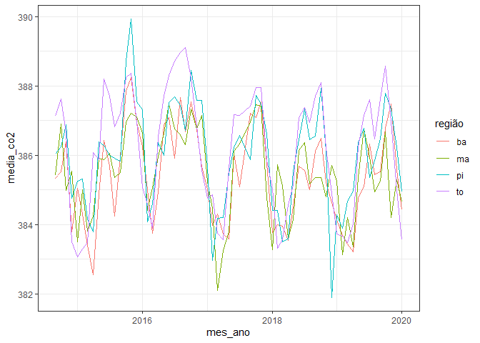
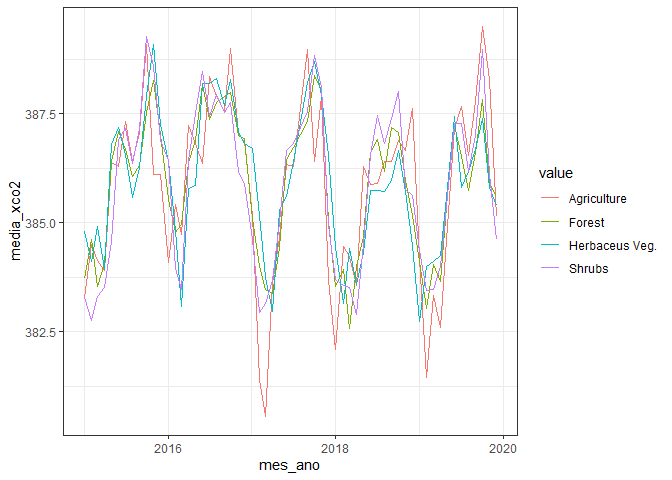

<!-- README.md is generated from README.Rmd. Please edit that file -->

## Pacotes exigidos

``` r
library(ggpubr)
library(tidyverse)
library(geobr)
library(writexl)
library(sp)
library(gstat)
source("r/graficos.R")
source("r/funcoes.R")
```

## Correção do sinal de SIF

sif_757: 2.6250912\*10^-19

sif_771: 2.57743\*10^-19

``` r
oco2_br <- read_rds("data/oco2_br.rds") %>% 
  mutate(
    sif_757 = fluorescence_radiance_757nm_idp_ph_sec_1_m_2_sr_1_um_1*2.6250912*10^(-19),
    sif_771 = fluorescence_radiance_771nm_idp_ph_sec_1_m_2_sr_1_um_1* 2.57743*10^(-19),
    SIF = (sif_757 + 1.5*sif_771)/2
  )
oco2_br %>% glimpse()
#> Rows: 37,387
#> Columns: 35
#> $ longitude                                                     <dbl> -70.5, -~
#> $ longitude_bnds                                                <chr> "-71.0:-~
#> $ latitude                                                      <dbl> -5.5, -4~
#> $ latitude_bnds                                                 <chr> "-6.0:-5~
#> $ time_yyyymmddhhmmss                                           <dbl> 2.014091~
#> $ time_bnds_yyyymmddhhmmss                                      <chr> "2014090~
#> $ altitude_km                                                   <dbl> 3307.8, ~
#> $ alt_bnds_km                                                   <chr> "0.0:661~
#> $ fluorescence_radiance_757nm_uncert_idp_ph_sec_1_m_2_sr_1_um_1 <dbl> 7.272876~
#> $ fluorescence_radiance_757nm_idp_ph_sec_1_m_2_sr_1_um_1        <dbl> 2.537127~
#> $ xco2_moles_mole_1                                             <dbl> 0.000394~
#> $ aerosol_total_aod                                             <dbl> 0.148579~
#> $ fluorescence_offset_relative_771nm_idp                        <dbl> 0.016753~
#> $ fluorescence_at_reference_ph_sec_1_m_2_sr_1_um_1              <dbl> 2.615319~
#> $ fluorescence_radiance_771nm_idp_ph_sec_1_m_2_sr_1_um_1        <dbl> 3.088582~
#> $ fluorescence_offset_relative_757nm_idp                        <dbl> 0.013969~
#> $ fluorescence_radiance_771nm_uncert_idp_ph_sec_1_m_2_sr_1_um_1 <dbl> 5.577878~
#> $ xco2                                                          <dbl> 394.3686~
#> $ data                                                          <dttm> 2014-09~
#> $ ano                                                           <dbl> 2014, 20~
#> $ mes                                                           <dbl> 9, 9, 9,~
#> $ dia                                                           <int> 6, 6, 6,~
#> $ dia_semana                                                    <dbl> 7, 7, 7,~
#> $ x                                                             <int> 7, 8, 11~
#> $ xco2_est                                                      <dbl> 392.7080~
#> $ delta                                                         <dbl> -1.66062~
#> $ XCO2                                                          <dbl> 387.2781~
#> $ flag_norte                                                    <lgl> TRUE, TR~
#> $ flag_nordeste                                                 <lgl> FALSE, F~
#> $ flag_sul                                                      <lgl> FALSE, F~
#> $ flag_sudeste                                                  <lgl> FALSE, F~
#> $ flag_centroeste                                               <lgl> FALSE, F~
#> $ sif_757                                                       <dbl> 0.666019~
#> $ sif_771                                                       <dbl> 0.796060~
#> $ SIF                                                           <dbl> 0.930054~
```

## Definição da região de trabalho

``` r
estados <- read_state(showProgress = FALSE)
matopiba_filtro <- estados$abbrev_state %in% c("MA","PI","TO","BA")
matopiba <- estados$geom[matopiba_filtro] 
matopiba %>% 
  ggplot2::ggplot() +
  ggplot2::geom_sf(fill="white", color="black",
          size=.15, show.legend = FALSE) +
  tema_mapa()
```

<!-- -->

## Dados de xCO2 e SIF

Inicialmente vamos extrair os polígonos com os limites dos estados do
objegio gerado pelo `{geobr}`.

``` r
pol_to <- estados$geom %>% purrr::pluck(7) %>% as.matrix()
pol_ma <- estados$geom %>% purrr::pluck(8) %>% as.matrix()
pol_ba <- estados$geom %>% purrr::pluck(16) %>% as.matrix()
pol_pi <- estados$geom %>% purrr::pluck(9) %>% as.matrix()
```

Utilizando a função `def_pol` para classificar se o ponto pertence, ou
não a um dos estados.

``` r
data_set <- oco2_br %>% 
  mutate(
    flag_to = def_pol(longitude, latitude, pol_to),
    flag_ma = def_pol(longitude, latitude, pol_ma),
    flag_ba = def_pol(longitude, latitude, pol_ba),
    flag_pi = def_pol(longitude, latitude, pol_pi)
  )
```

## Mapeamento

Plot dos pontos do satélite e da região do matopiba.

``` r
matopiba %>% 
  ggplot2::ggplot() +
  ggplot2::geom_sf(fill="white", color="black",
                   size=.15, show.legend = FALSE)+
  tema_mapa() +
  ggplot2::geom_point(data=data_set  %>%  dplyr::filter(flag_to |
                                                          flag_ma |
                                                          flag_pi |
                                                          flag_ba, ano == 2014) ,
                      ggplot2::aes(x=longitude,y=latitude),
                      shape=3,
                      col="red",
                      alpha=0.2)
```

<!-- -->

# Análise de série espaço-temporal

## Gráfico de concentração de CO<sub>2</sub>

``` r
data_set  %>%  
    tidyr::pivot_longer(
    dplyr::starts_with("flag"),
    names_to = "região",
    values_to = "flag"
  ) %>% 
  dplyr::filter(flag)  %>%  
  dplyr::mutate(região = stringr::str_remove(região,"flag_"))  %>% 
  dplyr::filter(região %in% c("ba","pi","to","ma")) %>% 
  dplyr::group_by(região, ano, mes) %>%  
  dplyr::summarise(media_co2 = mean(XCO2, na.rm=TRUE)) %>% 
    dplyr::mutate(
    mes_ano = lubridate::make_date(ano, mes, 1)
  )  %>%  
  ggplot2::ggplot(ggplot2::aes(x = mes_ano, y = media_co2,
                               color=região)) +
  ggplot2::geom_line() +
  ggplot2::theme_bw()
```

<!-- -->

## Gráfico do SIF

``` r
data_set  %>%  filter(SIF >= 0) %>% 
    tidyr::pivot_longer(
    dplyr::starts_with("flag"),
    names_to = "região",
    values_to = "flag"
  ) %>% 
  dplyr::filter(flag)  %>%  
  dplyr::mutate(região = stringr::str_remove(região,"flag_"))  %>% 
  dplyr::filter(região %in% c("ba","pi","to","ma")) %>% 
  dplyr::group_by(região, ano, mes) %>%  
  dplyr::summarise(media_sif = mean(SIF, na.rm=TRUE)) %>% 
    dplyr::mutate(
    mes_ano = lubridate::make_date(ano, mes, 1)
  )  %>%  
  ggplot2::ggplot(ggplot2::aes(x = mes_ano, y = media_sif,
                               color=região)) +
  ggplot2::geom_line() +
  ggplot2::theme_bw()
```

<!-- --> \# Buscar
temperatura de superficie land temperatura surface

## Tabela de médias de FCO2

``` r
tab_oco2_sif_media <- data_set  %>%  filter(SIF >= 0) %>% 
    tidyr::pivot_longer(
    dplyr::starts_with("flag"),
    names_to = "região",
    values_to = "flag"
  ) %>% 
  dplyr::filter(flag)  %>%  
  dplyr::mutate(região = stringr::str_remove(região,"flag_"))  %>% 
  dplyr::filter(região %in% c("ba","pi","to","ma")) %>% 
  dplyr::group_by(região, ano, mes, longitude, latitude) %>%  
  dplyr::summarise(media_sif = mean(SIF, na.rm=TRUE),
                   media_xco2 = mean(XCO2, na.rm=TRUE),
                   #latitude = mean(latitude, na.rm=TRUE),
                   #longitude = mean(longitude, na.rm=TRUE)
                   ) %>% 
    dplyr::mutate(
    mes_ano = lubridate::make_date(ano, mes, 1)
  )
write_xlsx(tab_oco2_sif_media, "data/medias_oco2_sif.xlsx")
```

## Gráficos de dispersão

``` r
tab_oco2_sif_media %>% 
  group_by(região, ano, mes) %>%  
  dplyr::summarise(media_sif = mean(media_sif, na.rm=TRUE),
                   media_xco2 = mean(media_xco2, na.rm=TRUE)
  ) %>% 
  ggscatter(
    x = "media_sif", y = "media_xco2",
    color = "região", palette = "jco",
    add = "reg.line"
  ) + coord_cartesian(ylim = c(382.5,392))+
  facet_wrap(~região) +
  stat_cor(label.y = 390) + 
  stat_regline_equation(label.y = 391.2)
```

<!-- -->

## Faça o download da tabela de médias

[medias_oco2_sif.xlsx](https://github.com/arpanosso/matopiba-xco2-sif/raw/master/data/medias_oco2_sif.xlsx)

## Análise geoestatística

### Criando o modelo de variabilidade espacial

Inicialmente, devemos criar o banco de dados com as amostras para a
geoestatística espaço-temporal.

``` r
dados_geo <- data_set  %>%  filter(SIF >= 0) %>% 
    tidyr::pivot_longer(
    dplyr::starts_with("flag"),
    names_to = "região",
    values_to = "flag"
  ) %>% 
  dplyr::filter(flag)  %>%  
  dplyr::mutate(região = stringr::str_remove(região,"flag_"))  %>% 
  dplyr::filter(região %in% c("ba","pi","to","ma")) %>% 
  mutate(
    mes_ano = lubridate::make_date(ano, mes, 1)
  ) %>% 
  select(longitude, latitude, mes_ano, XCO2, SIF)
dados_geo %>% glimpse()
#> Rows: 7,137
#> Columns: 5
#> $ longitude <dbl> -45.5, -45.5, -45.5, -45.5, -45.5, -44.5, -44.5, -44.5, -44.~
#> $ latitude  <dbl> -7.5, -6.5, -5.5, -4.5, -3.5, -12.5, -11.5, -10.5, -9.5, -8.~
#> $ mes_ano   <date> 2014-09-01, 2014-09-01, 2014-09-01, 2014-09-01, 2014-09-01,~
#> $ XCO2      <dbl> 386.7473, 384.4216, 389.8342, 388.0266, 381.5863, 386.5267, ~
#> $ SIF       <dbl> 0.4928928, 0.2229115, 0.1562369, 0.7605132, 1.1376032, 1.519~
```

Criando o grid de refinamento para a plotagem de pontos em locais não
amostrados

``` r
minX_pol <- min(pol_ma[,1],pol_to[,1],pol_pi[,1],pol_ba[,1])
maxX_pol <- max(pol_ma[,1],pol_to[,1],pol_pi[,1],pol_ba[,1])
minY_pol <- min(pol_ma[,2],pol_to[,2],pol_pi[,2],pol_ba[,2])
maxY_pol <- max(pol_ma[,2],pol_to[,2],pol_pi[,2],pol_ba[,2])
#x<-df_aux$x
#y<-df_aux$y
dis <- .1 #Distância entre pontos
grid <- expand.grid(X=seq(min(minX_pol),max(maxX_pol),dis), Y=seq(min(minY_pol),max(maxY_pol),dis))
gridded(grid) = ~ X + Y
plot(grid)
```

<!-- -->

Vamos filtrar para uma data específica e criar

``` r
lista_datas <- dados_geo$mes_ano %>% unique()
data_especifica <- "2014-09-01"
df_aux <- dados_geo %>% filter(mes_ano == data_especifica) %>% 
  mutate(x = longitude, y=latitude) %>% 
  select(x, y, XCO2) %>% 
  group_by(x,y) %>% 
  summarise(XCO2 = mean(XCO2))
coordinates(df_aux)= ~ x+y
form<-XCO2~1
```

Verificando o Variograma experimental

``` r
vario <- variogram(form, data=df_aux, cutoff=20, width=1.5,cressie=FALSE)
# vario  %>%
#   ggplot(aes(x=dist, y=gamma)) +
#   geom_point()
m_vario <- fit.variogram(vario,
                         fit.method = 7,
                         vgm(1, "Sph", 10, 0))
```

``` r
sqr.f1<-round(attr(m_vario, "SSErr"),4); c0<-round(m_vario$psill[[1]],4); c0_c1<-round(sum(m_vario$psill),4);a<-round(m_vario$range[[2]],2)
r2<-round(r2findWLS(m_vario,vario),8)
texto_ajuste <- paste("Esf(C0= ",c0,"; C0+C1= ", c0_c1, "; a= ", a,"; SQR = ", sqr.f1,"; R² = ",r2,")",sep="")
preds = gstat::variogramLine(m_vario, maxdist = max(vario$dist))
semivar <- vario %>% 
  ggplot(aes(dist, gamma)) +
  geom_point() +
  geom_line(data = preds) + 
  theme_bw() +
  labs(x="Distância de separação", y="Semivariância",
       title=data_especifica,
       subtitle = texto_ajuste)+
  coord_cartesian(ylim = c(0,max(vario$gamma)))
ggsave(paste0("img/variograma/",data_especifica,"_modelo.png"),semivar)
```

### Krigragem ordinária (KO)

Utilizando o algoritmo de KO, vamos estimar xco2/sif nos locais não
amostrados.

``` r
ko_var<-krige(formula=form, df_aux, grid, model=m_vario, 
    block=c(0,0),
    nsim=0,
    na.action=na.pass,
    debug.level=-1,  
    )
#> [using ordinary kriging]
#>   9% done100% done
```

Mapa de padrões espaciais.

``` r
krigagem <- tibble::as.tibble(ko_var) %>%  
  dplyr::mutate(flag = def_pol(X,Y,pol_ma) | def_pol(X,Y,pol_to) | def_pol(X,Y,pol_pi) | def_pol(X,Y,pol_ba)
                ) %>% 
  dplyr::filter(flag) %>% 
  ggplot(aes(x=X, y=Y),color="black") + 
  geom_tile(aes(fill = var1.pred)) +
  scale_fill_gradient(low = "yellow", high = "blue") + 
  coord_equal()+
  tema_mapa()+
  ggplot2::labs(fill="xco2 (ppm)",title = data_especifica) +
  ggspatial::annotation_scale(
    location="bl",
    plot_unit="km",
    height = ggplot2::unit(0.2,"cm"))
ggsave(paste0("img/krig/",data_especifica,"_modelo.png"),krigagem)
```

## Vamos criar um grid para testar todos os modelos

``` r
expand.grid(dia = lista_datas, 
            modelo = c("Sph","Exp","Gau"),
            formula = c("XCO2~1","SIF~1"))
#>            dia modelo formula
#> 1   2014-09-01    Sph  XCO2~1
#> 2   2014-10-01    Sph  XCO2~1
#> 3   2014-11-01    Sph  XCO2~1
#> 4   2014-12-01    Sph  XCO2~1
#> 5   2015-01-01    Sph  XCO2~1
#> 6   2015-02-01    Sph  XCO2~1
#> 7   2015-03-01    Sph  XCO2~1
#> 8   2015-04-01    Sph  XCO2~1
#> 9   2015-05-01    Sph  XCO2~1
#> 10  2015-06-01    Sph  XCO2~1
#> 11  2015-07-01    Sph  XCO2~1
#> 12  2015-08-01    Sph  XCO2~1
#> 13  2015-09-01    Sph  XCO2~1
#> 14  2015-10-01    Sph  XCO2~1
#> 15  2015-11-01    Sph  XCO2~1
#> 16  2015-12-01    Sph  XCO2~1
#> 17  2016-01-01    Sph  XCO2~1
#> 18  2016-02-01    Sph  XCO2~1
#> 19  2016-03-01    Sph  XCO2~1
#> 20  2016-04-01    Sph  XCO2~1
#> 21  2016-05-01    Sph  XCO2~1
#> 22  2016-06-01    Sph  XCO2~1
#> 23  2016-07-01    Sph  XCO2~1
#> 24  2016-08-01    Sph  XCO2~1
#> 25  2016-09-01    Sph  XCO2~1
#> 26  2016-10-01    Sph  XCO2~1
#> 27  2016-11-01    Sph  XCO2~1
#> 28  2016-12-01    Sph  XCO2~1
#> 29  2017-01-01    Sph  XCO2~1
#> 30  2017-02-01    Sph  XCO2~1
#> 31  2017-03-01    Sph  XCO2~1
#> 32  2017-04-01    Sph  XCO2~1
#> 33  2017-05-01    Sph  XCO2~1
#> 34  2017-06-01    Sph  XCO2~1
#> 35  2017-07-01    Sph  XCO2~1
#> 36  2017-09-01    Sph  XCO2~1
#> 37  2017-10-01    Sph  XCO2~1
#> 38  2017-11-01    Sph  XCO2~1
#> 39  2017-12-01    Sph  XCO2~1
#> 40  2018-01-01    Sph  XCO2~1
#> 41  2018-02-01    Sph  XCO2~1
#> 42  2018-03-01    Sph  XCO2~1
#> 43  2018-04-01    Sph  XCO2~1
#> 44  2018-05-01    Sph  XCO2~1
#> 45  2018-06-01    Sph  XCO2~1
#> 46  2018-07-01    Sph  XCO2~1
#> 47  2018-08-01    Sph  XCO2~1
#> 48  2018-09-01    Sph  XCO2~1
#> 49  2018-10-01    Sph  XCO2~1
#> 50  2018-11-01    Sph  XCO2~1
#> 51  2018-12-01    Sph  XCO2~1
#> 52  2019-01-01    Sph  XCO2~1
#> 53  2019-02-01    Sph  XCO2~1
#> 54  2019-03-01    Sph  XCO2~1
#> 55  2019-04-01    Sph  XCO2~1
#> 56  2019-05-01    Sph  XCO2~1
#> 57  2019-06-01    Sph  XCO2~1
#> 58  2019-07-01    Sph  XCO2~1
#> 59  2019-08-01    Sph  XCO2~1
#> 60  2019-09-01    Sph  XCO2~1
#> 61  2019-10-01    Sph  XCO2~1
#> 62  2019-11-01    Sph  XCO2~1
#> 63  2019-12-01    Sph  XCO2~1
#> 64  2020-01-01    Sph  XCO2~1
#> 65  2014-09-01    Exp  XCO2~1
#> 66  2014-10-01    Exp  XCO2~1
#> 67  2014-11-01    Exp  XCO2~1
#> 68  2014-12-01    Exp  XCO2~1
#> 69  2015-01-01    Exp  XCO2~1
#> 70  2015-02-01    Exp  XCO2~1
#> 71  2015-03-01    Exp  XCO2~1
#> 72  2015-04-01    Exp  XCO2~1
#> 73  2015-05-01    Exp  XCO2~1
#> 74  2015-06-01    Exp  XCO2~1
#> 75  2015-07-01    Exp  XCO2~1
#> 76  2015-08-01    Exp  XCO2~1
#> 77  2015-09-01    Exp  XCO2~1
#> 78  2015-10-01    Exp  XCO2~1
#> 79  2015-11-01    Exp  XCO2~1
#> 80  2015-12-01    Exp  XCO2~1
#> 81  2016-01-01    Exp  XCO2~1
#> 82  2016-02-01    Exp  XCO2~1
#> 83  2016-03-01    Exp  XCO2~1
#> 84  2016-04-01    Exp  XCO2~1
#> 85  2016-05-01    Exp  XCO2~1
#> 86  2016-06-01    Exp  XCO2~1
#> 87  2016-07-01    Exp  XCO2~1
#> 88  2016-08-01    Exp  XCO2~1
#> 89  2016-09-01    Exp  XCO2~1
#> 90  2016-10-01    Exp  XCO2~1
#> 91  2016-11-01    Exp  XCO2~1
#> 92  2016-12-01    Exp  XCO2~1
#> 93  2017-01-01    Exp  XCO2~1
#> 94  2017-02-01    Exp  XCO2~1
#> 95  2017-03-01    Exp  XCO2~1
#> 96  2017-04-01    Exp  XCO2~1
#> 97  2017-05-01    Exp  XCO2~1
#> 98  2017-06-01    Exp  XCO2~1
#> 99  2017-07-01    Exp  XCO2~1
#> 100 2017-09-01    Exp  XCO2~1
#> 101 2017-10-01    Exp  XCO2~1
#> 102 2017-11-01    Exp  XCO2~1
#> 103 2017-12-01    Exp  XCO2~1
#> 104 2018-01-01    Exp  XCO2~1
#> 105 2018-02-01    Exp  XCO2~1
#> 106 2018-03-01    Exp  XCO2~1
#> 107 2018-04-01    Exp  XCO2~1
#> 108 2018-05-01    Exp  XCO2~1
#> 109 2018-06-01    Exp  XCO2~1
#> 110 2018-07-01    Exp  XCO2~1
#> 111 2018-08-01    Exp  XCO2~1
#> 112 2018-09-01    Exp  XCO2~1
#> 113 2018-10-01    Exp  XCO2~1
#> 114 2018-11-01    Exp  XCO2~1
#> 115 2018-12-01    Exp  XCO2~1
#> 116 2019-01-01    Exp  XCO2~1
#> 117 2019-02-01    Exp  XCO2~1
#> 118 2019-03-01    Exp  XCO2~1
#> 119 2019-04-01    Exp  XCO2~1
#> 120 2019-05-01    Exp  XCO2~1
#> 121 2019-06-01    Exp  XCO2~1
#> 122 2019-07-01    Exp  XCO2~1
#> 123 2019-08-01    Exp  XCO2~1
#> 124 2019-09-01    Exp  XCO2~1
#> 125 2019-10-01    Exp  XCO2~1
#> 126 2019-11-01    Exp  XCO2~1
#> 127 2019-12-01    Exp  XCO2~1
#> 128 2020-01-01    Exp  XCO2~1
#> 129 2014-09-01    Gau  XCO2~1
#> 130 2014-10-01    Gau  XCO2~1
#> 131 2014-11-01    Gau  XCO2~1
#> 132 2014-12-01    Gau  XCO2~1
#> 133 2015-01-01    Gau  XCO2~1
#> 134 2015-02-01    Gau  XCO2~1
#> 135 2015-03-01    Gau  XCO2~1
#> 136 2015-04-01    Gau  XCO2~1
#> 137 2015-05-01    Gau  XCO2~1
#> 138 2015-06-01    Gau  XCO2~1
#> 139 2015-07-01    Gau  XCO2~1
#> 140 2015-08-01    Gau  XCO2~1
#> 141 2015-09-01    Gau  XCO2~1
#> 142 2015-10-01    Gau  XCO2~1
#> 143 2015-11-01    Gau  XCO2~1
#> 144 2015-12-01    Gau  XCO2~1
#> 145 2016-01-01    Gau  XCO2~1
#> 146 2016-02-01    Gau  XCO2~1
#> 147 2016-03-01    Gau  XCO2~1
#> 148 2016-04-01    Gau  XCO2~1
#> 149 2016-05-01    Gau  XCO2~1
#> 150 2016-06-01    Gau  XCO2~1
#> 151 2016-07-01    Gau  XCO2~1
#> 152 2016-08-01    Gau  XCO2~1
#> 153 2016-09-01    Gau  XCO2~1
#> 154 2016-10-01    Gau  XCO2~1
#> 155 2016-11-01    Gau  XCO2~1
#> 156 2016-12-01    Gau  XCO2~1
#> 157 2017-01-01    Gau  XCO2~1
#> 158 2017-02-01    Gau  XCO2~1
#> 159 2017-03-01    Gau  XCO2~1
#> 160 2017-04-01    Gau  XCO2~1
#> 161 2017-05-01    Gau  XCO2~1
#> 162 2017-06-01    Gau  XCO2~1
#> 163 2017-07-01    Gau  XCO2~1
#> 164 2017-09-01    Gau  XCO2~1
#> 165 2017-10-01    Gau  XCO2~1
#> 166 2017-11-01    Gau  XCO2~1
#> 167 2017-12-01    Gau  XCO2~1
#> 168 2018-01-01    Gau  XCO2~1
#> 169 2018-02-01    Gau  XCO2~1
#> 170 2018-03-01    Gau  XCO2~1
#> 171 2018-04-01    Gau  XCO2~1
#> 172 2018-05-01    Gau  XCO2~1
#> 173 2018-06-01    Gau  XCO2~1
#> 174 2018-07-01    Gau  XCO2~1
#> 175 2018-08-01    Gau  XCO2~1
#> 176 2018-09-01    Gau  XCO2~1
#> 177 2018-10-01    Gau  XCO2~1
#> 178 2018-11-01    Gau  XCO2~1
#> 179 2018-12-01    Gau  XCO2~1
#> 180 2019-01-01    Gau  XCO2~1
#> 181 2019-02-01    Gau  XCO2~1
#> 182 2019-03-01    Gau  XCO2~1
#> 183 2019-04-01    Gau  XCO2~1
#> 184 2019-05-01    Gau  XCO2~1
#> 185 2019-06-01    Gau  XCO2~1
#> 186 2019-07-01    Gau  XCO2~1
#> 187 2019-08-01    Gau  XCO2~1
#> 188 2019-09-01    Gau  XCO2~1
#> 189 2019-10-01    Gau  XCO2~1
#> 190 2019-11-01    Gau  XCO2~1
#> 191 2019-12-01    Gau  XCO2~1
#> 192 2020-01-01    Gau  XCO2~1
#> 193 2014-09-01    Sph   SIF~1
#> 194 2014-10-01    Sph   SIF~1
#> 195 2014-11-01    Sph   SIF~1
#> 196 2014-12-01    Sph   SIF~1
#> 197 2015-01-01    Sph   SIF~1
#> 198 2015-02-01    Sph   SIF~1
#> 199 2015-03-01    Sph   SIF~1
#> 200 2015-04-01    Sph   SIF~1
#> 201 2015-05-01    Sph   SIF~1
#> 202 2015-06-01    Sph   SIF~1
#> 203 2015-07-01    Sph   SIF~1
#> 204 2015-08-01    Sph   SIF~1
#> 205 2015-09-01    Sph   SIF~1
#> 206 2015-10-01    Sph   SIF~1
#> 207 2015-11-01    Sph   SIF~1
#> 208 2015-12-01    Sph   SIF~1
#> 209 2016-01-01    Sph   SIF~1
#> 210 2016-02-01    Sph   SIF~1
#> 211 2016-03-01    Sph   SIF~1
#> 212 2016-04-01    Sph   SIF~1
#> 213 2016-05-01    Sph   SIF~1
#> 214 2016-06-01    Sph   SIF~1
#> 215 2016-07-01    Sph   SIF~1
#> 216 2016-08-01    Sph   SIF~1
#> 217 2016-09-01    Sph   SIF~1
#> 218 2016-10-01    Sph   SIF~1
#> 219 2016-11-01    Sph   SIF~1
#> 220 2016-12-01    Sph   SIF~1
#> 221 2017-01-01    Sph   SIF~1
#> 222 2017-02-01    Sph   SIF~1
#> 223 2017-03-01    Sph   SIF~1
#> 224 2017-04-01    Sph   SIF~1
#> 225 2017-05-01    Sph   SIF~1
#> 226 2017-06-01    Sph   SIF~1
#> 227 2017-07-01    Sph   SIF~1
#> 228 2017-09-01    Sph   SIF~1
#> 229 2017-10-01    Sph   SIF~1
#> 230 2017-11-01    Sph   SIF~1
#> 231 2017-12-01    Sph   SIF~1
#> 232 2018-01-01    Sph   SIF~1
#> 233 2018-02-01    Sph   SIF~1
#> 234 2018-03-01    Sph   SIF~1
#> 235 2018-04-01    Sph   SIF~1
#> 236 2018-05-01    Sph   SIF~1
#> 237 2018-06-01    Sph   SIF~1
#> 238 2018-07-01    Sph   SIF~1
#> 239 2018-08-01    Sph   SIF~1
#> 240 2018-09-01    Sph   SIF~1
#> 241 2018-10-01    Sph   SIF~1
#> 242 2018-11-01    Sph   SIF~1
#> 243 2018-12-01    Sph   SIF~1
#> 244 2019-01-01    Sph   SIF~1
#> 245 2019-02-01    Sph   SIF~1
#> 246 2019-03-01    Sph   SIF~1
#> 247 2019-04-01    Sph   SIF~1
#> 248 2019-05-01    Sph   SIF~1
#> 249 2019-06-01    Sph   SIF~1
#> 250 2019-07-01    Sph   SIF~1
#> 251 2019-08-01    Sph   SIF~1
#> 252 2019-09-01    Sph   SIF~1
#> 253 2019-10-01    Sph   SIF~1
#> 254 2019-11-01    Sph   SIF~1
#> 255 2019-12-01    Sph   SIF~1
#> 256 2020-01-01    Sph   SIF~1
#> 257 2014-09-01    Exp   SIF~1
#> 258 2014-10-01    Exp   SIF~1
#> 259 2014-11-01    Exp   SIF~1
#> 260 2014-12-01    Exp   SIF~1
#> 261 2015-01-01    Exp   SIF~1
#> 262 2015-02-01    Exp   SIF~1
#> 263 2015-03-01    Exp   SIF~1
#> 264 2015-04-01    Exp   SIF~1
#> 265 2015-05-01    Exp   SIF~1
#> 266 2015-06-01    Exp   SIF~1
#> 267 2015-07-01    Exp   SIF~1
#> 268 2015-08-01    Exp   SIF~1
#> 269 2015-09-01    Exp   SIF~1
#> 270 2015-10-01    Exp   SIF~1
#> 271 2015-11-01    Exp   SIF~1
#> 272 2015-12-01    Exp   SIF~1
#> 273 2016-01-01    Exp   SIF~1
#> 274 2016-02-01    Exp   SIF~1
#> 275 2016-03-01    Exp   SIF~1
#> 276 2016-04-01    Exp   SIF~1
#> 277 2016-05-01    Exp   SIF~1
#> 278 2016-06-01    Exp   SIF~1
#> 279 2016-07-01    Exp   SIF~1
#> 280 2016-08-01    Exp   SIF~1
#> 281 2016-09-01    Exp   SIF~1
#> 282 2016-10-01    Exp   SIF~1
#> 283 2016-11-01    Exp   SIF~1
#> 284 2016-12-01    Exp   SIF~1
#> 285 2017-01-01    Exp   SIF~1
#> 286 2017-02-01    Exp   SIF~1
#> 287 2017-03-01    Exp   SIF~1
#> 288 2017-04-01    Exp   SIF~1
#> 289 2017-05-01    Exp   SIF~1
#> 290 2017-06-01    Exp   SIF~1
#> 291 2017-07-01    Exp   SIF~1
#> 292 2017-09-01    Exp   SIF~1
#> 293 2017-10-01    Exp   SIF~1
#> 294 2017-11-01    Exp   SIF~1
#> 295 2017-12-01    Exp   SIF~1
#> 296 2018-01-01    Exp   SIF~1
#> 297 2018-02-01    Exp   SIF~1
#> 298 2018-03-01    Exp   SIF~1
#> 299 2018-04-01    Exp   SIF~1
#> 300 2018-05-01    Exp   SIF~1
#> 301 2018-06-01    Exp   SIF~1
#> 302 2018-07-01    Exp   SIF~1
#> 303 2018-08-01    Exp   SIF~1
#> 304 2018-09-01    Exp   SIF~1
#> 305 2018-10-01    Exp   SIF~1
#> 306 2018-11-01    Exp   SIF~1
#> 307 2018-12-01    Exp   SIF~1
#> 308 2019-01-01    Exp   SIF~1
#> 309 2019-02-01    Exp   SIF~1
#> 310 2019-03-01    Exp   SIF~1
#> 311 2019-04-01    Exp   SIF~1
#> 312 2019-05-01    Exp   SIF~1
#> 313 2019-06-01    Exp   SIF~1
#> 314 2019-07-01    Exp   SIF~1
#> 315 2019-08-01    Exp   SIF~1
#> 316 2019-09-01    Exp   SIF~1
#> 317 2019-10-01    Exp   SIF~1
#> 318 2019-11-01    Exp   SIF~1
#> 319 2019-12-01    Exp   SIF~1
#> 320 2020-01-01    Exp   SIF~1
#> 321 2014-09-01    Gau   SIF~1
#> 322 2014-10-01    Gau   SIF~1
#> 323 2014-11-01    Gau   SIF~1
#> 324 2014-12-01    Gau   SIF~1
#> 325 2015-01-01    Gau   SIF~1
#> 326 2015-02-01    Gau   SIF~1
#> 327 2015-03-01    Gau   SIF~1
#> 328 2015-04-01    Gau   SIF~1
#> 329 2015-05-01    Gau   SIF~1
#> 330 2015-06-01    Gau   SIF~1
#> 331 2015-07-01    Gau   SIF~1
#> 332 2015-08-01    Gau   SIF~1
#> 333 2015-09-01    Gau   SIF~1
#> 334 2015-10-01    Gau   SIF~1
#> 335 2015-11-01    Gau   SIF~1
#> 336 2015-12-01    Gau   SIF~1
#> 337 2016-01-01    Gau   SIF~1
#> 338 2016-02-01    Gau   SIF~1
#> 339 2016-03-01    Gau   SIF~1
#> 340 2016-04-01    Gau   SIF~1
#> 341 2016-05-01    Gau   SIF~1
#> 342 2016-06-01    Gau   SIF~1
#> 343 2016-07-01    Gau   SIF~1
#> 344 2016-08-01    Gau   SIF~1
#> 345 2016-09-01    Gau   SIF~1
#> 346 2016-10-01    Gau   SIF~1
#> 347 2016-11-01    Gau   SIF~1
#> 348 2016-12-01    Gau   SIF~1
#> 349 2017-01-01    Gau   SIF~1
#> 350 2017-02-01    Gau   SIF~1
#> 351 2017-03-01    Gau   SIF~1
#> 352 2017-04-01    Gau   SIF~1
#> 353 2017-05-01    Gau   SIF~1
#> 354 2017-06-01    Gau   SIF~1
#> 355 2017-07-01    Gau   SIF~1
#> 356 2017-09-01    Gau   SIF~1
#> 357 2017-10-01    Gau   SIF~1
#> 358 2017-11-01    Gau   SIF~1
#> 359 2017-12-01    Gau   SIF~1
#> 360 2018-01-01    Gau   SIF~1
#> 361 2018-02-01    Gau   SIF~1
#> 362 2018-03-01    Gau   SIF~1
#> 363 2018-04-01    Gau   SIF~1
#> 364 2018-05-01    Gau   SIF~1
#> 365 2018-06-01    Gau   SIF~1
#> 366 2018-07-01    Gau   SIF~1
#> 367 2018-08-01    Gau   SIF~1
#> 368 2018-09-01    Gau   SIF~1
#> 369 2018-10-01    Gau   SIF~1
#> 370 2018-11-01    Gau   SIF~1
#> 371 2018-12-01    Gau   SIF~1
#> 372 2019-01-01    Gau   SIF~1
#> 373 2019-02-01    Gau   SIF~1
#> 374 2019-03-01    Gau   SIF~1
#> 375 2019-04-01    Gau   SIF~1
#> 376 2019-05-01    Gau   SIF~1
#> 377 2019-06-01    Gau   SIF~1
#> 378 2019-07-01    Gau   SIF~1
#> 379 2019-08-01    Gau   SIF~1
#> 380 2019-09-01    Gau   SIF~1
#> 381 2019-10-01    Gau   SIF~1
#> 382 2019-11-01    Gau   SIF~1
#> 383 2019-12-01    Gau   SIF~1
#> 384 2020-01-01    Gau   SIF~1
```

## função para análise geoestatística

``` r
# my_geo_stat <- function()
```
