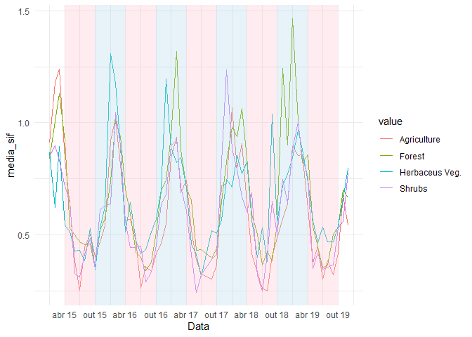
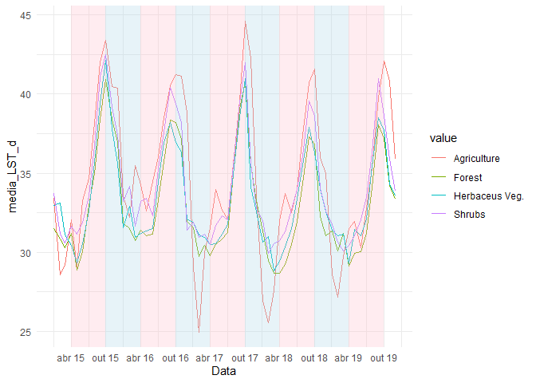
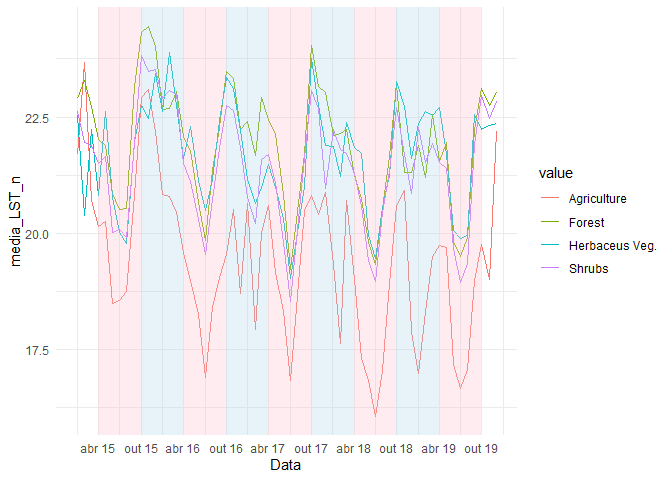
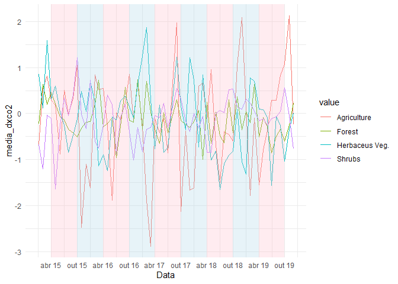
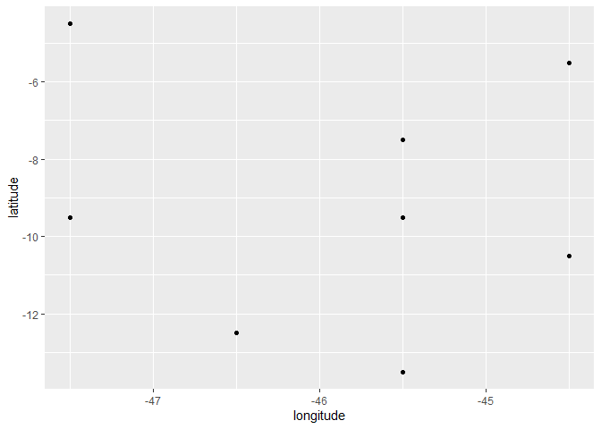
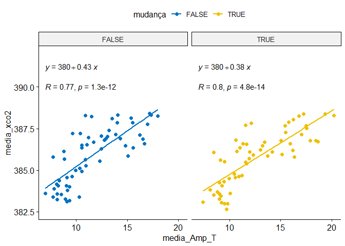

<!-- README.md is generated from README.Rmd. Please edit that file -->

## Pacotes exigidos

``` r
library(patchwork)
library(tidyverse)
library(writexl)
library(ggpubr)
library(gstat)
library(geobr)
library(sp)
source("r/graficos.R")
source("r/funcoes.R")
```

## Correção do sinal de SIF

sif_757: 2.6250912\*10^-19

sif_771: 2.57743\*10^-19

``` r
lst_dn<- read_rds("data/lst_dn.rds")
uso_solo <- read_rds("data/land_use2.rds")
oco2_br <- read_rds("data/oco2_br.rds") %>% 
  mutate(
    sif_757 = fluorescence_radiance_757nm_idp_ph_sec_1_m_2_sr_1_um_1*2.6250912*10^(-19),
    sif_771 = fluorescence_radiance_771nm_idp_ph_sec_1_m_2_sr_1_um_1* 2.57743*10^(-19),
    SIF = (sif_757 + 1.5*sif_771)/2
  )
oco2_br %>% glimpse()
#> Rows: 37,387
#> Columns: 35
#> $ longitude                                                     <dbl> -70.5, -~
#> $ longitude_bnds                                                <chr> "-71.0:-~
#> $ latitude                                                      <dbl> -5.5, -4~
#> $ latitude_bnds                                                 <chr> "-6.0:-5~
#> $ time_yyyymmddhhmmss                                           <dbl> 2.014091~
#> $ time_bnds_yyyymmddhhmmss                                      <chr> "2014090~
#> $ altitude_km                                                   <dbl> 3307.8, ~
#> $ alt_bnds_km                                                   <chr> "0.0:661~
#> $ fluorescence_radiance_757nm_uncert_idp_ph_sec_1_m_2_sr_1_um_1 <dbl> 7.272876~
#> $ fluorescence_radiance_757nm_idp_ph_sec_1_m_2_sr_1_um_1        <dbl> 2.537127~
#> $ xco2_moles_mole_1                                             <dbl> 0.000394~
#> $ aerosol_total_aod                                             <dbl> 0.148579~
#> $ fluorescence_offset_relative_771nm_idp                        <dbl> 0.016753~
#> $ fluorescence_at_reference_ph_sec_1_m_2_sr_1_um_1              <dbl> 2.615319~
#> $ fluorescence_radiance_771nm_idp_ph_sec_1_m_2_sr_1_um_1        <dbl> 3.088582~
#> $ fluorescence_offset_relative_757nm_idp                        <dbl> 0.013969~
#> $ fluorescence_radiance_771nm_uncert_idp_ph_sec_1_m_2_sr_1_um_1 <dbl> 5.577878~
#> $ xco2                                                          <dbl> 394.3686~
#> $ data                                                          <dttm> 2014-09~
#> $ ano                                                           <dbl> 2014, 20~
#> $ mes                                                           <dbl> 9, 9, 9,~
#> $ dia                                                           <int> 6, 6, 6,~
#> $ dia_semana                                                    <dbl> 7, 7, 7,~
#> $ x                                                             <int> 7, 8, 11~
#> $ xco2_est                                                      <dbl> 392.7080~
#> $ delta                                                         <dbl> -1.66062~
#> $ XCO2                                                          <dbl> 387.2781~
#> $ flag_norte                                                    <lgl> TRUE, TR~
#> $ flag_nordeste                                                 <lgl> FALSE, F~
#> $ flag_sul                                                      <lgl> FALSE, F~
#> $ flag_sudeste                                                  <lgl> FALSE, F~
#> $ flag_centroeste                                               <lgl> FALSE, F~
#> $ sif_757                                                       <dbl> 0.666019~
#> $ sif_771                                                       <dbl> 0.796060~
#> $ SIF                                                           <dbl> 0.930054~
```

## Definição da região de trabalho

``` r
estados <- read_state(showProgress = FALSE) # carregando estados
matopiba_filtro <- estados$abbrev_state %in% c("MA","PI","TO","BA") # filtrando estados
matopiba <- estados$geom[matopiba_filtro] ## estados do matopiba

microregiao <- read_micro_region(showProgress = FALSE) # buscando as microregioes
micro_nomes <- read.table("data-raw/microregiao_nomes.txt",h=TRUE,sep="\t") ## dados retirados da wikipedia
microregiao_filtro <- microregiao$name_micro %in% micro_nomes$Microrregião ## filtro por microregiao

poli_micro <- read.table("data-raw/digit.dat",sep=",") %>% as.matrix() ## lendo o polígono editado manualmente pelo surfer
colnames(poli_micro) <- c("X","Y") ## renomaenado colunas

matopiba_micro <- microregiao$geom[microregiao_filtro]
matopiba_micro <- matopiba_micro[-15]
matopiba %>% 
  ggplot2::ggplot() +
  ggplot2::geom_sf(fill="white", color="black",
          size=.15, show.legend = FALSE) +
  tema_mapa()+
  geom_sf(data=matopiba_micro,fill="gray")
```

<!-- -->

## Dados de xCO2 e SIF

Inicialmente vamos extrair os polígonos com os limites dos estados do
objegio gerado pelo `{geobr}`.

``` r
pol_to <- estados$geom %>% purrr::pluck(7) %>% as.matrix()
pol_ma <- estados$geom %>% purrr::pluck(8) %>% as.matrix()
pol_ba <- estados$geom %>% purrr::pluck(16) %>% as.matrix()
pol_pi <- estados$geom %>% purrr::pluck(9) %>% as.matrix()
```

Utilizando a função `def_pol` para classificar se o ponto pertence, ou
não a um dos estados.

``` r
data_set <- oco2_br %>% 
  mutate(
    flag_to = def_pol(longitude, latitude, pol_to),
    flag_ma = def_pol(longitude, latitude, pol_ma),
    flag_ba = def_pol(longitude, latitude, pol_ba),
    flag_pi = def_pol(longitude, latitude, pol_pi),
    flag_matopiba = def_pol(longitude, latitude, poli_micro)
  )
```

## Mapeamento

Plot dos pontos do satélite e da região do matopiba.

``` r
matopiba %>% 
  ggplot2::ggplot() +
  ggplot2::geom_sf(fill="white", color="black",
                   size=.15, show.legend = FALSE)+
  tema_mapa() +
  ggplot2::geom_point(data=data_set  %>%  dplyr::filter(flag_to |
                                                          flag_ma |
                                                          flag_pi |
                                                          flag_ba |
                                                          flag_matopiba, ano == 2014) ,
                      ggplot2::aes(x=longitude,y=latitude),
                      shape=3,
                      col="red",
                      alpha=0.2)
```

<!-- -->

## Tabela de médias de FCO2

``` r
tab_oco2_sif_media <- data_set  %>%  filter(SIF >= 0) %>% 
    tidyr::pivot_longer(
    dplyr::starts_with("flag"),
    names_to = "região",
    values_to = "flag"
  ) %>% 
  dplyr::filter(flag)  %>%  
  dplyr::mutate(região = stringr::str_remove(região,"flag_"))  %>% 
  dplyr::filter(região %in% c("ba","pi","to","ma")) %>% 
  dplyr::group_by(região, ano, mes, longitude, latitude) %>%  
  dplyr::summarise(media_sif = mean(SIF, na.rm=TRUE),
                   media_xco2 = mean(XCO2, na.rm=TRUE),
                   #latitude = mean(latitude, na.rm=TRUE),
                   #longitude = mean(longitude, na.rm=TRUE)
                   ) %>% 
    dplyr::mutate(
    mes_ano = lubridate::make_date(ano, mes, 1)
  )
write_xlsx(tab_oco2_sif_media, "data/medias_oco2_sif.xlsx")
```

## Faça o download da tabela de médias

[medias_oco2_sif.xlsx](https://github.com/arpanosso/matopiba-xco2-sif/raw/master/data/medias_oco2_sif.xlsx)

## Juntando os diferentes usos do solo para a região

``` r
uso_solo_uni <-uso_solo %>% 
  pivot_longer(LU_15:LU_19,names_to = "ano") %>% 
  arrange(ano) %>% 
  mutate(ano = as.numeric(str_remove(ano,"LU_"))+2000) %>% 
  rename(longitude = lon,latitude = lat)
uso_solo_uni %>% 
  ggplot(aes(longitude, latitude, color=value)) +
  geom_point() +
  facet_wrap(~ano)
```

<!-- -->

``` r
matopiba %>% 
  ggplot() +
  geom_sf(fill="white", color="black",
                   size=.15, show.legend = FALSE)+
  tema_mapa() +
  geom_point(data=uso_solo_uni,
                      ggplot2::aes(x=longitude,y=latitude,color=value)) +
    geom_polygon(data=poli_micro %>% as.tibble(),
               aes(x=X,y=Y),color="red", fill="lightblue", alpha=.0,
               size=1)
```

<!-- -->

``` r
  facet_wrap(~ano)
#> <ggproto object: Class FacetWrap, Facet, gg>
#>     compute_layout: function
#>     draw_back: function
#>     draw_front: function
#>     draw_labels: function
#>     draw_panels: function
#>     finish_data: function
#>     init_scales: function
#>     map_data: function
#>     params: list
#>     setup_data: function
#>     setup_params: function
#>     shrink: TRUE
#>     train_scales: function
#>     vars: function
#>     super:  <ggproto object: Class FacetWrap, Facet, gg>
```

## Juntando as duas bases de dados

``` r
tab_oco2_sif_uso <- tab_oco2_sif_media %>%
  group_by(longitude, latitude, ano) %>% 
  summarise(
    media_sif = mean(media_sif),
    media_xco2 = mean(media_xco2)
  ) %>% 
  left_join(uso_solo_uni,c("longitude","latitude","ano")) %>% 
  drop_na()

tab_oco2_sif_media <- tab_oco2_sif_media %>%
  left_join(uso_solo_uni,c("longitude","latitude","ano")) %>% 
  drop_na()

names(lst_dn) <- c("longitude","latitude","ano","mes","LST_d","LST_n" )

tab_oco2_sif_media <- left_join(tab_oco2_sif_media, lst_dn,
          c("longitude","latitude","ano","mes"))

tab_oco2_sif_media <- tab_oco2_sif_media %>% 
  mutate(
    Amp_T = LST_d - LST_n
  )
  
write_xlsx(tab_oco2_sif_media, "data/medias_oco2_sif_uso.xlsx")
```

## Faça o download da tabela de médias e usos do solo de 2015 a 2019

[medias_oco2_sif.xlsx](https://github.com/arpanosso/matopiba-xco2-sif/raw/master/data/medias_oco2_sif_uso.xlsx)

# RESULTADOS - variabilidade temporal

``` r
tab_oco2_sif_media  %>%  
  mutate(
        flag_matopiba = def_pol(longitude, latitude, poli_micro)
  ) %>% 
  filter(flag_matopiba) %>% 
  group_by(value, ano, mes) %>%  
  mutate(
    media_xco2 = mean(media_xco2)
  ) %>% 
  ggplot(aes(x = mes_ano, y = media_xco2,
                               color=value)) +
  geom_line() +
  theme_bw()
```

<!-- -->

``` r
tab_oco2_sif_media  %>%  
    mutate(
        flag_matopiba = def_pol(longitude, latitude, poli_micro)
  ) %>% 
  filter(flag_matopiba) %>% 
  group_by(value, ano, mes) %>%  
  mutate(
    media_sif = mean(media_sif)
  ) %>% 
  ggplot(aes(x = mes_ano, y = media_sif,
                               color=value)) +
  geom_line() +
  theme_bw()
```

<!-- -->

``` r
tab_oco2_sif_media  %>%  
    mutate(
        flag_matopiba = def_pol(longitude, latitude, poli_micro)
  ) %>% 
  filter(flag_matopiba) %>% 
  group_by(value, ano, mes) %>%  
  mutate(
    media_Amp_T = mean(Amp_T, na.rm=TRUE)
  ) %>% 
  ggplot(aes(x = mes_ano, y = media_Amp_T,
                               color=value)) +
  geom_line() +
  theme_bw()
```

<!-- -->

``` r
tab_oco2_sif_media  %>%  
    mutate(
        flag_matopiba = def_pol(longitude, latitude, poli_micro)
  ) %>% 
  filter(flag_matopiba) %>% 
  group_by(value, ano, mes) %>%  
  mutate(
    media_LST_d = mean(LST_d, na.rm=TRUE)
  ) %>% 
  ggplot(aes(x = mes_ano, y = media_LST_d,
                               color=value)) +
  geom_line() +
  theme_bw()
```

<!-- -->

``` r
tab_oco2_sif_media  %>%  
    mutate(
        flag_matopiba = def_pol(longitude, latitude, poli_micro)
  ) %>% 
  filter(flag_matopiba) %>% 
  group_by(value, ano, mes) %>%  
  mutate(
    media_LST_n = mean(LST_n,na.rm=TRUE)
  ) %>% 
  ggplot(aes(x = mes_ano, y = media_LST_n,
                               color=value)) +
  geom_line() +
  theme_bw()
```

<!-- --> \##
Correlação

``` r
mc <- tab_oco2_sif_media %>% ungroup() %>% 
  mutate(
    flag_matopiba = def_pol(longitude, latitude, poli_micro)
  ) %>% 
  filter(flag_matopiba) %>% 
  select(media_sif, media_xco2, Amp_T, LST_d, LST_n) %>% 
  drop_na() %>% 
  cor()
corrplot::corrplot.mixed(mc,upper = "ellipse",lower = "number",lower.col = "black")
```

<!-- -->

## Correlação por uso

``` r
land_uses <- tab_oco2_sif_media %>% pull(value) %>%  unique()

for(i in seq_along(land_uses)){
  print(land_uses[i])
  mc <- tab_oco2_sif_media %>% ungroup() %>% 
      mutate(
        flag_matopiba = def_pol(longitude, latitude, poli_micro)
  ) %>% 
  filter(flag_matopiba) %>% 
    filter(value==land_uses[i]) %>% 
    select(media_sif, media_xco2, Amp_T, LST_d, LST_n) %>% 
    drop_na() %>% 
    cor()
  corrplot::corrplot.mixed(mc,lower = "number",lower.col = "black")
}
#> [1] "Agriculture"
```

<!-- -->

    #> [1] "Herbaceus Veg."

<!-- -->

    #> [1] "Shrubs"

<!-- -->

    #> [1] "Forest"

<!-- -->

``` r
sc_sif <- tab_oco2_sif_media %>% 
  mutate(
        flag_matopiba = def_pol(longitude, latitude, poli_micro)
  ) %>% 
  filter(flag_matopiba) %>% 
  summarise(media_sif = mean(media_sif, na.rm=TRUE),
                   media_xco2 = mean(media_xco2, na.rm=TRUE)
  ) %>% filter(media_sif <= 2.5, media_xco2 <= 392.5 & media_xco2>=377.5) %>% 
  ggscatter(
    x = "media_sif", y = "media_xco2",
    add = "reg.line"
  ) + # coord_cartesian(ylim = c(382.5,392))+
  stat_cor(label.y = 395, label.x = .5) + 
  stat_regline_equation(label.y = 396.2, label.x = .5)+
  labs()

sc_amp <- tab_oco2_sif_media %>% 
  mutate(
        flag_matopiba = def_pol(longitude, latitude, poli_micro)
  ) %>% 
  filter(flag_matopiba) %>% 
  summarise(media_Amp_T = mean(Amp_T, na.rm=TRUE),
                   media_xco2 = mean(media_xco2, na.rm=TRUE)
  ) %>% filter(media_xco2 <= 392.5 & media_xco2>=377.5) %>%
  ggscatter(
    x = "media_Amp_T", y = "media_xco2",
    add = "reg.line", color="red"
  ) + # coord_cartesian(ylim = c(382.5,392))+
  stat_cor(label.y = 395, label.x = 2) + 
  stat_regline_equation(label.y = 396.2, label.x = 2) +
  labs(y="")

sc_sif | sc_amp
```

<!-- -->

``` r
tab_oco2_sif_media %>% 
  mutate(
        flag_matopiba = def_pol(longitude, latitude, poli_micro)
  ) %>% 
  filter(flag_matopiba) %>%
  group_by(value, ano, mes) %>%  
  summarise(media_sif = mean(media_sif, na.rm=TRUE),
                   media_xco2 = mean(media_xco2, na.rm=TRUE)
  ) %>% filter(media_sif <= 2.5, media_xco2 <= 392.5 & media_xco2>=377.5) %>% 
  ggscatter(
    x = "media_sif", y = "media_xco2",
    color = "value", palette = "jco",
    add = "reg.line"
  ) + coord_cartesian(ylim = c(382.5,392))+
  facet_wrap(~value) +
  stat_cor(label.y = 390) + 
  stat_regline_equation(label.y = 391.2)
```

<!-- -->

``` r
tab_oco2_sif_media %>% 
  mutate(
        flag_matopiba = def_pol(longitude, latitude, poli_micro)
  ) %>% 
  filter(flag_matopiba) %>%
  group_by(value, ano, mes) %>%  
  summarise(media_Amp_T = mean(Amp_T, na.rm=TRUE),
                   media_xco2 = mean(media_xco2, na.rm=TRUE)
  ) %>% filter(media_xco2 <= 392.5 & media_xco2>=377.5) %>% 
  ggscatter(
    x = "media_Amp_T", y = "media_xco2",
    color = "value", palette = "jco",
    add = "reg.line"
  ) + coord_cartesian(ylim = c(382.5,392))+
  facet_wrap(~value) +
  stat_cor(label.y = 390) + 
  stat_regline_equation(label.y = 391.2)
```

<!-- -->

### Para período de seca

``` r
tab_oco2_sif_media %>% 
  mutate(
        flag_matopiba = def_pol(longitude, latitude, poli_micro)
  ) %>% 
  filter(flag_matopiba) %>%
  mutate(season = ifelse(mes >= 5 & mes <= 10, "dry","wet")) %>% 
  group_by(season, value, ano, mes) %>%  
  dplyr::summarise(media_sif = mean(media_sif, na.rm=TRUE),
                   media_xco2 = mean(media_xco2, na.rm=TRUE)
  ) %>% filter(media_sif <= 2.5, media_xco2 <= 392.5 & media_xco2>=377.5) %>% 
  filter(season == "dry") %>% 
  ggscatter(
    x = "media_sif", y = "media_xco2",
    color = "value", palette = "jco",
    add = "reg.line"
  ) + coord_cartesian(ylim = c(382.5,392))+
  facet_wrap(~value) +
  stat_cor(label.y = 390) + 
  stat_regline_equation(label.y = 391.2)+
  labs(color = "Dry: value")
```

<!-- -->

``` r
tab_oco2_sif_media %>% 
  mutate(
        flag_matopiba = def_pol(longitude, latitude, poli_micro)
  ) %>% 
  filter(flag_matopiba) %>%
  mutate(season = ifelse(mes >= 5 & mes <= 10, "dry","wet")) %>% 
  group_by(season, value, ano, mes) %>%  
  dplyr::summarise(media_Amp_T = mean(Amp_T, na.rm=TRUE),
                   media_xco2 = mean(media_xco2, na.rm=TRUE)
  ) %>% filter(media_xco2 <= 392.5 & media_xco2>=377.5) %>% 
  filter(season == "dry") %>% 
  ggscatter(
    x = "media_Amp_T", y = "media_xco2",
    color = "value", palette = "jco",
    add = "reg.line"
  ) + coord_cartesian(ylim = c(382.5,392))+
  facet_wrap(~value) +
  stat_cor(label.y = 390) + 
  stat_regline_equation(label.y = 391.2)+
  labs(color = "Dry: value")
```

<!-- -->

### Para período úmido

``` r
tab_oco2_sif_media %>% 
  mutate(
        flag_matopiba = def_pol(longitude, latitude, poli_micro)
  ) %>% 
  filter(flag_matopiba) %>%
  mutate(season = ifelse(mes >= 5 & mes <= 10, "dry","wet")) %>% 
  group_by(season, value, ano, mes) %>%  
  dplyr::summarise(media_sif = mean(media_sif, na.rm=TRUE),
                   media_xco2 = mean(media_xco2, na.rm=TRUE)
  ) %>% 
  filter(season == "wet") %>% 
  ggscatter(
    x = "media_sif", y = "media_xco2",
    color = "value", palette = "jco",
    add = "reg.line"
  ) + coord_cartesian(ylim = c(382.5,392)) +
  facet_wrap(~value) +
  stat_cor(label.y = 390) + 
  stat_regline_equation(label.y = 391.2) +
  labs(color = "Wet: value")
```

<!-- -->

``` r
tab_oco2_sif_media %>% 
  mutate(
        flag_matopiba = def_pol(longitude, latitude, poli_micro)
  ) %>% 
  filter(flag_matopiba) %>%
  mutate(season = ifelse(mes >= 5 & mes <= 10, "dry","wet")) %>% 
  group_by(season, value, ano, mes) %>%  
  dplyr::summarise(media_Amp_T = mean(Amp_T, na.rm=TRUE),
                   media_xco2 = mean(media_xco2, na.rm=TRUE)
  ) %>% filter(media_xco2 <= 392.5 & media_xco2>=377.5) %>% 
  filter(season == "wet") %>% 
  ggscatter(
    x = "media_Amp_T", y = "media_xco2",
    color = "value", palette = "jco",
    add = "reg.line"
  ) + coord_cartesian(ylim = c(382.5,392))+
  facet_wrap(~value) +
  stat_cor(label.y = 390) + 
  stat_regline_equation(label.y = 391.2)+
  labs(color = "Wet: value")
```

<!-- --> \##
Motivação, quais pontos apresentaram alteração do uso do solo?

``` r
tab_oco2_sif_uso <- tab_oco2_sif_uso %>% ungroup()
tab_oco2_sif_uso %>% 
  group_by(longitude, latitude, value) %>% 
  summarise(
   n = n()
  ) %>% 
  filter(n<5) %>% 
  ggplot(aes(x=longitude, y=latitude)) +
  geom_point()
```

<!-- -->

Mapear os dados acima

``` r
matopiba %>% 
  ggplot() +
  geom_sf(fill="white", color="black",
          size=.15, show.legend = FALSE)+
  tema_mapa() +
  geom_point(data=tab_oco2_sif_uso %>% 
               group_by(longitude, latitude, value) %>% 
               summarise(
                 n = n()
               ) %>% 
               filter(n<5),
             aes(x=longitude,y=latitude),color="red")+
      geom_polygon(data=poli_micro %>% as.tibble(),
               aes(x=X,y=Y),color="red", fill="lightblue", alpha=.0,
               size=1)
```

<!-- -->

Ideal é identificar no banco de dados quais são esses pontos, por meio
da latitude e longitude

``` r
mudanca <- tab_oco2_sif_uso %>% 
  mutate(
        flag_matopiba = def_pol(longitude, latitude, poli_micro)
  ) %>% 
  filter(flag_matopiba) %>%
  group_by(longitude, latitude, value) %>% 
  summarise(
   n = n()
  ) %>% 
  filter(n<5) %>% 
  count()
tab_oco2_sif_media <- tab_oco2_sif_media %>% 
  mutate(
    mudança = 
      longitude %in% mudanca$longitude &
      latitude %in% mudanca$latitude
  )
#write_xlsx(tab_oco2_sif_media, "data/medias_oco2_sif_uso.xlsx")

tab_oco2_sif_media  %>% ungroup() %>%
  mutate(
        flag_matopiba = def_pol(longitude, latitude, poli_micro)
  ) %>% 
  filter(flag_matopiba) %>%
  mutate(season = ifelse(mes >= 5 & mes <= 10, "dry","wet")) %>% 
  group_by(mudança, ano, mes) %>%  
  dplyr::summarise(media_sif = mean(media_sif, na.rm=TRUE),
                   media_xco2 = mean(media_xco2, na.rm=TRUE)
  ) %>% 
  ggscatter(
    x = "media_sif", y = "media_xco2",
    color = "mudança", palette = "jco",
    add = "reg.line"
  ) + coord_cartesian(ylim = c(382.5,392))+
  facet_wrap(~mudança ) +
  stat_cor(label.y = 390) + 
  stat_regline_equation(label.y = 391.2)
```

<!-- -->

``` r
tab_oco2_sif_media  %>% ungroup() %>%
  mutate(
        flag_matopiba = def_pol(longitude, latitude, poli_micro)
  ) %>% 
  filter(flag_matopiba) %>%
  mutate(season = ifelse(mes >= 5 & mes <= 10, "dry","wet")) %>% 
  group_by(mudança, ano, mes) %>%  
  dplyr::summarise(media_Amp_T = mean(Amp_T, na.rm=TRUE),
                   media_xco2 = mean(media_xco2, na.rm=TRUE)
  ) %>% 
  ggscatter(
    x = "media_Amp_T", y = "media_xco2",
    color = "mudança", palette = "jco",
    add = "reg.line"
  ) + coord_cartesian(ylim = c(382.5,392))+
  facet_wrap(~mudança) +
  stat_cor(label.y = 390) + 
  stat_regline_equation(label.y = 391.2)
```

<!-- -->

### Tabela de estatística descritiva

``` r
data_set_aux <- tab_oco2_sif_media  %>% ungroup() #%>% 
  #   mutate(
  #       flag_matopiba = def_pol(longitude, latitude, poli_micro)
  # ) %>% 
  # filter(flag_matopiba) 

datas <- data_set_aux %>% pull(mes_ano) %>% unique()
usos <-  data_set_aux %>% pull(value) %>% unique()

for(i in 2015:2019){
  for(j in seq_along(usos)){
   daux <-  data_set_aux %>% 
      filter(ano == i, value == usos[j]) %>% 
      select(media_xco2,media_sif,Amp_T,LST_d, LST_n)
    d_aux <- apply(daux,2,est_descritiva)
    d_aux <- as.data.frame(d_aux)
    d_aux$ano <- i; d_aux$uso <- usos[j]; d_aux$medida <- row.names(d_aux)
    if(i == 2015 & j == 1) d_final <- d_aux
    else d_final <- rbind(d_final,d_aux)
  }
}
d_final
#>                 media_xco2     media_sif         Amp_T         LST_d
#> N             6.300000e+01  6.300000e+01  6.300000e+01  6.300000e+01
#> N_perdidos    0.000000e+00  0.000000e+00  3.000000e+00  2.000000e+00
#> Media         3.862401e+02  5.760488e-01  1.533484e+01  3.637985e+01
#> Mediana       3.865231e+02  4.599022e-01  1.458131e+01  3.595749e+01
#> Min           3.809519e+02  9.221319e-03  5.466665e+00  2.763142e+01
#> Max           3.931707e+02  1.577927e+00  2.893929e+01  4.897428e+01
#> Var           4.626444e+00  1.171864e-01  3.302501e+01  2.918969e+01
#> DP            2.150917e+00  3.423250e-01  5.746739e+00  5.402749e+00
#> Q1.25%        3.847121e+02  3.628172e-01  1.082314e+01  3.148899e+01
#> Q3.75%        3.873948e+02  6.740647e-01  1.885687e+01  4.039200e+01
#> CV            5.568859e-01  5.942639e+01  3.747506e+01  1.485094e+01
#> EPM           2.709901e-01  4.312890e-02  7.419008e-01  6.917511e-01
#> G1            2.649968e-01  1.383718e+00  5.770016e-01  2.629252e-01
#> G2            9.752036e-01  1.455687e+00 -3.925319e-01 -8.619702e-01
#> Norm          6.706884e-01  2.711636e-06  3.510972e-02  8.369253e-02
#> N1            1.640000e+02  1.640000e+02  1.640000e+02  1.640000e+02
#> N_perdidos1   0.000000e+00  0.000000e+00  8.000000e+00  5.000000e+00
#> Media1        3.856426e+02  5.498801e-01  1.244523e+01  3.367887e+01
#> Mediana1      3.857006e+02  4.813999e-01  1.222083e+01  3.359333e+01
#> Min1          3.777214e+02  7.157025e-03  3.335548e+00  2.290749e+01
#> Max1          3.925769e+02  1.590924e+00  2.753037e+01  4.666909e+01
#> Var1          5.906596e+00  7.938672e-02  2.198832e+01  2.777928e+01
#> DP1           2.430349e+00  2.817565e-01  4.689170e+00  5.270605e+00
#> Q1.25%1       3.840295e+02  3.502461e-01  8.994994e+00  2.996213e+01
#> Q3.75%1       3.875076e+02  7.323980e-01  1.527813e+01  3.691999e+01
#> CV1           6.302076e-01  5.123963e+01  3.767847e+01  1.564959e+01
#> EPM1          1.897784e-01  2.200149e-02  3.754341e-01  4.179862e-01
#> G11          -2.156829e-01  7.947720e-01  5.851195e-01  3.640313e-01
#> G21           2.267781e-01  5.675073e-01  3.259994e-01 -3.249109e-01
#> Norm1         7.192884e-01  8.191768e-05  4.082746e-03  3.851103e-02
#> N2            2.990000e+02  2.990000e+02  2.990000e+02  2.990000e+02
#> N_perdidos2   0.000000e+00  0.000000e+00  1.500000e+01  1.200000e+01
#> Media2        3.857596e+02  5.275000e-01  1.302616e+01  3.508664e+01
#> Mediana2      3.859690e+02  4.438743e-01  1.257927e+01  3.459153e+01
#> Min2          3.775994e+02  1.997272e-02  4.592514e+00  2.103000e+01
#> Max2          3.917572e+02  1.670835e+00  2.756324e+01  5.163454e+01
#> Var2          5.836582e+00  8.905319e-02  2.052148e+01  3.028216e+01
#> DP2           2.415902e+00  2.984178e-01  4.530064e+00  5.502923e+00
#> Q1.25%2       3.841929e+02  3.167765e-01  9.369846e+00  3.103666e+01
#> Q3.75%2       3.873926e+02  7.082983e-01  1.586438e+01  3.905846e+01
#> CV2           6.262714e-01  5.657210e+01  3.477666e+01  1.568381e+01
#> EPM2          1.397152e-01  1.725795e-02  2.688099e-01  3.248273e-01
#> G12          -3.474219e-01  1.012839e+00  5.383256e-01  2.366404e-01
#> G22           3.886687e-01  9.735197e-01 -8.899307e-02 -2.638510e-01
#> Norm2         5.270467e-02  1.832042e-10  3.459922e-05  1.492415e-01
#> N3            4.070000e+02  4.070000e+02  4.070000e+02  4.070000e+02
#> N_perdidos3   0.000000e+00  0.000000e+00  1.900000e+01  8.000000e+00
#> Media3        3.857718e+02  5.817240e-01  1.105212e+01  3.306418e+01
#> Mediana3      3.859357e+02  5.243362e-01  1.071617e+01  3.218699e+01
#> Min3          3.783624e+02  2.217377e-02  1.336976e+00  2.103999e+01
#> Max3          3.933323e+02  3.096356e+00  2.711378e+01  4.754352e+01
#> Var3          4.975648e+00  1.179381e-01  2.069897e+01  2.747346e+01
#> DP3           2.230616e+00  3.434212e-01  4.549612e+00  5.241513e+00
#> Q1.25%3       3.842842e+02  3.533450e-01  7.551972e+00  2.894428e+01
#> Q3.75%3       3.873028e+02  7.452369e-01  1.433205e+01  3.640884e+01
#> CV3           5.782216e-01  5.903507e+01  4.116504e+01  1.585254e+01
#> EPM3          1.105675e-01  1.702276e-02  2.309715e-01  2.624039e-01
#> G13          -1.480475e-01  1.941006e+00  5.081507e-01  4.802646e-01
#> G23           2.219964e-01  8.641308e+00  3.622139e-02 -3.618366e-01
#> Norm3         2.810706e-01  3.911892e-17  1.097025e-05  9.544830e-07
#> N4            4.000000e+01  4.000000e+01  4.000000e+01  4.000000e+01
#> N_perdidos4   0.000000e+00  0.000000e+00  2.000000e+00  1.000000e+00
#> Media4        3.868805e+02  5.363588e-01  1.776825e+01  3.694942e+01
#> Mediana4      3.875120e+02  4.244752e-01  1.841615e+01  3.647454e+01
#> Min4          3.834752e+02  1.290638e-01  7.194992e+00  2.937333e+01
#> Max4          3.900039e+02  1.426902e+00  2.434342e+01  4.409111e+01
#> Var4          3.094953e+00  9.352318e-02  2.644528e+01  1.480978e+01
#> DP4           1.759248e+00  3.058156e-01  5.142497e+00  3.848347e+00
#> Q1.25%4       3.853547e+02  3.080724e-01  1.429790e+01  3.475933e+01
#> Q3.75%4       3.881565e+02  7.108805e-01  2.218149e+01  3.957911e+01
#> CV4           4.547264e-01  5.701698e+01  2.894206e+01  1.041518e+01
#> EPM4          2.781615e-01  4.835369e-02  8.342232e-01  6.162288e-01
#> G14          -4.383426e-01  1.102753e+00 -4.858344e-01 -1.352436e-01
#> G24          -9.791135e-01  6.593445e-01 -7.957784e-01 -5.318211e-01
#> Norm4         1.966518e-02  1.533284e-03  2.838806e-02  4.172826e-01
#> N5            2.080000e+02  2.080000e+02  2.080000e+02  2.080000e+02
#> N_perdidos5   0.000000e+00  0.000000e+00  7.000000e+00  4.000000e+00
#> Media5        3.863637e+02  6.205109e-01  1.174172e+01  3.341747e+01
#> Mediana5      3.864842e+02  5.330812e-01  1.145088e+01  3.285721e+01
#> Min5          3.770478e+02  5.198132e-02  2.989990e+00  2.434199e+01
#> Max5          3.919572e+02  4.023066e+00  2.527677e+01  4.625466e+01
#> Var5          5.167172e+00  2.089346e-01  1.533554e+01  1.743823e+01
#> DP5           2.273141e+00  4.570936e-01  3.916061e+00  4.175910e+00
#> Q1.25%5       3.846777e+02  3.571386e-01  9.516217e+00  3.033011e+01
#> Q3.75%5       3.880408e+02  7.348285e-01  1.415709e+01  3.607017e+01
#> CV5           5.883424e-01  7.366407e+01  3.335168e+01  1.249619e+01
#> EPM5          1.576140e-01  3.169374e-02  2.762177e-01  2.923722e-01
#> G15          -5.620772e-01  3.448618e+00  2.605522e-01  4.456476e-01
#> G25           8.640132e-01  1.857637e+01  3.785618e-01 -1.379572e-01
#> Norm5         1.444788e-03  1.637698e-18  2.188629e-01  1.090442e-02
#> N6            3.450000e+02  3.450000e+02  3.450000e+02  3.450000e+02
#> N_perdidos6   0.000000e+00  0.000000e+00  1.300000e+01  1.200000e+01
#> Media6        3.863486e+02  5.365736e-01  1.313919e+01  3.521159e+01
#> Mediana6      3.866711e+02  4.295903e-01  1.272525e+01  3.464799e+01
#> Min6          3.761040e+02  1.096667e-02  4.557133e+00  2.560000e+01
#> Max6          3.917776e+02  3.129390e+00  2.360796e+01  4.728117e+01
#> Var6          5.243350e+00  1.291666e-01  1.392665e+01  1.791906e+01
#> DP6           2.289836e+00  3.593976e-01  3.731842e+00  4.233092e+00
#> Q1.25%6       3.849721e+02  3.013398e-01  1.040417e+01  3.229262e+01
#> Q3.75%6       3.879527e+02  7.179319e-01  1.588375e+01  3.838000e+01
#> CV6           5.926866e-01  6.698012e+01  2.840237e+01  1.202187e+01
#> EPM6          1.232806e-01  1.934932e-02  2.048115e-01  2.319720e-01
#> G16          -8.173009e-01  2.267620e+00  3.937643e-01  2.699595e-01
#> G26           1.643009e+00  1.006247e+01 -1.719942e-01 -3.869366e-01
#> Norm6         1.746168e-07  1.655048e-18  1.251107e-03  1.075549e-02
#> N7            4.700000e+02  4.700000e+02  4.700000e+02  4.700000e+02
#> N_perdidos7   0.000000e+00  0.000000e+00  1.900000e+01  1.100000e+01
#> Media7        3.866169e+02  5.992362e-01  1.095730e+01  3.273594e+01
#> Mediana7      3.866748e+02  5.422009e-01  1.068133e+01  3.203570e+01
#> Min7          3.779836e+02  1.668885e-02  5.981889e-01  2.323199e+01
#> Max7          3.984694e+02  1.741411e+00  2.282696e+01  4.678399e+01
#> Var7          4.314618e+00  1.079524e-01  1.581782e+01  1.789807e+01
#> DP7           2.077166e+00  3.285611e-01  3.977163e+00  4.230611e+00
#> Q1.25%7       3.854382e+02  3.463572e-01  8.116289e+00  2.965419e+01
#> Q3.75%7       3.880447e+02  7.944360e-01  1.374903e+01  3.590263e+01
#> CV7           5.372673e-01  5.482998e+01  3.629691e+01  1.292344e+01
#> EPM7          9.581252e-02  1.515539e-02  1.872773e-01  1.974680e-01
#> G17          -3.957516e-02  6.802840e-01  1.410253e-01  4.437695e-01
#> G27           2.727840e+00 -3.341525e-02 -2.548065e-01 -2.663995e-01
#> Norm7         2.155102e-07  5.631916e-10  3.134092e-01  3.948651e-06
#> N8            5.400000e+01  5.400000e+01  5.400000e+01  5.400000e+01
#> N_perdidos8   0.000000e+00  0.000000e+00  2.000000e+00  1.000000e+00
#> Media8        3.853656e+02  5.422456e-01  1.391828e+01  3.391587e+01
#> Mediana8      3.854610e+02  4.904086e-01  1.354367e+01  3.308073e+01
#> Min8          3.765005e+02  1.384869e-01  3.119995e+00  2.312000e+01
#> Max8          3.926764e+02  1.352243e+00  2.910690e+01  4.854454e+01
#> Var8          7.315072e+00  8.683101e-02  3.489690e+01  3.039478e+01
#> DP8           2.704639e+00  2.946710e-01  5.907360e+00  5.513146e+00
#> Q1.25%8       3.838576e+02  3.170819e-01  9.195384e+00  3.049333e+01
#> Q3.75%8       3.871575e+02  7.406174e-01  1.773830e+01  3.795333e+01
#> CV8           7.018372e-01  5.434273e+01  4.244319e+01  1.625536e+01
#> EPM8          3.680547e-01  4.009965e-02  8.192034e-01  7.572889e-01
#> G18          -2.390020e-01  7.614195e-01  3.994090e-01  5.159345e-01
#> G28           1.897536e+00 -8.270360e-02 -2.516119e-01  2.077954e-01
#> Norm8         1.739105e-01  6.928823e-03  5.391036e-01  3.116808e-01
#> N9            1.480000e+02  1.480000e+02  1.480000e+02  1.480000e+02
#> N_perdidos9   0.000000e+00  0.000000e+00  3.000000e+00  1.000000e+00
#> Media9        3.853426e+02  6.166509e-01  1.149846e+01  3.249800e+01
#> Mediana9      3.855562e+02  5.193494e-01  1.096078e+01  3.177999e+01
#> Min9          3.728863e+02  5.682880e-02  9.599915e-01  1.998000e+01
#> Max9          3.940068e+02  5.390428e+00  2.302272e+01  4.477428e+01
#> Var9          7.603218e+00  2.737737e-01  1.715273e+01  2.294026e+01
#> DP9           2.757393e+00  5.232339e-01  4.141586e+00  4.789599e+00
#> Q1.25%9       3.837104e+02  3.324334e-01  8.777774e+00  2.976325e+01
#> Q3.75%9       3.868185e+02  7.605473e-01  1.411818e+01  3.449869e+01
#> CV9           7.155694e-01  8.485091e+01  3.601862e+01  1.473814e+01
#> EPM9          2.266563e-01  4.300956e-02  3.439400e-01  3.950395e-01
#> G19          -6.958463e-01  5.491199e+00  3.908619e-01  5.602985e-01
#> G29           3.810557e+00  4.685475e+01  1.859226e-01  4.644587e-01
#> Norm9         1.470942e-05  4.244319e-18  1.042900e-01  1.659483e-04
#> N10           2.690000e+02  2.690000e+02  2.690000e+02  2.690000e+02
#> N_perdidos10  0.000000e+00  0.000000e+00  2.100000e+01  1.500000e+01
#> Media10       3.856370e+02  5.435563e-01  1.282270e+01  3.424085e+01
#> Mediana10     3.857298e+02  4.520652e-01  1.239677e+01  3.329619e+01
#> Min10         3.754507e+02  9.284105e-03  4.337779e+00  2.176199e+01
#> Max10         3.922358e+02  6.011580e+00  2.525830e+01  4.809047e+01
#> Var10         5.662799e+00  2.182866e-01  1.498317e+01  2.301036e+01
#> DP10          2.379664e+00  4.672115e-01  3.870810e+00  4.796911e+00
#> Q1.25%10      3.842098e+02  2.949974e-01  9.999460e+00  3.087590e+01
#> Q3.75%10      3.871793e+02  6.886526e-01  1.537625e+01  3.742285e+01
#> CV10          6.170734e-01  8.595457e+01  3.018717e+01  1.400932e+01
#> EPM10         1.450906e-01  2.848639e-02  2.457967e-01  3.009850e-01
#> G110         -4.520488e-01  6.487607e+00  4.816697e-01  3.412597e-01
#> G210          1.782376e+00  7.008366e+01  2.379957e-04 -1.336152e-01
#> Norm10        1.820354e-04  1.837968e-24  3.330153e-03  3.918994e-04
#> N11           3.620000e+02  3.620000e+02  3.620000e+02  3.620000e+02
#> N_perdidos11  0.000000e+00  0.000000e+00  2.500000e+01  5.000000e+00
#> Media11       3.855521e+02  6.652249e-01  1.057931e+01  3.213164e+01
#> Mediana11     3.855343e+02  5.896062e-01  1.016529e+01  3.122999e+01
#> Min11         3.766680e+02  6.703128e-03  9.000091e-01  2.179999e+01
#> Max11         3.942389e+02  5.105489e+00  2.599394e+01  4.578521e+01
#> Var11         5.180859e+00  2.635002e-01  1.672515e+01  2.205909e+01
#> DP11          2.276150e+00  5.133227e-01  4.089639e+00  4.696710e+00
#> Q1.25%11      3.842091e+02  3.566857e-01  7.459323e+00  2.852667e+01
#> Q3.75%11      3.870788e+02  8.649829e-01  1.326815e+01  3.470559e+01
#> CV11          5.903612e-01  7.716529e+01  3.865697e+01  1.461709e+01
#> EPM11         1.196318e-01  2.697964e-02  2.227768e-01  2.485763e-01
#> G111         -7.515040e-02  4.341863e+00  5.170911e-01  7.373154e-01
#> G211          1.424348e+00  3.179474e+01  2.825536e-01  1.312726e-01
#> Norm11        1.778534e-03  3.301861e-25  5.356000e-04  6.109006e-09
#> N12           3.700000e+01  3.700000e+01  3.700000e+01  3.700000e+01
#> N_perdidos12  0.000000e+00  0.000000e+00  0.000000e+00  0.000000e+00
#> Media12       3.855324e+02  5.497164e-01  1.556382e+01  3.400188e+01
#> Mediana12     3.857546e+02  4.716761e-01  1.668081e+01  3.450799e+01
#> Min12         3.794150e+02  6.787300e-02  5.176656e+00  2.463334e+01
#> Max12         3.904341e+02  1.583709e+00  2.642000e+01  4.638545e+01
#> Var12         4.783463e+00  1.154779e-01  4.040827e+01  3.146814e+01
#> DP12          2.187113e+00  3.398204e-01  6.356750e+00  5.609647e+00
#> Q1.25%12      3.845727e+02  3.245968e-01  8.820002e+00  2.914332e+01
#> Q3.75%12      3.867863e+02  6.554106e-01  2.065057e+01  3.730908e+01
#> CV12          5.672969e-01  6.181740e+01  4.084311e+01  1.649805e+01
#> EPM12         3.595592e-01  5.586613e-02  1.045043e+00  9.222203e-01
#> G112         -6.645734e-01  1.101570e+00 -4.004336e-02  2.969857e-01
#> G212          1.414260e+00  1.417918e+00 -1.203296e+00 -4.936360e-01
#> Norm12        1.977835e-01  1.781242e-02  5.711263e-02  2.669116e-01
#> N13           1.930000e+02  1.930000e+02  1.930000e+02  1.930000e+02
#> N_perdidos13  0.000000e+00  0.000000e+00  8.000000e+00  0.000000e+00
#> Media13       3.851672e+02  6.052735e-01  1.139260e+01  3.244417e+01
#> Mediana13     3.851574e+02  5.347102e-01  1.128800e+01  3.216999e+01
#> Min13         3.803815e+02  6.126527e-03  1.108995e+00  2.315200e+01
#> Max13         3.901096e+02  5.069615e+00  2.339222e+01  4.447999e+01
#> Var13         3.404791e+00  2.542315e-01  1.357193e+01  1.503316e+01
#> DP13          1.845208e+00  5.042138e-01  3.684011e+00  3.877262e+00
#> Q1.25%13      3.839551e+02  3.438550e-01  9.110527e+00  2.958000e+01
#> Q3.75%13      3.866021e+02  7.714875e-01  1.382858e+01  3.492000e+01
#> CV13          4.790667e-01  8.330345e+01  3.233688e+01  1.195057e+01
#> EPM13         1.328209e-01  3.629410e-02  2.708538e-01  2.790915e-01
#> G113         -4.326095e-02  5.414827e+00  2.851480e-01  2.755031e-01
#> G213         -2.119963e-01  4.228665e+01  4.323446e-01 -1.452629e-01
#> Norm13        7.774387e-01  3.918726e-21  3.309396e-01  5.561540e-01
#> N14           3.180000e+02  3.180000e+02  3.180000e+02  3.180000e+02
#> N_perdidos14  0.000000e+00  0.000000e+00  1.500000e+01  1.300000e+01
#> Media14       3.853070e+02  5.444700e-01  1.284506e+01  3.428476e+01
#> Mediana14     3.853588e+02  4.428918e-01  1.256668e+01  3.384428e+01
#> Min14         3.752794e+02  2.767132e-02  4.283107e+00  2.328999e+01
#> Max14         3.918026e+02  4.480031e+00  2.594923e+01  4.885845e+01
#> Var14         5.418329e+00  1.709033e-01  1.552732e+01  1.967330e+01
#> DP14          2.327730e+00  4.134046e-01  3.940472e+00  4.435460e+00
#> Q1.25%14      3.839213e+02  2.856942e-01  9.940973e+00  3.101461e+01
#> Q3.75%14      3.868706e+02  6.689768e-01  1.548538e+01  3.717374e+01
#> CV14          6.041236e-01  7.592789e+01  3.067696e+01  1.293712e+01
#> EPM14         1.305326e-01  2.318258e-02  2.263742e-01  2.539737e-01
#> G114         -4.015827e-01  3.787354e+00  4.455034e-01  3.345315e-01
#> G214          1.344267e+00  2.745326e+01  2.006788e-01 -2.109036e-01
#> Norm14        1.706348e-03  2.917937e-22  3.417988e-03  1.178508e-02
#> N15           4.030000e+02  4.030000e+02  4.030000e+02  4.030000e+02
#> N_perdidos15  0.000000e+00  0.000000e+00  6.000000e+00  1.000000e+00
#> Media15       3.852869e+02  6.395072e-01  1.027683e+01  3.133104e+01
#> Mediana15     3.854589e+02  5.371099e-01  9.537421e+00  3.042903e+01
#> Min15         3.622772e+02  3.053604e-02  2.425003e+00  2.248799e+01
#> Max15         3.915930e+02  7.709852e+00  2.228250e+01  4.354266e+01
#> Var15         6.882778e+00  3.010347e-01  1.602427e+01  1.748434e+01
#> DP15          2.623505e+00  5.486663e-01  4.003033e+00  4.181428e+00
#> Q1.25%15      3.840620e+02  3.345487e-01  7.421999e+00  2.839960e+01
#> Q3.75%15      3.869625e+02  8.403822e-01  1.299833e+01  3.373912e+01
#> CV15          6.809225e-01  8.579517e+01  3.895203e+01  1.334596e+01
#> EPM15         1.306861e-01  2.733101e-02  2.009065e-01  2.085507e-01
#> G115         -2.303002e+00  6.415181e+00  4.880417e-01  6.512073e-01
#> G215          1.549835e+01  7.285766e+01 -2.178184e-01 -3.133294e-02
#> Norm15        8.923279e-18  9.523390e-29  5.426955e-06  9.835187e-09
#> N16           3.400000e+01  3.400000e+01  3.400000e+01  3.400000e+01
#> N_perdidos16  0.000000e+00  0.000000e+00  1.000000e+00  1.000000e+00
#> Media16       3.858440e+02  5.247424e-01  1.531451e+01  3.395556e+01
#> Mediana16     3.861530e+02  4.933144e-01  1.536010e+01  3.313818e+01
#> Min16         3.800674e+02  1.667992e-01  5.853997e+00  2.522888e+01
#> Max16         3.911087e+02  1.318683e+00  2.562245e+01  4.429777e+01
#> Var16         7.212921e+00  6.135112e-02  3.285183e+01  2.631809e+01
#> DP16          2.685688e+00  2.476916e-01  5.731652e+00  5.130116e+00
#> Q1.25%16      3.842666e+02  3.193151e-01  1.110603e+01  2.952888e+01
#> Q3.75%16      3.877155e+02  6.147026e-01  1.931506e+01  3.675130e+01
#> CV16          6.960554e-01  4.720251e+01  3.742628e+01  1.510832e+01
#> EPM16         4.605917e-01  4.247876e-02  9.977525e-01  8.930386e-01
#> G116         -3.961857e-01  1.261699e+00  1.985663e-01  4.578204e-01
#> G216         -1.610532e-01  2.317075e+00 -9.699687e-01 -6.166022e-01
#> Norm16        5.941359e-01  9.045296e-03  2.805754e-01  1.395056e-01
#> N17           2.150000e+02  2.150000e+02  2.150000e+02  2.150000e+02
#> N_perdidos17  0.000000e+00  0.000000e+00  1.300000e+01  4.000000e+00
#> Media17       3.853962e+02  5.927590e-01  1.135700e+01  3.266371e+01
#> Mediana17     3.855533e+02  5.383160e-01  1.106696e+01  3.204166e+01
#> Min17         3.784826e+02  9.678841e-03  2.036672e+00  2.377142e+01
#> Max17         3.915550e+02  1.526368e+00  2.294857e+01  4.586571e+01
#> Var17         4.111009e+00  9.427692e-02  1.701662e+01  1.831882e+01
#> DP17          2.027562e+00  3.070455e-01  4.125121e+00  4.280049e+00
#> Q1.25%17      3.842976e+02  3.716376e-01  8.742928e+00  2.951667e+01
#> Q3.75%17      3.868102e+02  7.829209e-01  1.407348e+01  3.532514e+01
#> CV17          5.260982e-01  5.179937e+01  3.632228e+01  1.310338e+01
#> EPM17         1.382786e-01  2.094033e-02  2.902425e-01  2.946508e-01
#> G117         -2.821856e-01  5.805769e-01  4.266867e-01  4.992093e-01
#> G217          3.935500e-01  9.124658e-02  4.030161e-01 -7.299711e-02
#> Norm17        2.186282e-01  3.565600e-04  7.649322e-03  4.760005e-03
#> N18           3.570000e+02  3.570000e+02  3.570000e+02  3.570000e+02
#> N_perdidos18  0.000000e+00  0.000000e+00  1.600000e+01  1.300000e+01
#> Media18       3.854820e+02  5.460007e-01  1.308794e+01  3.469205e+01
#> Mediana18     3.855953e+02  4.883867e-01  1.244788e+01  3.405785e+01
#> Min18         3.787362e+02  2.605028e-02  4.789998e+00  2.403142e+01
#> Max18         3.911629e+02  3.007400e+00  2.498675e+01  4.718799e+01
#> Var18         4.785387e+00  1.054984e-01  1.785353e+01  2.283795e+01
#> DP18          2.187553e+00  3.248051e-01  4.225343e+00  4.778907e+00
#> Q1.25%18      3.839057e+02  3.184786e-01  9.774998e+00  3.109205e+01
#> Q3.75%18      3.870335e+02  7.389949e-01  1.611104e+01  3.826651e+01
#> CV18          5.674851e-01  5.948805e+01  3.228426e+01  1.377522e+01
#> EPM18         1.157776e-01  1.719051e-02  2.288152e-01  2.576614e-01
#> G118         -1.565119e-01  1.764960e+00  4.128317e-01  3.389421e-01
#> G218         -7.706857e-02  8.722162e+00 -4.657752e-01 -5.543191e-01
#> Norm18        5.626901e-01  9.027342e-15  3.807800e-05  1.450448e-04
#> N19           4.410000e+02  4.410000e+02  4.410000e+02  4.410000e+02
#> N_perdidos19  0.000000e+00  0.000000e+00  1.100000e+01  4.000000e+00
#> Media19       3.855040e+02  6.437849e-01  1.060334e+01  3.200615e+01
#> Mediana19     3.856240e+02  5.504127e-01  1.019976e+01  3.119998e+01
#> Min19         3.734747e+02  1.456092e-04  1.000061e-01  2.226999e+01
#> Max19         3.921248e+02  8.549264e+00  2.469705e+01  4.686266e+01
#> Var19         5.479527e+00  4.087571e-01  1.657769e+01  1.898431e+01
#> DP19          2.340839e+00  6.393412e-01  4.071571e+00  4.357099e+00
#> Q1.25%19      3.842190e+02  3.349736e-01  7.777401e+00  2.864499e+01
#> Q3.75%19      3.868762e+02  7.736124e-01  1.333512e+01  3.481583e+01
#> CV19          6.072152e-01  9.930975e+01  3.839895e+01  1.361332e+01
#> EPM19         1.114685e-01  3.044482e-02  1.963486e-01  2.084283e-01
#> G119         -7.507972e-01  6.796991e+00  3.587264e-01  6.459830e-01
#> G219          2.612623e+00  6.818497e+01  2.575848e-02 -5.345885e-03
#> Norm19        1.970782e-08  1.133811e-32  3.198406e-03  1.469143e-08
#>                      LST_n  ano            uso     medida
#> N             6.300000e+01 2015    Agriculture          N
#> N_perdidos    3.000000e+00 2015    Agriculture N_perdidos
#> Media         2.118395e+01 2015    Agriculture      Media
#> Mediana       2.167916e+01 2015    Agriculture    Mediana
#> Min           1.572666e+01 2015    Agriculture        Min
#> Max           2.656999e+01 2015    Agriculture        Max
#> Var           7.811828e+00 2015    Agriculture        Var
#> DP            2.794965e+00 2015    Agriculture         DP
#> Q1.25%        1.911837e+01 2015    Agriculture     Q1.25%
#> Q3.75%        2.359964e+01 2015    Agriculture     Q3.75%
#> CV            1.319379e+01 2015    Agriculture         CV
#> EPM           3.608284e-01 2015    Agriculture        EPM
#> G1           -3.052009e-01 2015    Agriculture         G1
#> G2           -7.483829e-01 2015    Agriculture         G2
#> Norm          8.117868e-02 2015    Agriculture       Norm
#> N1            1.640000e+02 2015 Herbaceus Veg.          N
#> N_perdidos1   8.000000e+00 2015 Herbaceus Veg. N_perdidos
#> Media1        2.128292e+01 2015 Herbaceus Veg.      Media
#> Mediana1      2.155507e+01 2015 Herbaceus Veg.    Mediana
#> Min1          1.280249e+01 2015 Herbaceus Veg.        Min
#> Max1          2.748249e+01 2015 Herbaceus Veg.        Max
#> Var1          9.666740e+00 2015 Herbaceus Veg.        Var
#> DP1           3.109138e+00 2015 Herbaceus Veg.         DP
#> Q1.25%1       1.951475e+01 2015 Herbaceus Veg.     Q1.25%
#> Q3.75%1       2.378681e+01 2015 Herbaceus Veg.     Q3.75%
#> CV1           1.460861e+01 2015 Herbaceus Veg.         CV
#> EPM1          2.489303e-01 2015 Herbaceus Veg.        EPM
#> G11          -4.621860e-01 2015 Herbaceus Veg.         G1
#> G21          -2.339259e-01 2015 Herbaceus Veg.         G2
#> Norm1         1.256536e-02 2015 Herbaceus Veg.       Norm
#> N2            2.990000e+02 2015         Shrubs          N
#> N_perdidos2   1.500000e+01 2015         Shrubs N_perdidos
#> Media2        2.210147e+01 2015         Shrubs      Media
#> Mediana2      2.226569e+01 2015         Shrubs    Mediana
#> Min2          1.497185e+01 2015         Shrubs        Min
#> Max2          2.896476e+01 2015         Shrubs        Max
#> Var2          6.403461e+00 2015         Shrubs        Var
#> DP2           2.530506e+00 2015         Shrubs         DP
#> Q1.25%2       2.067500e+01 2015         Shrubs     Q1.25%
#> Q3.75%2       2.380782e+01 2015         Shrubs     Q3.75%
#> CV2           1.144949e+01 2015         Shrubs         CV
#> EPM2          1.501579e-01 2015         Shrubs        EPM
#> G12          -4.124182e-01 2015         Shrubs         G1
#> G22           2.811255e-01 2015         Shrubs         G2
#> Norm2         1.547206e-03 2015         Shrubs       Norm
#> N3            4.070000e+02 2015         Forest          N
#> N_perdidos3   1.900000e+01 2015         Forest N_perdidos
#> Media3        2.211931e+01 2015         Forest      Media
#> Mediana3      2.237499e+01 2015         Forest    Mediana
#> Min3          1.331866e+01 2015         Forest        Min
#> Max3          2.705066e+01 2015         Forest        Max
#> Var3          5.548584e+00 2015         Forest        Var
#> DP3           2.355543e+00 2015         Forest         DP
#> Q1.25%3       2.091340e+01 2015         Forest     Q1.25%
#> Q3.75%3       2.378973e+01 2015         Forest     Q3.75%
#> CV3           1.064926e+01 2015         Forest         CV
#> EPM3          1.195846e-01 2015         Forest        EPM
#> G13          -8.076607e-01 2015         Forest         G1
#> G23           8.842234e-01 2015         Forest         G2
#> Norm3         2.036197e-08 2015         Forest       Norm
#> N4            4.000000e+01 2016    Agriculture          N
#> N_perdidos4   2.000000e+00 2016    Agriculture N_perdidos
#> Media4        1.917668e+01 2016    Agriculture      Media
#> Mediana4      1.923777e+01 2016    Agriculture    Mediana
#> Min4          1.478879e+01 2016    Agriculture        Min
#> Max4          2.467000e+01 2016    Agriculture        Max
#> Var4          5.324590e+00 2016    Agriculture        Var
#> DP4           2.307507e+00 2016    Agriculture         DP
#> Q1.25%4       1.746465e+01 2016    Agriculture     Q1.25%
#> Q3.75%4       2.068610e+01 2016    Agriculture     Q3.75%
#> CV4           1.203288e+01 2016    Agriculture         CV
#> EPM4          3.743271e-01 2016    Agriculture        EPM
#> G14           3.636955e-01 2016    Agriculture         G1
#> G24          -3.254016e-01 2016    Agriculture         G2
#> Norm4         8.096531e-01 2016    Agriculture       Norm
#> N5            2.080000e+02 2016 Herbaceus Veg.          N
#> N_perdidos5   7.000000e+00 2016 Herbaceus Veg. N_perdidos
#> Media5        2.172864e+01 2016 Herbaceus Veg.      Media
#> Mediana5      2.199999e+01 2016 Herbaceus Veg.    Mediana
#> Min5          1.420499e+01 2016 Herbaceus Veg.        Min
#> Max5          2.658332e+01 2016 Herbaceus Veg.        Max
#> Var5          6.142586e+00 2016 Herbaceus Veg.        Var
#> DP5           2.478424e+00 2016 Herbaceus Veg.         DP
#> Q1.25%5       2.044875e+01 2016 Herbaceus Veg.     Q1.25%
#> Q3.75%5       2.346000e+01 2016 Herbaceus Veg.     Q3.75%
#> CV5           1.140626e+01 2016 Herbaceus Veg.         CV
#> EPM5          1.748146e-01 2016 Herbaceus Veg.        EPM
#> G15          -4.810110e-01 2016 Herbaceus Veg.         G1
#> G25          -1.418058e-01 2016 Herbaceus Veg.         G2
#> Norm5         3.494011e-03 2016 Herbaceus Veg.       Norm
#> N6            3.450000e+02 2016         Shrubs          N
#> N_perdidos6   1.300000e+01 2016         Shrubs N_perdidos
#> Media6        2.207819e+01 2016         Shrubs      Media
#> Mediana6      2.223425e+01 2016         Shrubs    Mediana
#> Min6          1.510480e+01 2016         Shrubs        Min
#> Max6          2.737285e+01 2016         Shrubs        Max
#> Var6          5.790685e+00 2016         Shrubs        Var
#> DP6           2.406384e+00 2016         Shrubs         DP
#> Q1.25%6       2.057479e+01 2016         Shrubs     Q1.25%
#> Q3.75%6       2.378321e+01 2016         Shrubs     Q3.75%
#> CV6           1.089937e+01 2016         Shrubs         CV
#> EPM6          1.320675e-01 2016         Shrubs        EPM
#> G16          -3.356967e-01 2016         Shrubs         G1
#> G26          -1.412617e-01 2016         Shrubs         G2
#> Norm6         8.153382e-03 2016         Shrubs       Norm
#> N7            4.700000e+02 2016         Forest          N
#> N_perdidos7   1.900000e+01 2016         Forest N_perdidos
#> Media7        2.182447e+01 2016         Forest      Media
#> Mediana7      2.217143e+01 2016         Forest    Mediana
#> Min7          1.402499e+01 2016         Forest        Min
#> Max7          2.693999e+01 2016         Forest        Max
#> Var7          5.121579e+00 2016         Forest        Var
#> DP7           2.263090e+00 2016         Forest         DP
#> Q1.25%7       2.040441e+01 2016         Forest     Q1.25%
#> Q3.75%7       2.347823e+01 2016         Forest     Q3.75%
#> CV7           1.036951e+01 2016         Forest         CV
#> EPM7          1.065648e-01 2016         Forest        EPM
#> G17          -6.007085e-01 2016         Forest         G1
#> G27           2.514319e-01 2016         Forest         G2
#> Norm7         1.122562e-06 2016         Forest       Norm
#> N8            5.400000e+01 2017    Agriculture          N
#> N_perdidos8   2.000000e+00 2017    Agriculture N_perdidos
#> Media8        2.020521e+01 2017    Agriculture      Media
#> Mediana8      2.020255e+01 2017    Agriculture    Mediana
#> Min8          1.429999e+01 2017    Agriculture        Min
#> Max8          2.528249e+01 2017    Agriculture        Max
#> Var8          7.734198e+00 2017    Agriculture        Var
#> DP8           2.781043e+00 2017    Agriculture         DP
#> Q1.25%8       1.851249e+01 2017    Agriculture     Q1.25%
#> Q3.75%8       2.213666e+01 2017    Agriculture     Q3.75%
#> CV8           1.376399e+01 2017    Agriculture         CV
#> EPM8          3.856612e-01 2017    Agriculture        EPM
#> G18          -1.882767e-01 2017    Agriculture         G1
#> G28          -4.419031e-01 2017    Agriculture         G2
#> Norm8         5.632497e-01 2017    Agriculture       Norm
#> N9            1.480000e+02 2017 Herbaceus Veg.          N
#> N_perdidos9   3.000000e+00 2017 Herbaceus Veg. N_perdidos
#> Media9        2.104468e+01 2017 Herbaceus Veg.      Media
#> Mediana9      2.100888e+01 2017 Herbaceus Veg.    Mediana
#> Min9          1.196461e+01 2017 Herbaceus Veg.        Min
#> Max9          2.719555e+01 2017 Herbaceus Veg.        Max
#> Var9          9.278219e+00 2017 Herbaceus Veg.        Var
#> DP9           3.046017e+00 2017 Herbaceus Veg.         DP
#> Q1.25%9       1.939565e+01 2017 Herbaceus Veg.     Q1.25%
#> Q3.75%9       2.327499e+01 2017 Herbaceus Veg.     Q3.75%
#> CV9           1.447404e+01 2017 Herbaceus Veg.         CV
#> EPM9          2.529579e-01 2017 Herbaceus Veg.        EPM
#> G19          -4.781983e-01 2017 Herbaceus Veg.         G1
#> G29           1.807649e-01 2017 Herbaceus Veg.         G2
#> Norm9         4.718987e-02 2017 Herbaceus Veg.       Norm
#> N10           2.690000e+02 2017         Shrubs          N
#> N_perdidos10  2.100000e+01 2017         Shrubs N_perdidos
#> Media10       2.149351e+01 2017         Shrubs      Media
#> Mediana10     2.182733e+01 2017         Shrubs    Mediana
#> Min10         1.195999e+01 2017         Shrubs        Min
#> Max10         2.786181e+01 2017         Shrubs        Max
#> Var10         6.916592e+00 2017         Shrubs        Var
#> DP10          2.629942e+00 2017         Shrubs         DP
#> Q1.25%10      1.997761e+01 2017         Shrubs     Q1.25%
#> Q3.75%10      2.343077e+01 2017         Shrubs     Q3.75%
#> CV10          1.223598e+01 2017         Shrubs         CV
#> EPM10         1.670015e-01 2017         Shrubs        EPM
#> G110         -6.617006e-01 2017         Shrubs         G1
#> G210          5.644037e-01 2017         Shrubs         G2
#> Norm10        7.667867e-05 2017         Shrubs       Norm
#> N11           3.620000e+02 2017         Forest          N
#> N_perdidos11  2.500000e+01 2017         Forest N_perdidos
#> Media11       2.173484e+01 2017         Forest      Media
#> Mediana11     2.199817e+01 2017         Forest    Mediana
#> Min11         1.410714e+01 2017         Forest        Min
#> Max11         2.695411e+01 2017         Forest        Max
#> Var11         4.858208e+00 2017         Forest        Var
#> DP11          2.204134e+00 2017         Forest         DP
#> Q1.25%11      2.028777e+01 2017         Forest     Q1.25%
#> Q3.75%11      2.327428e+01 2017         Forest     Q3.75%
#> CV11          1.014102e+01 2017         Forest         CV
#> EPM11         1.200668e-01 2017         Forest        EPM
#> G111         -4.719131e-01 2017         Forest         G1
#> G211          7.070901e-02 2017         Forest         G2
#> Norm11        8.355938e-04 2017         Forest       Norm
#> N12           3.700000e+01 2018    Agriculture          N
#> N_perdidos12  0.000000e+00 2018    Agriculture N_perdidos
#> Media12       1.843805e+01 2018    Agriculture      Media
#> Mediana12     1.809142e+01 2018    Agriculture    Mediana
#> Min12         1.342181e+01 2018    Agriculture        Min
#> Max12         2.353999e+01 2018    Agriculture        Max
#> Var12         5.390184e+00 2018    Agriculture        Var
#> DP12          2.321677e+00 2018    Agriculture         DP
#> Q1.25%12      1.710666e+01 2018    Agriculture     Q1.25%
#> Q3.75%12      2.000083e+01 2018    Agriculture     Q3.75%
#> CV12          1.259177e+01 2018    Agriculture         CV
#> EPM12         3.816813e-01 2018    Agriculture        EPM
#> G112          3.626145e-01 2018    Agriculture         G1
#> G212          9.889721e-02 2018    Agriculture         G2
#> Norm12        3.845209e-01 2018    Agriculture       Norm
#> N13           1.930000e+02 2018 Herbaceus Veg.          N
#> N_perdidos13  8.000000e+00 2018 Herbaceus Veg. N_perdidos
#> Media13       2.113990e+01 2018 Herbaceus Veg.      Media
#> Mediana13     2.148461e+01 2018 Herbaceus Veg.    Mediana
#> Min13         1.377090e+01 2018 Herbaceus Veg.        Min
#> Max13         2.631332e+01 2018 Herbaceus Veg.        Max
#> Var13         6.116795e+00 2018 Herbaceus Veg.        Var
#> DP13          2.473216e+00 2018 Herbaceus Veg.         DP
#> Q1.25%13      1.962380e+01 2018 Herbaceus Veg.     Q1.25%
#> Q3.75%13      2.277285e+01 2018 Herbaceus Veg.     Q3.75%
#> CV13          1.169928e+01 2018 Herbaceus Veg.         CV
#> EPM13         1.818344e-01 2018 Herbaceus Veg.        EPM
#> G113         -3.835891e-01 2018 Herbaceus Veg.         G1
#> G213         -7.722281e-02 2018 Herbaceus Veg.         G2
#> Norm13        6.856362e-02 2018 Herbaceus Veg.       Norm
#> N14           3.180000e+02 2018         Shrubs          N
#> N_perdidos14  1.500000e+01 2018         Shrubs N_perdidos
#> Media14       2.146626e+01 2018         Shrubs      Media
#> Mediana14     2.161000e+01 2018         Shrubs    Mediana
#> Min14         1.496374e+01 2018         Shrubs        Min
#> Max14         2.740000e+01 2018         Shrubs        Max
#> Var14         5.180777e+00 2018         Shrubs        Var
#> DP14          2.276132e+00 2018         Shrubs         DP
#> Q1.25%14      2.018303e+01 2018         Shrubs     Q1.25%
#> Q3.75%14      2.291194e+01 2018         Shrubs     Q3.75%
#> CV14          1.060330e+01 2018         Shrubs         CV
#> EPM14         1.307604e-01 2018         Shrubs        EPM
#> G114         -2.599514e-01 2018         Shrubs         G1
#> G214          6.979062e-03 2018         Shrubs         G2
#> Norm14        1.573075e-01 2018         Shrubs       Norm
#> N15           4.030000e+02 2018         Forest          N
#> N_perdidos15  6.000000e+00 2018         Forest N_perdidos
#> Media15       2.109850e+01 2018         Forest      Media
#> Mediana15     2.120833e+01 2018         Forest    Mediana
#> Min15         1.245042e+01 2018         Forest        Min
#> Max15         2.596285e+01 2018         Forest        Max
#> Var15         5.066995e+00 2018         Forest        Var
#> DP15          2.250999e+00 2018         Forest         DP
#> Q1.25%15      1.965894e+01 2018         Forest     Q1.25%
#> Q3.75%15      2.275999e+01 2018         Forest     Q3.75%
#> CV15          1.066900e+01 2018         Forest         CV
#> EPM15         1.129744e-01 2018         Forest        EPM
#> G115         -5.468941e-01 2018         Forest         G1
#> G215          4.334274e-01 2018         Forest         G2
#> Norm15        8.292090e-05 2018         Forest       Norm
#> N16           3.400000e+01 2019    Agriculture          N
#> N_perdidos16  1.000000e+00 2019    Agriculture N_perdidos
#> Media16       1.864105e+01 2019    Agriculture      Media
#> Mediana16     1.863499e+01 2019    Agriculture    Mediana
#> Min16         1.526952e+01 2019    Agriculture        Min
#> Max16         2.359692e+01 2019    Agriculture        Max
#> Var16         4.914217e+00 2019    Agriculture        Var
#> DP16          2.216803e+00 2019    Agriculture         DP
#> Q1.25%16      1.675999e+01 2019    Agriculture     Q1.25%
#> Q3.75%16      2.000476e+01 2019    Agriculture     Q3.75%
#> CV16          1.189205e+01 2019    Agriculture         CV
#> EPM16         3.858959e-01 2019    Agriculture        EPM
#> G116          2.647847e-01 2019    Agriculture         G1
#> G216         -6.183133e-01 2019    Agriculture         G2
#> Norm16        4.197679e-01 2019    Agriculture       Norm
#> N17           2.150000e+02 2019 Herbaceus Veg.          N
#> N_perdidos17  1.300000e+01 2019 Herbaceus Veg. N_perdidos
#> Media17       2.144514e+01 2019 Herbaceus Veg.      Media
#> Mediana17     2.178799e+01 2019 Herbaceus Veg.    Mediana
#> Min17         1.388090e+01 2019 Herbaceus Veg.        Min
#> Max17         2.677555e+01 2019 Herbaceus Veg.        Max
#> Var17         6.672278e+00 2019 Herbaceus Veg.        Var
#> DP17          2.583075e+00 2019 Herbaceus Veg.         DP
#> Q1.25%17      1.997894e+01 2019 Herbaceus Veg.     Q1.25%
#> Q3.75%17      2.308922e+01 2019 Herbaceus Veg.     Q3.75%
#> CV17          1.204504e+01 2019 Herbaceus Veg.         CV
#> EPM17         1.817445e-01 2019 Herbaceus Veg.        EPM
#> G117         -5.507600e-01 2019 Herbaceus Veg.         G1
#> G217         -3.257700e-03 2019 Herbaceus Veg.         G2
#> Norm17        1.107898e-03 2019 Herbaceus Veg.       Norm
#> N18           3.570000e+02 2019         Shrubs          N
#> N_perdidos18  1.600000e+01 2019         Shrubs N_perdidos
#> Media18       2.163137e+01 2019         Shrubs      Media
#> Mediana18     2.197384e+01 2019         Shrubs    Mediana
#> Min18         1.502999e+01 2019         Shrubs        Min
#> Max18         2.754416e+01 2019         Shrubs        Max
#> Var18         6.063053e+00 2019         Shrubs        Var
#> DP18          2.462327e+00 2019         Shrubs         DP
#> Q1.25%18      2.002608e+01 2019         Shrubs     Q1.25%
#> Q3.75%18      2.334000e+01 2019         Shrubs     Q3.75%
#> CV18          1.138313e+01 2019         Shrubs         CV
#> EPM18         1.333425e-01 2019         Shrubs        EPM
#> G118         -3.446918e-01 2019         Shrubs         G1
#> G218         -1.339440e-01 2019         Shrubs         G2
#> Norm18        6.275894e-03 2019         Shrubs       Norm
#> N19           4.410000e+02 2019         Forest          N
#> N_perdidos19  1.100000e+01 2019         Forest N_perdidos
#> Media19       2.146741e+01 2019         Forest      Media
#> Mediana19     2.178616e+01 2019         Forest    Mediana
#> Min19         1.250952e+01 2019         Forest        Min
#> Max19         2.653221e+01 2019         Forest        Max
#> Var19         5.708661e+00 2019         Forest        Var
#> DP19          2.389280e+00 2019         Forest         DP
#> Q1.25%19      2.003689e+01 2019         Forest     Q1.25%
#> Q3.75%19      2.319521e+01 2019         Forest     Q3.75%
#> CV19          1.112980e+01 2019         Forest         CV
#> EPM19         1.152213e-01 2019         Forest        EPM
#> G119         -7.810380e-01 2019         Forest         G1
#> G219          7.153195e-01 2019         Forest         G2
#> Norm19        1.009642e-08 2019         Forest       Norm
# write_xlsx(d_final,"data/estatistica_descritiva.xlsx")
```

# RESULTADOS - Variabilidade espacial

Inicialmente, devemos criar o banco de dados com as amostras para a
geoestatística espaço-temporal.

``` r
dados_geo <- data_set  %>%  filter(SIF >= 0) %>% 
    tidyr::pivot_longer(
    dplyr::starts_with("flag"),
    names_to = "região",
    values_to = "flag"
  ) %>% 
  dplyr::filter(flag)  %>%  
  dplyr::mutate(região = stringr::str_remove(região,"flag_"))  %>% 
  dplyr::filter(região %in% c("ba","pi","to","ma")) %>% 
  mutate(
    mes_ano = lubridate::make_date(ano, mes, 1)
  ) %>% 
  select(longitude, latitude, mes_ano, XCO2, SIF)

dados_geo <- dados_geo %>% 
  left_join(tab_oco2_sif_media,c("longitude","latitude","mes_ano")) %>% 
  drop_na()

dados_geo %>% glimpse()
#> Rows: 6,433
#> Columns: 15
#> $ longitude  <dbl> -50.5, -50.5, -50.5, -48.5, -48.5, -47.5, -47.5, -47.5, -47~
#> $ latitude   <dbl> -12.5, -11.5, -10.5, -9.5, -8.5, -12.5, -11.5, -10.5, -9.5,~
#> $ mes_ano    <date> 2015-01-01, 2015-01-01, 2015-01-01, 2015-01-01, 2015-01-01~
#> $ XCO2       <dbl> 382.4614, 382.7462, 382.8724, 384.4948, 383.7093, 384.5950,~
#> $ SIF        <dbl> 1.0275361, 0.8187736, 0.9326621, 0.8214164, 0.9543531, 1.17~
#> $ região     <chr> "to", "to", "to", "to", "to", "to", "to", "to", "to", "pi",~
#> $ ano        <dbl> 2015, 2015, 2015, 2015, 2015, 2015, 2015, 2015, 2015, 2015,~
#> $ mes        <dbl> 1, 1, 1, 1, 1, 1, 1, 1, 1, 1, 1, 1, 1, 1, 1, 1, 1, 1, 1, 1,~
#> $ media_sif  <dbl> 1.0275361, 0.8187736, 0.9326621, 0.8214164, 0.9543531, 1.17~
#> $ media_xco2 <dbl> 382.4614, 382.7462, 382.8724, 384.4948, 383.7093, 384.5950,~
#> $ value      <chr> "Herbaceus Veg.", "Forest", "Herbaceus Veg.", "Forest", "Fo~
#> $ LST_d      <dbl> 31.80200, 33.17500, 28.26221, 31.45272, 31.06999, 31.91999,~
#> $ LST_n      <dbl> 24.72000, 24.54999, 24.92667, 24.46666, 23.55500, 23.98666,~
#> $ Amp_T      <dbl> 7.081995, 8.625008, 3.335548, 6.986053, 7.514987, 7.933323,~
#> $ mudança    <lgl> FALSE, FALSE, FALSE, FALSE, FALSE, TRUE, FALSE, TRUE, TRUE,~
```

Criando o grid de refinamento para a plotagem de pontos em locais não
amostrados

``` r
minX_pol <- min(pol_ma[,1],pol_to[,1],pol_pi[,1],pol_ba[,1])
maxX_pol <- max(pol_ma[,1],pol_to[,1],pol_pi[,1],pol_ba[,1])
minY_pol <- min(pol_ma[,2],pol_to[,2],pol_pi[,2],pol_ba[,2])
maxY_pol <- max(pol_ma[,2],pol_to[,2],pol_pi[,2],pol_ba[,2])
#x<-df_aux$x
#y<-df_aux$y
dis <- .1 #Distância entre pontos
grid <- expand.grid(X=seq(min(minX_pol),max(maxX_pol),dis), Y=seq(min(minY_pol),max(maxY_pol),dis))
gridded(grid) = ~ X + Y
plot(grid)
```

<!-- --> Vamos
filtrar para uma data específica e criar

``` r
lista_datas <- dados_geo$mes_ano %>% unique()
data_especifica <- "2015-03-01"
df_aux <- dados_geo %>% filter(mes_ano == data_especifica) %>% 
  mutate(x = longitude, y=latitude) %>% 
  select(x, y, LST_d) %>% 
  group_by(x,y) %>% 
  summarise(LST_d = mean(LST_d))
coordinates(df_aux)= ~ x+y
# form<-XCO2~1
form<-LST_d~1
```

Verificando o Variograma experimental

``` r
vario <- variogram(form, data=df_aux, cutoff=20, width=1.5,cressie=FALSE)
# vario  %>%
#   ggplot(aes(x=dist, y=gamma)) +
#   geom_point()
m_vario <- fit.variogram(vario,
                         fit.method = 7,
                         vgm(1, "Sph", 10, 0))

## validação Cruzada
m <- vgm(1, "Sph", 10, 0)
df_aux_g <- gstat(id=as.character(form)[2], formula = LST_d~1, data=df_aux)
df_aux_g <- gstat(df_aux_g, model =  m, fill.all = TRUE)
x <- variogram(df_aux_g, cutoff = 20)
df_fit = fit.lmc(x, df_aux_g)
out = gstat.cv(df_fit, nmax = 40, verbose = FALSE) 
#> [using ordinary kriging]
#> [using ordinary kriging]
#> [using ordinary kriging]
#> [using ordinary kriging]
#> [using ordinary kriging]
#> [using ordinary kriging]
#> [using ordinary kriging]
#> [using ordinary kriging]
#> [using ordinary kriging]
#> [using ordinary kriging]
#> [using ordinary kriging]
#> [using ordinary kriging]
#> [using ordinary kriging]
#> [using ordinary kriging]
#> [using ordinary kriging]
#> [using ordinary kriging]
#> [using ordinary kriging]
#> [using ordinary kriging]
#> [using ordinary kriging]
#> [using ordinary kriging]
#> [using ordinary kriging]
#> [using ordinary kriging]
#> [using ordinary kriging]
#> [using ordinary kriging]
#> [using ordinary kriging]
#> [using ordinary kriging]
#> [using ordinary kriging]
#> [using ordinary kriging]
#> [using ordinary kriging]
#> [using ordinary kriging]
#> [using ordinary kriging]
#> [using ordinary kriging]
#> [using ordinary kriging]
#> [using ordinary kriging]
#> [using ordinary kriging]
#> [using ordinary kriging]
#> [using ordinary kriging]
#> [using ordinary kriging]
#> [using ordinary kriging]
#> [using ordinary kriging]
#> [using ordinary kriging]
#> [using ordinary kriging]
#> [using ordinary kriging]
#> [using ordinary kriging]
#> [using ordinary kriging]
#> [using ordinary kriging]
#> [using ordinary kriging]
#> [using ordinary kriging]
#> [using ordinary kriging]
#> [using ordinary kriging]
#> [using ordinary kriging]
#> [using ordinary kriging]
#> [using ordinary kriging]
#> [using ordinary kriging]
#> [using ordinary kriging]
#> [using ordinary kriging]
#> [using ordinary kriging]
#> [using ordinary kriging]
#> [using ordinary kriging]
out %>% as.tibble() %>% 
  ggplot(aes(x=observed,LST_d.pred)) +
  geom_point() +
  geom_smooth(method = "lm") +
  ggpubr::stat_regline_equation(ggplot2::aes(
  label =  paste(..eq.label.., ..rr.label.., sep = "*plain(\",\")~~")))+
  theme_bw()
```

<!-- -->

``` r
sqr.f1<-round(attr(m_vario, "SSErr"),4); c0<-round(m_vario$psill[[1]],4); c0_c1<-round(sum(m_vario$psill),4);a<-round(m_vario$range[[2]],2)
r2<-round(r2findWLS(m_vario,vario),8)
texto_ajuste <- paste("Esf(C0= ",c0,"; C0+C1= ", c0_c1, "; a= ", a,"; SQR = ", sqr.f1,"; R² = ",r2,")",sep="")
preds = gstat::variogramLine(m_vario, maxdist = max(vario$dist))
semivar <- vario %>% 
  ggplot(aes(dist, gamma)) +
  geom_point() +
  geom_line(data = preds) + 
  theme_bw() +
  labs(x="Distância de separação", y="Semivariância",
       title=data_especifica,
       subtitle = texto_ajuste)+
  coord_cartesian(ylim = c(0,max(vario$gamma)))
ggsave(paste0("img/variograma/",data_especifica,"_modelo.png"),semivar)
```

### Krigragem ordinária (KO)

Utilizando o algoritmo de KO, vamos estimar xco2/sif nos locais não
amostrados.

``` r
ko_var<-krige(formula=form, df_aux, grid, model=m_vario, 
    block=c(0,0),
    nsim=0,
    na.action=na.pass,
    debug.level=-1,  
    )
#> [using ordinary kriging]
#>  23% done100% done
```

Mapa de padrões espaciais.

``` r
krigagem <- tibble::as.tibble(ko_var) %>%  
  dplyr::mutate(flag = def_pol(X,Y,pol_ma) | def_pol(X,Y,pol_to) | def_pol(X,Y,pol_pi) | def_pol(X,Y,pol_ba)
                ) %>% 
  dplyr::filter(flag) %>% 
  ggplot(aes(x=X, y=Y),color="black") + 
  geom_tile(aes(fill = var1.pred)) +
  scale_fill_gradient(low = "yellow", high = "blue") + 
  coord_equal()+
  tema_mapa()+
  ggplot2::labs(fill="xco2 (ppm)",title = data_especifica) +
  ggspatial::annotation_scale(
    location="bl",
    plot_unit="km",
    height = ggplot2::unit(0.2,"cm"))
ggsave(paste0("img/krig/",data_especifica,"_modelo.png"),krigagem)
print(krigagem)
```

<!-- -->

[Yamamoto,
2007](https://link.springer.com/article/10.1007/s10596-007-9046-x)

[Journel,
1978](https://trove.nla.gov.au/work/23680388?q&versionId=44967529)

![y = k_0 \cdot exp \left\[ ln(\hat{y}\_{OK})+\frac{\sigma^2\_{OK}}{2} \right\]](https://latex.codecogs.com/png.image?%5Cdpi%7B110%7D&space;%5Cbg_white&space;y%20%3D%20k_0%20%5Ccdot%20exp%20%5Cleft%5B%20ln%28%5Chat%7By%7D_%7BOK%7D%29%2B%5Cfrac%7B%5Csigma%5E2_%7BOK%7D%7D%7B2%7D%20%5Cright%5D "y = k_0 \cdot exp \left[ ln(\hat{y}_{OK})+\frac{\sigma^2_{OK}}{2} \right]")

De acordo com Noel Cressie, preditor não viciado de

a qual sofreu transformação lognormal:

 = exp(\hat{p}_Y(Z;S_0)+\sigma^2_{Y}(S_0)/2-var(\hat{p}_Y(Z;S_0))/2)")

``` r
krigagem_bt <- tibble::as.tibble(ko_var) %>%  
  mutate(
    pz = exp(var1.pred),
    bt = exp(var1.pred + (var1.var/2)),
    bt_2 = bt*(mean(df_aux$XCO2)/mean(bt))
  ) %>% 
  dplyr::mutate(flag = def_pol(X,Y,pol_ma) | def_pol(X,Y,pol_to) | def_pol(X,Y,pol_pi) | def_pol(X,Y,pol_ba) | def_pol(X,Y,poli_micro)
                ) %>%
  dplyr::filter(flag) %>%
  ggplot(aes(x=X, y=Y),color="black") + 
  geom_tile(aes(fill = bt_2)) +
  scale_fill_gradient(low = "yellow", high = "blue") + 
  coord_equal()+
  tema_mapa()+
  ggplot2::labs(fill="xco2 (ppm)",title = data_especifica) +
  ggspatial::annotation_scale(
    location="bl",
    plot_unit="km",
    height = ggplot2::unit(0.2,"cm"))+
  geom_polygon(data=poli_micro %>% as.tibble(),
               aes(x=X,y=Y),color="red", fill="lightblue", alpha=.0,
               size=1)
print(krigagem_bt)
```

<!-- -->

## Vamos criar um grid para testar todos os modelos

<https://gis.stackexchange.com/questions/237574/backtransformation-of-kriging-predictions-and-variances>

``` r
mypar<-expand.grid(dia_ = lista_datas, 
             modelo_ = c("Sph","Exp","Gau"),
             variavel_ = c("XCO2","SIF","Amp_T"))
```

## Usando a `my_geo_stat` função para análise geoestatística

``` r
# my_geo_stat(df = dados_geo,
#                        modelo = "Gau",
#                          dia = "2015-01-01",
#                          variavel="Amp_T")
# # 
# for(i in 1:nrow(mypar)){
#   my_geo_stat(df = dados_geo,
#                         modelo = mypar$modelo_[i] %>% as.character(),
#                         dia = mypar$dia_[i] %>% as.character(),
#                         variavel=mypar$variavel_[i]%>% as.character()
#               )
#   print(paste0("---",i,"/",nrow(mypar),"----"))
# }
```

## Após a seleção de modelos, vamos fazer todos as figuras novamente.

``` r
modelos <- readxl::read_excel("data/modelos.xlsx")
ko_final <- readxl::read_excel("data/ko_todos.xlsx")
# modelos <- modelos %>% 
#   mutate(
#     V1 = as.Date(V1)
#   )
# names(modelos) <- c("dia_","modelo_")
# modelos$variavel_ <- "LST_n"
# for(i in 1:nrow(modelos)){
#   my_geo_stat(df = dados_geo,
#                         modelo = modelos$modelo_[i] %>% as.character(),
#                         dia = modelos$dia_[i] %>% as.character(),
#                         variavel = modelos$variavel_[i] %>% as.character()
#               )
#   print(paste0("---",i,"/",nrow(modelos),"----"))
# }
```

``` r
# for(i in 1:nrow(modelos)){
#   z <- modelos$variavel_[i]
#   df_aux <- dados_geo %>% filter(mes_ano == modelos$dia_[i]) %>% 
#     mutate(x = longitude, y=latitude) %>% 
#     select(x, y, z)
#   names(df_aux) <- c("x","y","z")
#   df_aux <- df_aux %>% 
#     group_by(x,y) %>% 
#     summarise(z = mean(z,na.rm=TRUE))
#   coordinates(df_aux)= ~ x+y
#   vario <- variogram(z ~ 1, data=df_aux, cutoff=20, width=1.5,cressie=FALSE)
#   m_vario <- fit.variogram(vario,
#                            fit.method = 7,
#                            vgm(1, modelos$modelo_[i], 10, 0))
#   ko_var<-krige(formula=z ~1, df_aux, grid, model=m_vario, 
#                 block=c(0,0),
#                 nsim=0,
#                 na.action=na.pass,
#                 debug.level=-1,  
#   )
#   if(i == 1) {
#     ko_final <- ko_var %>% as.tibble() %>% select(X,Y,var1.pred)
#     names(ko_final) <- c("X","Y",
#                          paste0(modelos$dia_[i],"_",z))
#   } else {
#     ko_aux <- ko_var %>% as.tibble() %>% select(var1.pred)
#     names(ko_aux) <- paste0(modelos$dia_[i],"_",z)
#     ko_final <- cbind(ko_final,ko_aux)
#   }
# }
```

``` r
# ko_final <- ko_final %>% 
#   mutate(
#     flag = def_pol(X,Y,poli_micro)
#   ) %>% 
#   filter(flag)
```

``` r
# for(i in 1:length(datas)){
#   print(datas[i])
#   ko_aux <- ko_final %>% 
#     select(starts_with(as.character(datas[i])))
#   names(ko_aux) <- str_remove(names(ko_aux),paste0(as.character(datas[i]),"_"))
#   ko_aux %>% 
#     cor() %>% 
#     corrplot::corrplot.mixed(upper = "ellipse", lower = "number",lower.col = "black")
# }
```

## Mapas Seco Chuvoso

``` r
ko_dw <- readxl::read_excel("data/ko_todos_secochuvoso.xlsx") %>% 
  select(X,Y,ends_with("wet"),ends_with("dry"))
```

``` r
kw <- matopiba %>%
  ggplot2::ggplot() +
  ggplot2::geom_sf(fill="white", color="black",
          size=.15, show.legend = FALSE) +
  tema_mapa() +
  geom_tile(data=ko_dw, aes(X,Y,fill= `2019_XCO2_wet`) ) +
  scale_fill_viridis_c()+
  # scale_fill_gradient(low = "yellow", high = "blue",breaks=breaks ) +
    geom_polygon(data=poli_micro %>% as.tibble(),
               aes(x=X,y=Y),color="red", fill="lightblue", alpha=.0,
               size=1)+
  labs(fill="",x="Longitude",y="") +
    ggtitle('Wet') +
  theme(plot.title = element_text(hjust = 0.5))

kd <- matopiba %>%
  ggplot2::ggplot() +
  ggplot2::geom_sf(fill="white", color="black",
          size=.15, show.legend = FALSE) +
  tema_mapa() +
  geom_tile(data=ko_dw, aes(X,Y,fill= `2019_XCO2_dry`) ) +
  scale_fill_viridis_c()+
  # scale_fill_gradient(low = "yellow", high = "blue",breaks=breaks) +
    geom_polygon(data=poli_micro %>% as.tibble(),
               aes(x=X,y=Y),color="red", fill="lightblue", alpha=.0,
               size=1)+
  labs(fill="",x="Longitude",y="Latitude") +
    ggtitle('Dry')+
  theme(plot.title = element_text(hjust = 0.5))

patchwork  <- kd | kw
patchwork + plot_annotation(
  title = 'XCO2 (ppm)',
  subtitle = '2019',
  theme = theme(plot.title = element_text(hjust = 0.5),
                plot.subtitle = element_text(hjust = 0.5)),
  
)
```

<!-- -->

``` r
kw <- matopiba %>%
  ggplot2::ggplot() +
  ggplot2::geom_sf(fill="white", color="black",
          size=.15, show.legend = FALSE) +
  tema_mapa() +
  geom_tile(data=ko_dw, aes(X,Y,fill= `2015_SIF_wet`) ) +
  scale_fill_viridis_c()+
  # scale_fill_gradient(low = "yellow", high = "blue",breaks=breaks ) +
    geom_polygon(data=poli_micro %>% as.tibble(),
               aes(x=X,y=Y),color="red", fill="lightblue", alpha=.0,
               size=1)+
  labs(fill="",x="Longitude",y="") +
    ggtitle('Wet') +
  theme(plot.title = element_text(hjust = 0.5))

kd <- matopiba %>%
  ggplot2::ggplot() +
  ggplot2::geom_sf(fill="white", color="black",
          size=.15, show.legend = FALSE) +
  tema_mapa() +
  geom_tile(data=ko_dw, aes(X,Y,fill= `2015_SIF_dry`) ) +
  scale_fill_viridis_c()+
  # scale_fill_gradient(low = "yellow", high = "blue",breaks=breaks) +
    geom_polygon(data=poli_micro %>% as.tibble(),
               aes(x=X,y=Y),color="red", fill="lightblue", alpha=.0,
               size=1)+
  labs(fill="",x="Longitude",y="Latitude") +
    ggtitle('Dry')+
  theme(plot.title = element_text(hjust = 0.5))

patchwork  <- kd | kw
patchwork + plot_annotation(
  title = expression(paste("SIF(W",m^{-2},sr^{-1}, mu,m^{-1},")")),
  subtitle = '2015',
  theme = theme(plot.title = element_text(hjust = 0.5),
                plot.subtitle = element_text(hjust = 0.5)),
  
)
```

<!-- -->

``` r
kw <- matopiba %>%
  ggplot2::ggplot() +
  ggplot2::geom_sf(fill="white", color="black",
          size=.15, show.legend = FALSE) +
  tema_mapa() +
  geom_tile(data=ko_dw, aes(X,Y,fill= `2019_Amp_T_wet`) ) +
  scale_fill_viridis_c()+
  # scale_fill_gradient(low = "yellow", high = "blue",breaks=breaks ) +
    geom_polygon(data=poli_micro %>% as.tibble(),
               aes(x=X,y=Y),color="red", fill="lightblue", alpha=.0,
               size=1)+
  labs(fill="",x="Longitude",y="") +
    ggtitle('Wet') +
  theme(plot.title = element_text(hjust = 0.5))

kd <- matopiba %>%
  ggplot2::ggplot() +
  ggplot2::geom_sf(fill="white", color="black",
          size=.15, show.legend = FALSE) +
  tema_mapa() +
  geom_tile(data=ko_dw, aes(X,Y,fill= `2019_Amp_T_dry`) ) +
  scale_fill_viridis_c()+
  # scale_fill_gradient(low = "yellow", high = "blue",breaks=breaks) +
    geom_polygon(data=poli_micro %>% as.tibble(),
               aes(x=X,y=Y),color="red", fill="lightblue", alpha=.0,
               size=1)+
  labs(fill="",x="Longitude",y="Latitude") +
    ggtitle('Dry')+
  theme(plot.title = element_text(hjust = 0.5))

patchwork  <- kd | kw
patchwork + plot_annotation(
  title = 'Amp_T (ºC)',
  subtitle = '2019',
  theme = theme(plot.title = element_text(hjust = 0.5),
                plot.subtitle = element_text(hjust = 0.5)),
  
)
```

<!-- -->

``` r
season <- "dry"
year <- "2019"
da <- ko_dw %>% 
  select(X,Y,ends_with(season)) %>% 
  select(starts_with(year))
names(da) <- str_remove_all(names(da),
                        c(season))
names(da) <- str_remove_all(names(da),
                        c(year))
names(da) <- str_remove_all(names(da),
                        c("_"))
cor(da[c(2,1,5)]) %>% 
   corrplot::corrplot.mixed(upper = "ellipse", lower = "number",lower.col = "black")
```

<!-- -->

``` r
season <- "wet"
year <- "2019"
da <- ko_dw %>% 
  select(X,Y,ends_with(season)) %>% 
  select(starts_with(year))
names(da) <- str_remove_all(names(da),
                        c(season))
names(da) <- str_remove_all(names(da),
                        c(year))
names(da) <- str_remove_all(names(da),
                        c("_"))
cor(da[c(2,1,5)]) %>% 
   corrplot::corrplot.mixed(upper = "ellipse", lower = "number",lower.col = "black")
```

<!-- -->

## Mapas para XCO2 mesma escala

``` r
matopiba %>% 
  ggplot2::ggplot() +
  ggplot2::geom_sf(fill="white", color="black",
          size=.15, show.legend = FALSE) +
  tema_mapa()+
  geom_tile(data=ko_dw%>% 
  select(X,Y,`2015_XCO2_wet`,`2015_XCO2_dry`) %>% 
pivot_longer(cols = c(`2015_XCO2_wet`,`2015_XCO2_dry`),values_to = "value",names_to = "ano") %>% 
  group_by(ano) %>% 
  mutate(ano = str_remove(ano,"2015_XCO2_")), 
            aes(X,Y,fill= value) ) +
  scale_fill_viridis_c(limits = c(200.8, 400))+
  geom_polygon(data=poli_micro %>% as.tibble(),
               aes(x=X,y=Y),color="red", fill="lightblue", alpha=.0,
               size=1)+
  facet_wrap(~ano)+
  labs(fill="XCO2")
```

<!-- -->
